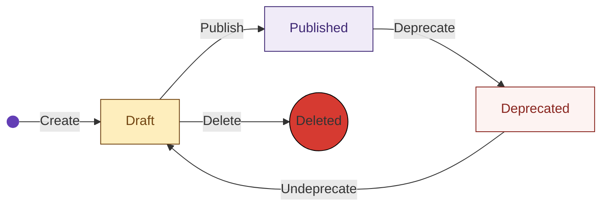

With the [**Event Specifications API**](https://console.snowplowanalytics.com/api/msc/v1/docs), you can efficiently manage event specifications programmatically. Whether you want to retrieve, create, edit, publish, deprecate, or delete event specifications, the API provides the necessary endpoints and functionalities.

:::note
In the previous API version (V1), event specifications were referred to as 'tracking scenarios.
:::

## Getting Started

For comprehensive details regarding each request, including query parameters and response formats, please consult the relevant [API documentation](https://console.snowplowanalytics.com/api/msc/v1/docs).

### Authorizing in the API Documentation

To post sample requests in the documentation, you must click the `Authorize` button at the top of the document and authenticate with your token. The token field value in each individual request is overwritten by this authorization.

For each request, you are required to include your Organization ID. You can find it [on the _Manage organization_ page](https://console.snowplowanalytics.com/settings) in Console.

```mdx-code-block
import GetConsoleApiKey from "@site/docs/reusable/get-console-api-key/_index.md"

<GetConsoleApiKey/>
```

## Response Format

The event specifications API follows a specific response format for successful cases (`2xx`) and for scenarios where critical and non-critical errors may occur, such as (`422`) **Unprocessable Entity**.


```json
{
    "data": [
        // Event specifications
    ],
    "includes": [
        // Additional event specifications info
    ],
    "errors": [
        // Warnings or errors
    ]
}
```

- `data`: Contains the event specification/s, depending on the request
- `includes`: Provides additional information, such as the history of event specification changes
- `errors`: Holds a list of errors, which could be of type `Error` or `Warning`. **If the array field contains at least one error of type `Error`, the request will also return a `4xx` status code, indicating that it cannot perform the store operation. Any other severity different from `Error` will result in a `2xx` status code.**

## Compatibility Checks

Certain endpoints conduct a validation to verify the compatibility of a specific event specification event schema, `event.schema`, with the source data structure version referenced by `event.source`. When both `event.schema` and `event.source` are defined in the event specification, the compatibility checks will be executed.

```json
...
"event": {
    "source": "iglu:com.example/ui_actions/jsonschema/1-0-0",
    "schema": {
        "$schema": "http://json-schema.org/draft-04/schema#",
        "description": "Event to capture search submit",
        "type": "object",
        "required": [
            "label",
            "action"
        ],
        "properties": {
            "action": {
                "type": "string",
                "enum": [
                    "click"
                ]
            },
            "label": {
                "type": "string",
                "enum": [
                    "Search"
                ]
            }
        },
        "additionalProperties": false
    }
}
...
```
However, the compatibility check will not only be performed against the version specified by the source data structure (`event.source` field, e.g., `1-0-0`), which we will refer to as the **current** version. It will also be conducted against the latest version available in Iglu, referred to as the **latest** version.

This approach is because it's common for a new event specification to utilize the latest version of the source data structure. However, as this data structure may evolve over time and become incompatible with the `event.schema` defined in the event specification, we provide a method to detect these compatibility issues. Consequently, customers can update the event specification to ensure compatibility.

In cases where an event specification is incompatible or we cannot determine it, some errors will be provided in the `errors` field of the [response](#response-format). These errors alerting of compatibility issues between the event specification and the source data structure will take a similar shape to the one below:

```json
...
"errors": [
    {
        "type":"Warning",
        "code":"SchemaIncompatible",
        "title":"Event specification with id: 59b5e250-91c4-45af-a63d-5f8cd39f4b67, event schema is INCOMPATIBLE with schema with name: test_event, vendor: com.snplow.msc.aws, version: 1-0-13",
        "source":"event.schema"
    }
]
...
```

Compatibility checks can result in three possible values: **Compatible**, **SchemaIncompatible**, or **SchemaUndecidable**.

- If **Compatible**, the event specification is compatible, and no errors will be appended to the `errors` response field
- If **SchemaIncompatible**, the event specification is incompatible against some version. If the check for the **current** version is incompatible, the `type` will be `Error`. For incompatibility with the **latest** version, the `type` will be `Warning`. If the requested operation involves persisting the event specification (create/update), an error of type `Error` will be appended to the response, the status code will be **422 Unprocessable Entity**, and the store operation will not persist. When fetching an event specification, the checks will run for both too, **current** and **latest** versions, and if incompatible, the error type will always be `Warning`, returning status code **200 Ok**.
- If **SchemaUndecidable**, it is indeterminable whether the event specification is compatible with a specific version due to the use of some advanced JSON-Schema features and the high computational cost of checking compatibility. The `type` will always be `Warning`, and the user is responsible for ensuring that the event specification is compatible with the source data structure. A warning will be attached to the `errors` response field.

:::info
The algorithm used to perform the compatibility check is based on the [Finding Data Compatibility Bugs with JSON Subschema Checking](https://dl.acm.org/doi/pdf/10.1145/3460319.3464796) paper, authored by Andrew Habib, Avraham Shinnar, and Michael Pradel.

:::

## Retrieve a List of Event Specifications

Use this request to retrieve a list of event specifications within an organization, which will be wrapped into the `data` field of the [response](#response-format).

`GET /api/msc/v1/organizations/{organizationId}/event-specs/v1`

The `organizationId` parameter is required.

### Query Parameters and Filters

You can filter the results based on the following query parameters:

- `dataProductId`: Filters the event specifications associated with a particular data product
- `sourceId`: Filters the event specifications associated with a particular data structure, inferred from the `event.source` field
- `sourceVersion`: Filters the event specifications associated with a specific data structure version when used with `dataStructureId`.
- `withLatestHistory`: When `true`, it will return a list of event specifications, with the latest change per event specification attached to the `includes` array field. The relation between event specifications in `data` and history in `includes` can be determined by `id = eventSpecId`.
- `status`: Filters the event specifications that match the specified status

:::info
If no query parameters are provided, it will return all the event specifications for an organization.
:::

## Retrieve a Specific Event Specification

Use this request to retrieve a specific event specification within an organization. The retrieved event specification will be wrapped into the `data` field of the response.

`GET /api/msc/v1/organizations/{organizationId}/event-specs/v1/{eventSpecId}`

:::info
This endpoint will trigger [**compatibility checking**](#compatibility-checks) if `event.source` and `event.schema` are defined.
:::

Query parameters `organizationId` and `eventSpecId` are required:

- `withHistory`: When `true`, returns a list with the history for the event specification in the `includes` array field of the response, related to the event specification by its id
- `status`: Filters the event specifications that match the specified status.

## Creating an Event Specification

Use this request to create an event specification within an organization.

`POST /api/msc/v1/organizations/{organizationId}/event-specs/v1`

Query parameter `organizationId` is required.

Request body example:

```json
{
  "spec": {
    "name": "Search",
    "description": "Tracking the use of the search box",
    "event": {
      "source": "iglu:com.example/ui_actions/jsonschema/1-0-0"
    }
  },
  "message": "update"
}
```

The creation form has two fields at the top level, as shown in the example above:

- `message`: An optional field to provide a message
- `spec`: The definition of the event specification, which should comply with the [validations](#validations).

By default, the event specification will be created with `spec.status` set to `draft` and `spec.version` set to `0` if not provided. These values can be changed and managed after creation. Here is an example response:

```json
{
    "data": [
        {
            "id": "5a203ef8-939b-4fd1-914e-f12a3dd1a869",
            "version": 0,
            "status": "draft",
            "name": "Search",
            "description": "Tracking the use of the search box",
            "event": {
                "source": "iglu:com.example/ui_actions/jsonschema/1-0-0"
            }
        }
    ],
    "includes": [
        {
            "author": "39b81015-1bd5-4b37-96c7-3296cabaa36f",
            "message": "initial draft",
            "date": "2023-04-26T14:41:48.708191Z",
            "eventSpecId": "5a203ef8-939b-4fd1-914e-f12a3dd1a869",
            "version": 0,
            "status": "draft",
            "type": "History"
        }
    ],
    "errors": []
}
```

### Validations

- `spec.event.source`: If provided it should match a valid and existing Iglu URI
- `spec.name`: It validates that the `spec.name` of an event specification is unique within the data structure context, inferred from the source data structure `spec.event.source` if provided
- `spec.version`: If provided should be equal or greater than zero
- `spec.status`: If provided should match one of `draft`, `published` or `deprecated`
- `spec.entities`: If provided it will validate that the entities, `spec.entities.tracked` and `spec.entities.enriched`, are not duplicated and that they exist
- `spec.dataProductId`: If provided it will validate that the data products exists. (Coming soon)

:::info
This endpoint will trigger [**compatibility checking**](#compatibility-checks) if `event.source` and `event.schema` are defined.
:::

## Editing an Event Specification

Use this request to edit an event specification within an organization. The format of the request and response is the same as during creation.

The `organizationId` and `eventSpecId` parameters are required.

`PUT /api/msc/v1/organizations/{organizationId}/event-specs/v1/{eventSpecId}`

### Publishing an Event Specification

When editing an event specification, it can be published by setting the `status` to `published`. Currently, this will indicate to the event specification consumers (for instance, front-end developers) that the tracking design is ready to be implemented or consumed.

By default, when an event specification is created and no value is provided for `spec.status`, it will be set to `draft`. With this, we suggest an event specification lifecycle that we recommend following, but we allow a certain degree of flexibility to accommodate unique customer use cases. Here is the suggested lifecycle:



In addition to this lifecycle, and in conjunction with versioning, we enforce that when an event specification is **published**, the versions between two published versions are **discarded**. For example:

Publish new version, before squash:


After discarding intermediate versions:


### Deprecating an Event Specification

When editing an event specification, it can be deprecated by setting the `status` to `deprecated`. This is a way of informing event specifications consumers (for instance, developers) not to rely on the tracking anymore.

### Validations

- `spec.event.source`: If provided, it should match a valid and existing Iglu URI
- `spec.name`: It validates that the `spec.name` of an event specification is unique within the data structure context, inferred from the source data structure `spec.event.source` if provided
- `spec.version`: If provided, it should be equal to or greater than zero, should not exist, and be greater than the last published version
- `spec.status`: If provided, it should match one of `draft`, `published`, or `deprecated`
- `spec.entities`: If provided, it will validate that the entities, `spec.entities.tracked` and `spec.entities.enriched`, are not duplicated and that they exist
- `sceeventSpecnario.dataProductId`: If provided, it will validate that the data product exists

:::info
This endpoint will trigger [**compatibility checking**](#compatibility-checks) if `event.source` and `event.schema` are defined.
:::

## Deleting an Event Specification

Use this request to delete an event specification within an organization.

`DELETE /api/msc/v1/organizations/{organizationId}/event-specs/v1/{eventSpecId}`

:::warning
Please note that this action is irreversible and will permanently delete the event specification.
:::
