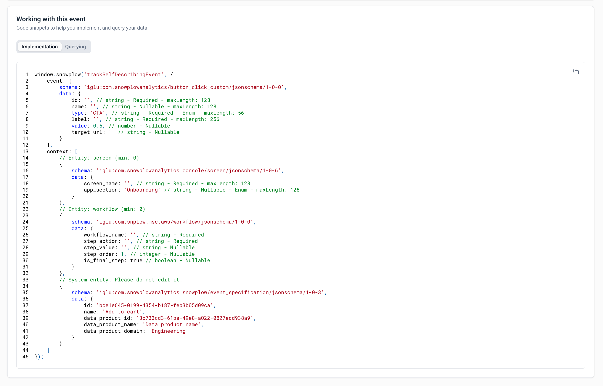
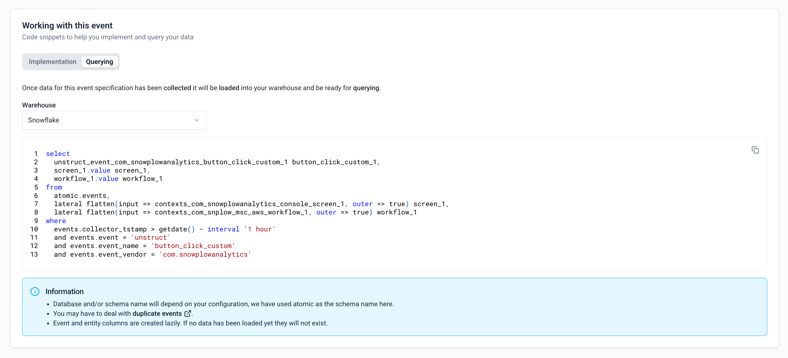

## Creating a new event specification through Console

Event specifications serve as direct counterparts to [data structures](/docs/data-product-studio/data-structures/manage/index.md) and encapsulate the documented events within a data product.

:::info
Please note that the creation of event specifications is exclusive to data products.
:::

Create event specifications in tandem with the latest deployed data structure version in development. This ensures tracking implementation instructions align with the validation criteria in the event specification.

Your event specification guarantees compatibility with the associated data structure version, being a specialization of it. This ensures events tracked using specified instructions pass validation for the associated data structure.

## Creating and editing event specifications

To create a new event specification, follow these steps:

1. Select a data product
2. Click the **Create event** button
3. A dialog will appear, prompting you to enter a name for your event specification and click **Save and continue**
4. Your first event specification will be displayed on the page

To add more information or modify an existing event specification, follow these steps:

1. Navigate to the appropriate data product
2. Select the desired event specification
3. This action will open on overview of the selected event specification containing the details that have been added to date

This interface is divided into focused sections; explore each section below for more details.

### Event information

This section provides essential meta-information for your event specification, including the event name, description, and the applications in which this event is tracked.

### Event data structure

This section defines the event data structure that this event will validate against as it is processed by your pipeline.

You can choose from two types of data structures:

- **Standard**: provided by the Snowplow tracker by default
- **Custom**: provided by your organization

### Entity data structures

Within this section, you have the flexibility to define the entities that should be associated with the event when it is triggered.

To facilitate making an informed selection of your entities, you can view a detailed breakdown of the properties associated with the chosen entities (and its version) by a specific version.

### Event triggers

This section defines the locations and circumstances under which this event is triggered.

To create your first trigger, simply select the **Add trigger** button. You can edit or delete an existing trigger by clicking the dedicated buttons beside each entry in the triggers list.

A dialog will appear, allowing you to upload an image and provide additional context, such as the URL to the page on which this trigger applies.

### Properties

This section allows you to specify how each property for a selected event or entity data structure should be populated.

The dialog displays the list of properties for the selected data structure will be listed here, with the ability to provide the exact value/s or a description of how to populate these properties when the event is triggered.

You can configure detailed instructions for any of the properties shown in the list by clicking the **Add instruction** or **Edit** buttons. Once you have selected the type of instruction you wish to add/edit and have filled in the required input fields, you are then able to click **Save and update instruction** and return to the properties list.

*Notes: instructions for required properties are added by default and can be edited but they cannot be deleted.*

## Event specification code generation

To accelerate your implementation of event tracking, Snowplow Console includes pre-generated code snippets specifically for custom self-describing events. These snippets can be accessed directly within the Console interface to significantly reduce the time and effort required for integrating event tracking functionality into your applications.

### Working with event specifications

When viewing an event specification, the **Working with this event** section provides two key tabs:

- **Implementation**: access ready-to-use tracking code for your event
- **Querying**: view example SQL queries to retrieve your event data from the warehouse

:::note
For standard Snowplow events (page views, screen views, page pings, and self-describing events), tracking code is available out of the box without requiring any additional configuration.
:::

### Implementation - Code snippets

The Implementation tab generates tracking code snippets tailored to your event specification. You can:

- **Select your tracker type**: choose between JavaScript tracker options (tag-based or npm-based)
- **Toggle Snowtype code**: use the **Show snowtype code** toggle to display the specific Snowtype function name to call for tracking implementation.
- **Copy code directly**: use the generated code snippets immediately in your application

:::note
Draft data structures can't be used for event validation during testing or production since they aren't loaded into Iglu. Validation will fail without schemas in an Iglu registry, though you can configure a custom registry if needed. Deploy your draft to the development environment when you're ready to test.
:::

### Querying - SQL examples

The Querying tab provides example SQL queries to help you retrieve and analyze your event data. You can:

- **Select your warehouse**: choose from Snowflake, BigQuery, Redshift, Databricks, and other supported warehouses
- **View tailored queries**: see SQL examples optimized for your selected warehouse
- **Access event data**: query both the event properties and attached entities

