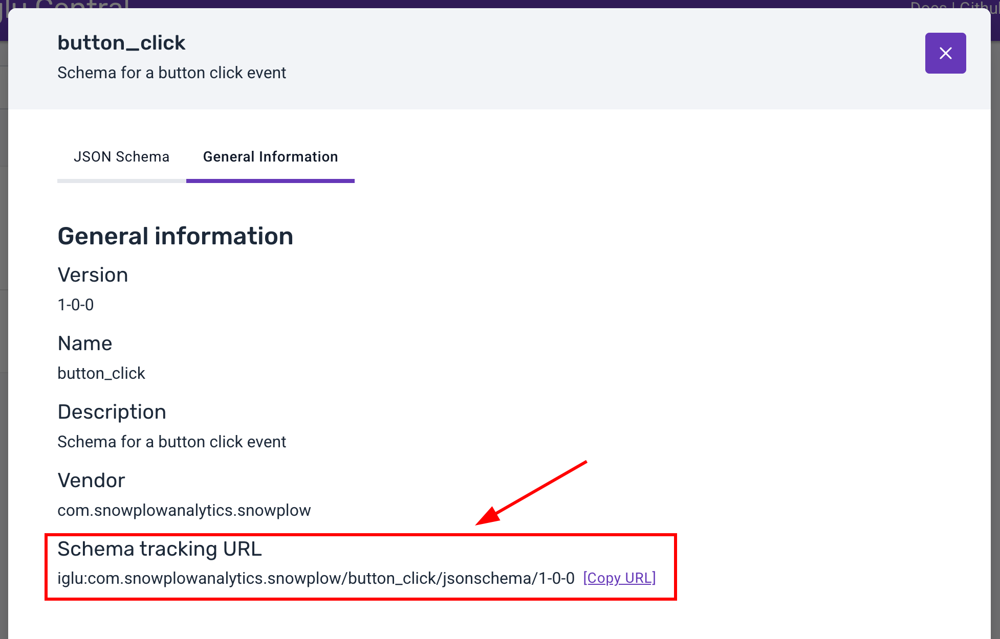

```mdx-code-block
import Tabs from '@theme/Tabs';
import TabItem from '@theme/TabItem';
```

## Snowtype CLI

The Snowtype CLI is a tool which aims to speed up tracking implementations, provide type safety and inline documentation for developers and ultimately reduce the number of erroneous events. By integrating this tool in the development workflow we introduce a way to connect the additions and updates done in a Snowplow implementation with the corresponding tracking code of the project.

## Authenticating with the Console

A Console API key is required for the Snowtype CLI to authenticate with your account. You can find your own or create one in the Console [API key management](https://console.snowplowanalytics.com/credentials).

:::note
Both API key and API key ID variables are required for versions > `0.9.0`.
:::

The ways for the CLI to read the credentials are either through the global `-k, --apiKey` and `-s, apiKeyId` options or the `SNOWPLOW_CONSOLE_API_KEY` and `SNOWPLOW_CONSOLE_API_KEY_ID` environment variables. Additionally, the Snowtype CLI automatically reads from a `.env` file at the root of your project.

<Tabs groupId="api-key">
  <TabItem value="env file" label=".env file" default>

  ```bash
  SNOWPLOW_CONSOLE_API_KEY=MY-API-KEY
  SNOWPLOW_CONSOLE_API_KEY_ID=MY-API-KEY-ID
  ```

  </TabItem>
  <TabItem value="shell" label="Shell variable" default>

  ```bash
  # The required command will depend on your shell
  export SNOWPLOW_CONSOLE_API_KEY=MY-API-KEY
  export SNOWPLOW_CONSOLE_API_KEY_ID=MY-API-KEY-ID
  ```

  </TabItem>
  <TabItem value="cli" label="CLI parameter" default>

  ```bash
  npx @snowplow/snowtype@latest generate --apiKey MY-API-KEY --apiKeyId MY-API-KEY-ID
  ```

  </TabItem>
</Tabs>

**Recommended:** We recommend that you use the `SNOWPLOW_CONSOLE_API_KEY` and `SNOWPLOW_CONSOLE_API_KEY_ID` environment variables.

## Initializing Snowtype for your project

For the Snowtype CLI to work properly, it requires a [configuration file](../snowtype-config/index.md) to be initialized and present on your project's root folder. This file will be automatically generated using the `snowtype init` command, after adding the required input.

```bash
# Start prompting for configuration inputs
npx @snowplow/snowtype@latest init
```

The input required for the initialization to work, it the following:
- The organization ID from Snowplow Console.
- The [tracker](./index.md#available-trackerslanguages) you wish to generate code for.
-  _If applicable,_ the language for that tracker.
- The output path you wish the CLI to generate the code to.

These will all be prompted to you by default, but if needed you can call the `snowtype init` command with any or all the attributes passed as [optional flags](../commands/index.md#snowtype-init) so prompting is not required.


## Generate tracking code

The CLI will generate tracking code using a valid Snowtype configuration file with the `snowtype generate command`. The code that will be generated, depending on the language, will have all the required types used in schemas and Event Specifications together with methods/classes that allows for tracking these.


```bash
# Code will be generated to the outpath configuration
npx @snowplow/snowtype@latest generate
```

The code generated by the CLI is not minified and contains inline documentation for methods, classes and types. If needed you can modify it in any way it suits your project.

### Contents
The contents of a generated file from the Snowtype CLI will be:
- Types/Interfaces/Classes for each schema that relates to the Data Structures, Iglu Central Schemas and Event Specifications selected.
  - For each Event Specification [instruction set](/docs/data-product-studio/event-specifications/index.md#properties), a type for the adjusted schema is generated as well. The type/class will contain the Event Specification name as suffix to avoid conflicts.
- For each schema:
    - A method/class to instantiate the structure as a Self Describing JSON. _This is particularly useful to add entities as extra context on events._
    - A method that sends a Self Describing Event with the schema as the main event entity.
- For each Event Specification, a method/class to track the event specification with the set event and context entity schemas.

:::caution
The Snowtype CLI does not automatically install the required Snowplow tracking libraries. For now it generates code that use the tracking libraries which are expected to be installed on the project.
:::

### Available Trackers/Languages

Following is the set of available trackers and languages the Snowtype CLI currently can work with. This list is also the source of truth for valid keys in the `tracker` and `language` attributes of the Snowtype configuration file.

```mdx-code-block
import Trackers from "../_supported-trackers.md"

<Trackers/>
```

### Example Usage

Below we show example usage of the generated code. For demonstration, we assume the code was generated for the [web_page](https://github.com/snowplow/iglu-central/blob/master/schemas/com.snowplowanalytics.snowplow/web_page/jsonschema/1-0-0) and [product](https://github.com/snowplow/iglu-central/tree/master/schemas/com.snowplowanalytics.snowplow.ecommerce/product/jsonschema/1-0-0) schemas.

<Tabs groupId="example usage">
<TabItem value="@snowplow/browser-tracker-typescript" label="@snowplow/browser-tracker TypeScript" default>

```tsx
import {
  trackWebPage,
  createProduct,
  WebPage,
  Product,
  createWebPage,
} from "./{outpath}/snowplow";
/* Track a WebPage event */
trackWebPage({ id: "212a9b63-1af7-4e96-9f35-e2fca110ff43" });
/* Track a WebPage event with a Product context entity */
const product = createProduct({
  id: "Product id",
  name: "Snowplow product",
  currency: "EUR",
  price: 10,
  category: "Snowplow/Shoes",
});
trackWebPage({
  id: "212a9b63-1af7-4e96-9f35-e2fca110ff43",
  context: [product],
});
/* You can enforce specific context entities on any `track` function using type arguments */
const webPage = createWebPage({ id: "212a9b63-1af7-4e96-9f35-e2fca110ff43" });
trackWebPage<Product | WebPage>({
  id: "212a9b63-1af7-4e96-9f35-e2fca110ff43",
  context: [product, webPage],
});
```

</TabItem>

<TabItem value="@snowplow/node-tracker-typescript" label="@snowplow/node-tracker TypeScript" default>

```tsx
import {
  trackWebPage,
  createProduct,
  WebPage,
  Product,
  createWebPage,
} from "./{outpath}/snowplow";

/* `t` is the tracker instance created by the `tracker` function of the @snowplow/node-tracker package. */

/* Track a WebPage event */
trackWebPage(t, { id: "212a9b63-1af7-4e96-9f35-e2fca110ff43" });
/* Track a WebPage event with a Product context entity */
const product = createProduct({
  id: "Product id",
  name: "Snowplow product",
  currency: "EUR",
  price: 10,
  category: "Snowplow/Shoes",
});
trackWebPage(t, {
  id: "212a9b63-1af7-4e96-9f35-e2fca110ff43",
  context: [product],
});
/* You can enforce specific context entities on any `track` function using type arguments */
const webPage = createWebPage({ id: "212a9b63-1af7-4e96-9f35-e2fca110ff43" });
trackWebPage<Product | WebPage>(t, {
  id: "212a9b63-1af7-4e96-9f35-e2fca110ff43",
  context: [product, webPage],
});
```

</TabItem>

<TabItem value="snowplow-android-tracker" label="snowplow-android-tracker" default>

```kotlin
import {{ specified package }}.Product
import {{ specified package }}.WebPage

/* Track a WebPage event */
tracker.track(WebPage(id = "212a9b63-1af7-4e96-9f35-e2fca110ff43").toEvent())

/* Track a WebPage event with a Product context entity */
val product = Product(
    id = "Product id",
    name = "Snowplow product",
    currency = "EUR",
    price = 10.0,
    category = "Snowplow/Shoes",
)
val event = WebPage(id = "212a9b63-1af7-4e96-9f35-e2fca110ff43").toEvent()
event.entities.add(product.toEntity())
tracker.track(event)
```

</TabItem>

<TabItem value="snowplow-ios-tracker" label="snowplow-ios-tracker" default>

```swift
import SnowplowTracker

/* Track a WebPage event */
_ = tracker.track(WebPage(id: "212a9b63-1af7-4e96-9f35-e2fca110ff43").toEvent())

/* Track a WebPage event with a Product context entity */
let product = Product(
    category: "Snowplow/Shoes",
    currency: "EUR",
    id: "Product id",
    name: "Snowplow product",
    price: 10
)
let event = WebPage(id: "212a9b63-1af7-4e96-9f35-e2fca110ff43").toEvent()
event.entities.append(product.toEntity())
_ = tracker.track(event)
```

</TabItem>

<TabItem value="snowplow-golang-tracker" label="snowplow-golang-tracker">

```go
// Track a WebPage event
TrackWebPage(tracker, WebPage{ID: "212a9b63-1af7-4e96-9f35-e2fca110ff43"})

// Track a WebPage event with a Product context entity
productName := "Snowplow product"
product := Product{
	ID:       "Product_id",
	Currency: "EUR",
	Price:    10,
	Category: "Snowplow/Shoes",
	Name:     &productName,
}

TrackWebPage(
	tracker,
	WebPage{ID: "212a9b63-1af7-4e96-9f35-e2fca110ff43"},
	WithContexts(product),
)
```

</TabItem>

<TabItem value="@snowplow/react-native-tracker-typescript" label="@snowplow/react-native-tracker TypeScript" default>

```tsx
import {
  trackWebPage,
  createProduct,
  WebPage,
  Product,
  createWebPage,
} from "./{outpath}/snowplow";

/* `t` is the tracker instance created by the `createTracker` function of the @snowplow/react-native-tracker package. */

/* Track a WebPage event */
trackWebPage(t, { id: "212a9b63-1af7-4e96-9f35-e2fca110ff43" });
/* Track a WebPage event with a Product context entity */
const product = createProduct({
  id: "Product id",
  name: "Snowplow product",
  currency: "EUR",
  price: 10,
  category: "Snowplow/Shoes",
});
trackWebPage(t, {
  id: "212a9b63-1af7-4e96-9f35-e2fca110ff43",
  context: [product],
});
/* You can enforce specific context entities on any `track` function using type arguments */
const webPage = createWebPage({ id: "212a9b63-1af7-4e96-9f35-e2fca110ff43" });
trackWebPage<Product | WebPage>(t, {
  id: "212a9b63-1af7-4e96-9f35-e2fca110ff43",
  context: [product, webPage],
});
```

</TabItem>

<TabItem value="snowplow-flutter-tracker" label="snowplow-flutter-tracker" default>

```dart
import './{outpath}/snowplow.dart';

/* Track a WebPage event */
await tracker.track(const WebPage(id: "212a9b63-1af7-4e96-9f35-e2fca110ff43"));

/* Track a WebPage event with a Product context entity */
const product = Product(
  category: "Snowplow/Shoes",
  currency: "EUR",
  id: "Product id",
  price: 10.0,
  name: "Snowplow product"
);
const event = WebPage(id: "212a9b63-1af7-4e96-9f35-e2fca110ff43");
await tracker.track(event, contexts: [product]);
```

</TabItem>

<TabItem value="snowplow-java-tracker" label="snowplow-java-tracker" default>

```java
package test;

import com.snowplowanalytics.snowplow.tracker.*;
import com.snowplowanalytics.snowplow.tracker.Tracker;
import com.snowplowanalytics.snowplow.snowtype.*;
import com.snowplowanalytics.snowplow.tracker.events.SelfDescribing;

import java.util.Collections;


public class SnowtypeTest {
    public static void main(String[] args) {
        Tracker tracker = Snowplow.createTracker("asdf", "asdf", "asdf");

        /* Track a WebPage event */
        tracker.track(SelfDescribing.builder().eventData(new WebPage.Builder().setId("212a9b63-1af7-4e96-9f35-e2fca110ff43").build().toSelfDescribingJson()).build());

        /* Track a WebPage event with a Product context entity */
        Product product = new Product.Builder().setId("Product id").setName("Snowplow product").setCurrency("EUR").setPrice(10.0).setCategory("Snowplow/Shoes").build();
        WebPage webPage = new WebPage.Builder().setId("212a9b63-1af7-4e96-9f35-e2fca110ff43").build();
        SelfDescribing event = SelfDescribing.builder().eventData(product.toSelfDescribingJson()).customContext(Collections.singletonList(webPage.toSelfDescribingJson())).build();
        tracker.track(event);
    }
}
```

</TabItem>

</Tabs>

### Data Products

To generate code for the whole set of Event Specifications of a Data Product, either manually or through the `snowtype patch` command, you will need the ID of the Data Product. You can do this either by clicking on the `Implement tracking` button on the Data Products main page to get the command directly:


Or retrieve the ID from the URL bar and then add it on the `dataProductIds` array:


### Event Specifications

To add an Event Specification to the code generation, either manually or through the `snowtype patch` command, you would need the ID of the Event Specification. You can find the Event Specification ID in the main page of the Event Specification as shown below:


Then you should add this ID to your configuration file `eventSpecificationIds` array.

### Data Structures

To add a Data Structure to the code generation, either manually or through the `snowtype patch` command, you would need the Data Structure `Schema tracking URL`. You can find the Data Structure tracking URL on the Data Structure page in the Console, under the **Overview** tab as shown below:


Then you should add this Data Structure tracking URL to your configuration file `dataStructures` array.

### Iglu Central Schemas

To add a Data Structure to the code generation, either manually or through the `snowtype patch` command, you would need the `Schema tracking URL`. You can find the Schema tracking URL on [Iglu Central](http://iglucentral.com/) by searching for the schema and under the **General Information** tab you can find the URL as shown below:



Then you should add this Schema tracking URL to your configuration file `igluCentralSchemas` array.

### Local Data Structure Repositories

To add a local Data Structure repository to the code generation, either manually or through the `snowtype patch` command, you would only need the path/s to the repository/ies you have generated schemas using the [snowplow-cli](/docs/data-product-studio/data-structures/manage/cli/index.md).

Then you should add the path/s to your configuration file `repositories` array.

## Generating event specification instructions

When generating code for event specifications, you have the option of delivering the implementation instructions and triggers for each specification right on the developer's environment.

By using the `--instructions` option on the `snowtype generate` command, you can generate a markdown file with all the required information about tracking an event specification.

This includes:
- Trigger description.
- Implementation rules.
- Images uploaded on your Event Specification triggers.
- App identifiers and URLs this event should be triggered on.
- Direct links to the code for this Event Specification.

## Keeping up with latest updates

It is important that the tracking code is up-to-date with latest versions of Data Structures and Event Specifications we are tracking on a project. The Snowtype CLI gives the engineers the ability to check if there are available updates for Data Structures and Event Specifications that are used in the project.

This works with the `snowtype update` command.

```bash
npx @snowplow/snowtype@latest update
```

The above command will output a _diff_ showing the available version updates, similar to what you can see below:


In that case, you can select to update to latest versions and regenerate the tracking code. To automatically update and regenerate the tracking code reflecting the latest updates, you can use the `--yes` flag.

### Adjust the level of update notifications

For possible Data Structure updates, you can set the maximum level of update you want to be notified about using the `--maximumBump` flag. This value provides the maximum bump to be notified about and update to if available. This value defaults to 'major' meaning the update command will notify you for all updates up to and including major type of updates to the schema model.

An example showcasing the flag's behavior:

```js
// Data Structure version added to the snowtype config is 1-0-0.
{
  // Other options...
  dataStructures: ["iglu:com.acme_company/page_unload/jsonschema/1-0-0"]
}
```

This Data Structure has other deployed versions such as `1-0-1`, `1-1-0` and `2-0-0`. The `update` command will show available updates as follows:

```bash
npx @snowplow/snowtype@latest update --maximumBump=major
# Will prompt an update to 2-0-0 or any other available update.

npx @snowplow/snowtype@latest update --maximumBump=minor
# Will prompt an update to 1-1-0 or 1-0-1 if the only available update.

npx @snowplow/snowtype@latest update --maximumBump=patch
# Will prompt an update to 1-0-1 if available or any other patch type update.
```

## Disallow generating code using schemas not deployed on production environment.

While developing or testing, it might be useful to use [Snowplow Mini](../../../pipeline-components-and-applications/snowplow-mini/) to validate against your new schemas in your development environment.
In this and any other case you are developing a schema and eventually publishing the tracking to production, you need to make sure all the schemas you are using are deployed to the production environment for the pipeline to use. Failing to do that will result in failed events.

Snowtype by default will print a warning when code is generated using schemas only published to development environment. To make sure that there are no schemas not yet deployed to production, you can use the `--disallowDevSchemas` flag or option when using the `generate` command. Using this flag will make sure each generation attempt will fail, indicating the schemas that are not yet deployed to the production environment.
