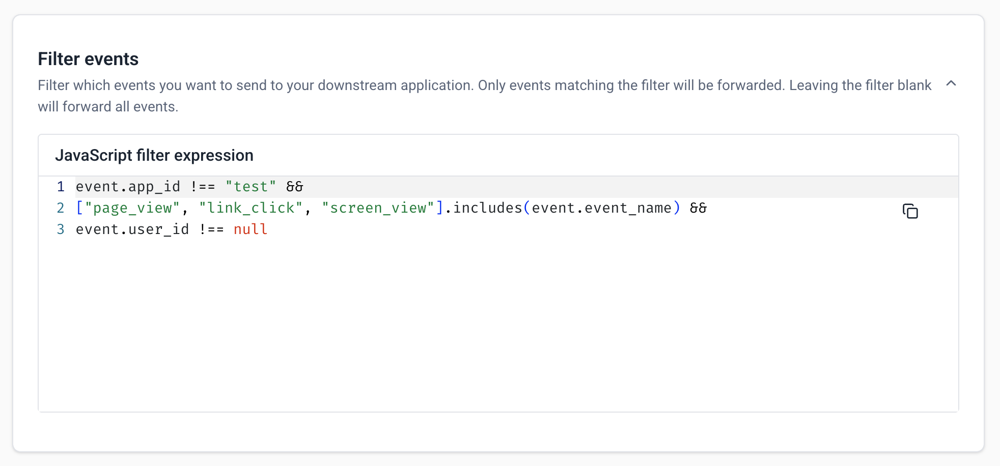
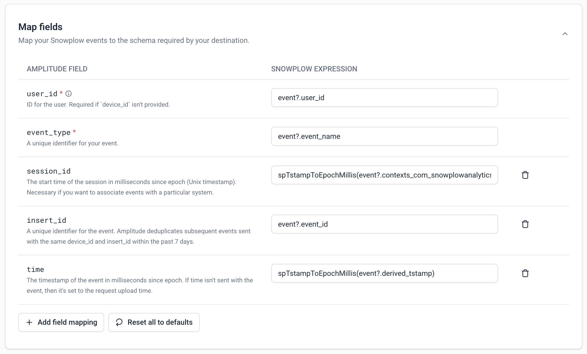
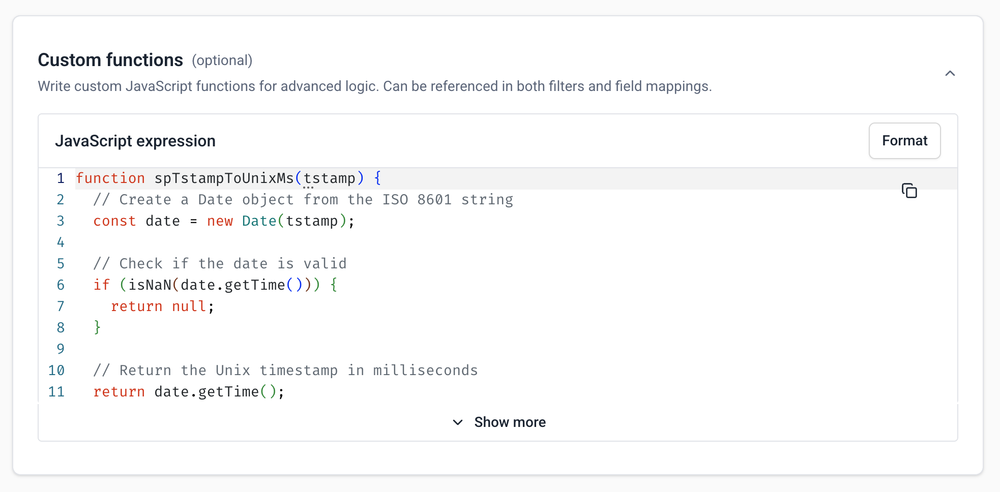
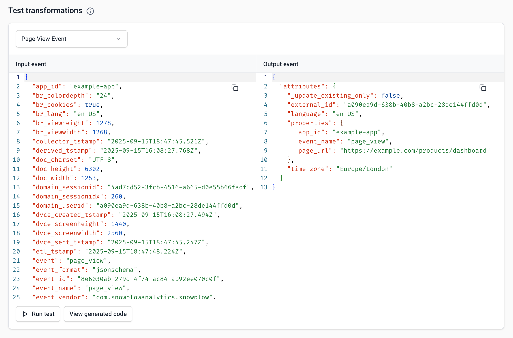

Follow the steps below to configure a new event forwarder. See [available integrations](/docs/destinations/forwarding-events/integrations/index.md) for destination-specific guides.

## Step 1: Create a connection

A **connection** is a resource that stores the credentials and endpoint details needed to send events to your destination.

To create a connection from [Snowplow Console](https://console.snowplowanalytics.com), first go to **Destinations** > **Connections**, then select **Set up connection**. From the dropdown, choose **Loader connection**, then select the destination you want to forward events to. Each destination will have specific authentication and endpoint details required.


When finished, click **Deploy**. Once a connection is deployed, you can use it in one or more forwarders to connect to your destination.


## Step 2: Create a new forwarder

1. Go to **Destinations** > **Destination list**.
2. Navigate to the **Available** tab and select **Configure** on the destination card from the list of available integrations to start setting up the forwarder.
3. Give the forwarder a **name**, select the **pipeline** you want the forwarder to read events from, and choose the **connection** you created in step 1.
4. Optionally, you can choose to **Import configuration from** an existing forwarder. This is helpful when migrating a forwarder setup from development to production.
5. Click **Continue** to configure event filters and data mapping.

## Step 3: Configure event filters and field mapping

Forwarders use JavaScript expressions to define which events to forward and how to map Snowplow data to your destination's required schema.

### Event filtering

Use JavaScript expressions to select which events to forward. Only events that return `true` when evaluated against your filter will be sent to your destination.

Use the `event` object to reference fields on your Snowplow payloads. For example:
```javascript
// Forward page views from website
event.app_id == "website" && event.event_name == "page_view"

// Forward a list of custom events
["add_to_cart", "purchase"].includes(event.event_name)
```

Leave the filter blank to forward all events.



### Field mapping

Define how Snowplow data maps to your destination fields. For each mapping, **Destination Field** represents the property name and **Snowplow expression** is a JavaScript expression used to extract data from your Snowplow event. Snowplow provides default mappings based on common fields, but you can overwrite or delete them as needed.



### Custom functions

You can also write JavaScript functions for complex data transformations. Examples include converting date formats, transforming enum values, combining multiple fields, or applying other business logic. You can then reference functions in both the event filter and field mapping sections.



:::info
To learn more about the supported filter and mapping expressions, check out the [filter and mapping reference](/docs/destinations/forwarding-events/reference/index.md).
:::

## Step 4: Test your transformations

Once you've defined your filter and mapping configuration, you can test it against a sample event and preview what the output JSON payload looks like. Choose an event from the **Select sample input event** dropdown and selecting **Run test**.



Snowplow provides a few out-of-the-box sample events to test with, which you can edit as needed. You can also choose **Custom event** to paste in your own JSON-formatted Snowplow event. You can use [Snowplow Micro](/docs/testing/snowplow-micro/) with the `--output-json` flag to generate your own events to test with.

Select **View generated code** to see the JavaScript function generated from your filters, field mappings, and custom functions. This is exactly what will run when transforming events for your destination, and can be used directly in a [Snowbridge JavaScript transformation](docs/api-reference/snowbridge/configuration/transformations/custom-scripts/javascript-configuration/index.md) for local testing.

If there is an error with your configuration, the generated code will show the line number which contains the error.

## Step 5: Deploy

When you're done, select **Deploy** to save your configuration and create the forwarder. This will deploy the underlying Snowbridge instance to your cloud account and begin forwarding events based on your configuration. It typically takes a few minutes to deploy a new forwarder.
