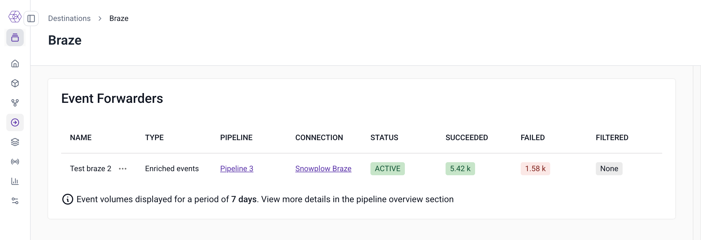

This page is an overview of how to monitoring event forwarder performance and diagnosing delivery issues. Snowplow provides both summary metrics and detailed failed event logs to help you understand failure patterns and troubleshoot specific problems.

## Failure types and retry logic

Forwarders uses the same retry logic and failure handling as the underlying [Snowbridge failure model](/docs/destinations/forwarding-events/snowbridge/concepts/failure-model/index.md). Snowplow handles event forwarding failures differently depending on the type:

- **Invalid data failures**: Snowplow treats events that fail transformation or violate destination API requirements as unrecoverable. Event forwarding creates [event forwarding error failed events](https://iglucentral.com/?q=event_forwarding_error) and logs them in your cloud storage bucket without retry.
- **Transformation failures**: Snowplow treats JavaScript transformation errors as invalid data and logs them to your cloud storage bucket without retry.
- **Destination failures**: when API requests fail (e.g., HTTP 4xx/5xx responses), Snowplow retries based on the destination-specific retry policy. See the list of [available destinations](/docs/destinations/forwarding-events/integrations/index.md) for destination-specific details.
- **Oversized data failures**: Snowplow creates [size violation failed events](docs/api-reference/failed-events/index.md) for events exceeding destination size limits and logs them to your cloud storage bucket without retry.

Failed events are automatically routed to your configured failure destination, which is typically your cloud storage bucket, where you can inspect them further. For how to query these metrics, see [Inspecing and debugging failures](#inspecting-and-debugging-failures).

## Monitoring and metrics

You can monitor forwarders in a few ways:

- [**Console metrics**](#console-metrics): you can view high-level delivery statistics in BDP Console
- [**Cloud monitoring metrics**](#cloud-monitoring-metrics): forwarders emit a set of metrics to your cloud providers's observabilty service
- [**Failed event logs**](#inspecting-and-debugging-failures): for failed deliveries, Snowplow saves detailed logs to your cloud storage bucket. These logs can be consumed for automated monitoring in your observability platform of choice.

### Console metrics

In BDP Console, you can see the number of filtered, failed, and successfuly delivered events over the last 7 days.

To view these metrics, navigate to **Destinations** > **Destinations list** and select the destination you'd like to view. On the event forwarders overview table, you will see metrics for each forwarder configured for that destination.



### Cloud monitoring metrics

:::INFO
Forwarder cloud metrics are only available for [BDP Enterprise](/docs/get-started/snowplow-bdp/index.md#enterprise-in-your-own-cloud) customers.
:::

Forwarders produce the following metrics in your cloud provider's monitoring service:

- `target_success`: events successfully delivered to your destination
- `target_failed`: events that failed delivery but are eligible for retry
- `message_filtered`: events filtered out based on the forwarder's JavaScript filter expression
- `failure_target_success`: events that failed with unrecoverable errors, such as transformation errors, and logged to your cloud storage bucket

You can find forwarder metrics in the following locations based on which cloud provider you use:

- **AWS**: CloudWatch metrics under `snowplow/event-forwarding` namespace
- **GCP**: Cloud Monitoring metrics with `snowplow_event_forwarding` prefix

To get notified of any issues, you can use these metrics to define [CloudWatch alarms](https://docs.aws.amazon.com/AmazonCloudWatch/latest/monitoring/AlarmThatSendsEmail.html) or [Cloud Monitoring alerts](https://cloud.google.com/monitoring/alerts).

## Inspecting and debugging failures

### Finding failed event logs

To better understand why a failure has occurred, you directly access and review detailed failed delivery logs in file storage. The logs are automatically saved as [failed events](/docs/data-product-studio/data-quality/failed-events/exploring-failed-events/file-storage/index.md) in your Snowplow cloud storage bucket under the prefix:
`/{pipeline_name}/partitioned/com.snowplowanalytics.snowplow.badrows.event_forwarding_errors/`

For more details on where to find failed events, see [Accessing failed events in file storage](/docs/data-product-studio/data-quality/failed-events/exploring-failed-events/file-storage/index.md).

Failed event logs [event_forwarding_error schema](https://iglucentral.com/?q=event_forwarding_error) and contain:

- **Original event data**: the complete Snowplow event that failed
- **Error details**: specific error type and message
- **Failure timestamp**: when the error occurred
- **Transformation state**: data state at the point of failure

### Querying failed event logs 

On AWS, you can use [Athena](https://aws.amazon.com/athena/) to query your failed events using the cloud storage files as a data source. Follow the steps below to 

**1. Create a table and load the data**

To make the logs easier to query, run the following query to create a table:
```sql
CREATE EXTERNAL TABLE snowplow_event_forwarding_failures (
  data struct<payload:string,
              processor:struct<artifact:string,
                              version:string
              >,
              failure:struct<errorCode:string,
                            errorMessage:string,
                            errorType:string,
                            latestState:string,
                            timestamp:string>
              > 
  )           
ROW FORMAT SERDE 'org.openx.data.jsonserde.JsonSerDe'
LOCATION 's3://{BUCKET_NAME}/{PIPELINE_NAME}/partitioned/com.snowplowanalytics.snowplow.badrows.event_forwarding_error/' 
```
If the table already exists, run the following query to pull in new data:

```sql
MSCK REPAIR TABLE event_forwarding_failures
```

**2. Explore failure records**

Use the query below to view a sample of failure records:

```sql
SELECT 
    data.failure.timestamp,
    data.failure.errorType,
    data.failure.errorCode,
    data.failure.errorMessage,
    data.processor.artifact,
    data.processor.version,
    data.failure.latestState, -- these are last because they can be quite large 
    data.payload
FROM event_forwarding_failures
LIMIT 10
```

### Example failed event queries

Summarize the most common types of errors:

```sql
SELECT 
    data.failure.errorType,
    data.failure.errorCode,
        -- time range for each - is the issue still happening?
    MIN(data.failure.timestamp) AS minTstamp,
    MAX(data.failure.timestamp) AS maxTstamp,
        -- How many errors overall,
    count(*) AS errorCount, 
        -- There might just be lots of different messages for the same error
        -- If this close to error count, the messages for a single error might just have high cardinality - worth checking the messages themselves
        -- If it's a low number, we might have more than one issue
        -- If it's 1, we have only one issue and the below message is shared by all
    count(DISTINCT data.failure.errorMessage) AS distinctErrorMessages, 
        -- a sample of error message. You may need to look at them individually to get the full picture
    MIN(data.failure.errorMessage) AS sampleErrorMessage
FROM event_forwarding_failures
GROUP BY 1, 2
ORDER BY errorCount DESC -- Most errors first
LIMIT 10
```

View transformation errors:

```sql
SELECT 
    data.failure.timestamp,
    data.failure.errorType,
    data.failure.errorCode,
    data.failure.errorMessage,
    data.processor.artifact,
    data.processor.version,
    data.failure.latestState, 
    data.payload
FROM event_forwarding_failures 
WHERE data.failure.errorType = 'transformation'
LIMIT 50
```

View api errors:

```sql
SELECT 
    data.failure.timestamp,
    data.failure.errorType,
    data.failure.errorCode,
    data.failure.errorMessage,
    data.processor.artifact,
    data.processor.version,
    data.failure.latestState,
FROM event_forwarding_failures 
WHERE data.failure.errorType = 'api'
LIMIT 50
```

Filter based on a date and hour:
```sql
-- Note that the times in the paths are for the creation of the file, not the failure time

SELECT 
    data.failure.timestamp,
    data.failure.errorType,
    data.failure.errorCode,
    data.failure.errorMessage,
    data.processor.artifact,
    data.processor.version,
    data.failure.latestState, -- these are last because they can be quite large 
    data.payload
FROM event_forwarding_failures 
WHERE "$path" LIKE '%2025-07-29-16%' -- File paths are timestamped like this, so we can limit our queries this way
LIMIT 50
```

Filter for a range of timestamps:

```sql
SELECT 
    data.failure.timestamp,
    data.failure.errorType,
    data.failure.errorCode,
    data.failure.errorMessage,
    data.processor.artifact,
    data.processor.version,
    data.failure.latestState, -- these are last because they can be quite large 
    data.payload
FROM event_forwarding_failures 
-- Here we need the full path prefix
WHERE "$path" > 's3://{BUCKET_NAME}/{PIPELINE_NAME}/partitioned/com.snowplowanalytics.snowplow.badrows.event_forwarding_error/2025-07-29-16' 
AND "$path" < 's3://{BUCKET_NAME}/{PIPELINE_NAME}/partitioned/com.snowplowanalytics.snowplow.badrows.event_forwarding_error/2025-07-29-20'
```
