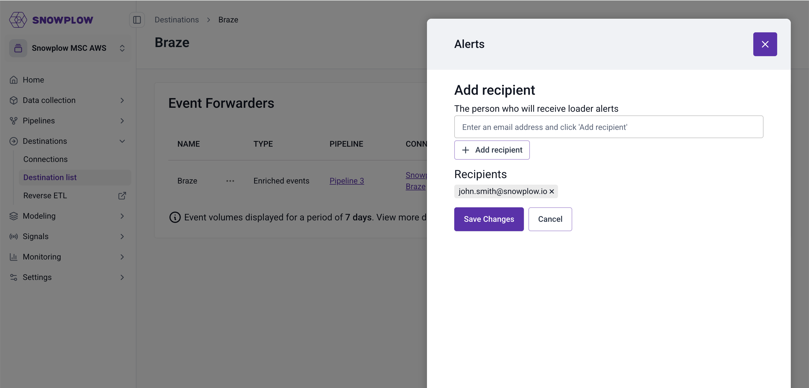

This page outlines how to monitor event forwarder performance and diagnose delivery issues. Snowplow provides both summary metrics and detailed failed event logs to help you understand failure patterns and troubleshoot specific problems.

## Failure types and handling

Snowplow handles event forwarding failures differently depending on the type of error.

### Data processing failures

These failures occur when there are issues with the event data itself or how in how it's transformed before reaching the destination.

**Transformation failures** occur when Snowplow hits an exception when applying your configured JavaScript transformation. While there are safeguards against deploying invalid JavaScript, transformations may still result in runtime errors. Snowplow treats transformation failures as invalid data and logs them as failed events in your cloud storage bucket without retrying.

**Oversized data failures** results from events exceeding the destination's size limits. Snowplow creates [size violation failed events](docs/api-reference/failed-events/index.md) for these events and logs them to your cloud storage bucket without retrying.

### Destination failures

These failures occur when the destination's API cannot accept or process the event data.

**Transient failures** are those that are expected to succeed on retry. This includes temporary network errors, HTTP 5xx server errors, or rate limiting. Transient failures are automatically retried.

**Setup failures** result from configuration issues that typically require human intervention to resolve, such as invalid API keys or insufficient permissions. When a setup error occurs, Snowplow will trigger email alerts to the configured list of users. For more information on alerting, see [configuring setup alerts](#configuring-setup-alerts) on this page.
<!-- TODO: what happens when we hit a setup failure?-->

**Other unrecoverable failures** are bad requests that won't succeed on retry, such as those with missing or invalid fields. These often map to HTTP 400 response codes. Snowplow will log them as failed events in your cloud storage bucket without retrying.

Failure types are defined per destination based on their expected HTTP response codes. See the list of [available destinations](/docs/destinations/forwarding-events/integrations/index.md) for destination-specific details on retry policies and error handling.

### What happens when events fail

When any type of failure occurs, Snowplow can take one or more of the following actions:

- **Automatic retries**: transient failures are automatically retried according to each destination's retry policy. For all HTTP API destinations, Snowplow will retry up to 5 times with exponential backoff.
- **Failed event logging**: all non-retryable failures are routed to your configured failure destination, which is typically a cloud storage bucket, where you can inspect them further. This includes transformation failures, oversized data failures, unrecoverable failures, and transient failures that have exceeded their retry limit. For how to query these logs, see [Inspecting and debugging failures](#inspecting-and-debugging-failures) on this page.
- **Setup alerts**: just like warehouse loaders, setup failures trigger email alerts to notify configured users of authentication or configuration problems.

## Configuring setup alerts

Once a forwarder is deployed, you can configure one or more email addresses to send alerts when setup failures occur. Follow the steps below to configure the alerts.

1. Navigate to **Destinations** > **Destinations list** from the navigation bar and click the **Details** button on a destination card to open the **Destination details** page.
2. On the table of forwarders, click the three dots next to the forwarder you want to configure alerting for and select **Alerts**.
3. You'll see a modal where you can enter the email addresses you want to be alerted in case of setup errors. Click **Save Changes** to confirm.



## Metrics and monitoring

You can monitor forwarders in a few ways:

- **Console metrics**: you can view high-level delivery statistics in BDP Console.
- **Cloud monitoring metrics**: forwarders emit a set of metrics to your cloud provider's observability service.
- **Failed event logs**: for failed deliveries, Snowplow saves detailed logs to your cloud storage bucket. Consume these logs for automated monitoring in your observability platform of choice.

### Console metrics

In Snowplow Console, you can see the number of filtered, failed, and successfully delivered events over the last seven days.

To view these metrics, navigate to **Destinations** > **Destinations list** and select the destination you'd like to view. On the event forwarders overview table, you will see metrics for each forwarder configured for that destination.


### Cloud monitoring metrics

:::info
Forwarder cloud metrics are only available for [BDP Enterprise](/docs/get-started/snowplow-bdp/index.md#enterprise-in-your-own-cloud) customers.
:::

Forwarders emit the following metrics in your cloud provider's monitoring service:

- `target_success`: events successfully delivered to your destination
- `target_failed`: events that failed delivery but are eligible for retry
- `message_filtered`: events filtered out based on the forwarder's JavaScript filter expression
- `failure_target_success`: events that failed with unrecoverable errors, such as transformation errors, and logged to your cloud storage bucket

You can find forwarder metrics in the following locations based on which cloud provider you use:

- **AWS**: CloudWatch metrics under `snowplow/event-forwarding` namespace
- **GCP**: Cloud Monitoring metrics with `snowplow_event_forwarding` prefix

To get notified of any issues, you can use these metrics to define [CloudWatch alarms](https://docs.aws.amazon.com/AmazonCloudWatch/latest/monitoring/AlarmThatSendsEmail.html) or [Cloud Monitoring alerts](https://cloud.google.com/monitoring/alerts).

## Inspecting and debugging failures

This section explains how to find and query failed event logs.

### Finding failed event logs

To better understand why a failure has occurred, you can directly access and review detailed failed delivery logs in file storage. The logs are automatically saved as [failed events](/docs/data-product-studio/data-quality/failed-events/exploring-failed-events/file-storage/index.md) in your Snowplow cloud storage bucket under the prefix:
`/{pipeline_name}/partitioned/com.snowplowanalytics.snowplow.badrows.event_forwarding_errors/`

For more details on where to find failed events, see [Accessing failed events in file storage](/docs/data-product-studio/data-quality/failed-events/exploring-failed-events/file-storage/index.md).

Failed event logs are formatted according to the [`event_forwarding_error`](https://iglucentral.com/?q=event_forwarding_error) schema and contain:

- **Original event data**: the complete Snowplow event that failed
- **Error details**: specific error type and message
- **Failure timestamp**: when the error occurred
- **Transformation state**: data state at the point of failure

### Querying failed event logs

You can query failed events using [Athena](https://aws.amazon.com/athena/) on AWS or [BigQuery external tables](https://cloud.google.com/bigquery/docs/external-tables) on GCP.

```mdx-code-block
import Tabs from '@theme/Tabs';
import TabItem from '@theme/TabItem';

<Tabs groupId="cloud" queryString>
  <TabItem value="aws" label="AWS" default>
```

**1. Create a table and load the data**

To make the logs easier to query, run the following query to create a table:
```sql
CREATE EXTERNAL TABLE snowplow_event_forwarding_failures (
  data struct<payload:string,
              processor:struct<artifact:string,
                              version:string
              >,
              failure:struct<errorCode:string,
                            errorMessage:string,
                            errorType:string,
                            latestState:string,
                            timestamp:string>
              >
  )
ROW FORMAT SERDE 'org.openx.data.jsonserde.JsonSerDe'
LOCATION 's3://{BUCKET_NAME}/{PIPELINE_NAME}/partitioned/com.snowplowanalytics.snowplow.badrows.event_forwarding_error/'
```
If the table already exists, run the following query to pull in new data:

```sql
MSCK REPAIR TABLE event_forwarding_failures
```

**2. Explore failure records**

Use the query below to view a sample of failure records:

```sql
SELECT
    data.failure.timestamp,
    data.failure.errorType,
    data.failure.errorCode,
    data.failure.errorMessage,
    data.processor.artifact,
    data.processor.version,
    data.failure.latestState, -- these are last because they can be quite large
    data.payload
FROM event_forwarding_failures
LIMIT 10
```

**3. Example queries**

Summarize the most common types of errors:

```sql
SELECT
    data.failure.errorType,
    data.failure.errorCode,
        -- time range for each - is the issue still happening?
    MIN(data.failure.timestamp) AS minTstamp,
    MAX(data.failure.timestamp) AS maxTstamp,
        -- How many errors overall,
    count(*) AS errorCount,
        -- There might just be lots of different messages for the same error
        -- If this close to error count, the messages for a single error might just have high cardinality - worth checking the messages themselves
        -- If it's a low number, we might have more than one issue
        -- If it's 1, we have only one issue and the below message is shared by all
    count(DISTINCT data.failure.errorMessage) AS distinctErrorMessages,
        -- a sample of error message. You may need to look at them individually to get the full picture
    MIN(data.failure.errorMessage) AS sampleErrorMessage
FROM event_forwarding_failures
GROUP BY 1, 2
ORDER BY errorCount DESC -- Most errors first
LIMIT 10
```

View transformation errors:

```sql
SELECT
    data.failure.timestamp,
    data.failure.errorType,
    data.failure.errorCode,
    data.failure.errorMessage,
    data.processor.artifact,
    data.processor.version,
    data.failure.latestState,
    data.payload
FROM event_forwarding_failures
WHERE data.failure.errorType = 'transformation'
LIMIT 50
```

View API errors:

```sql
SELECT
    data.failure.timestamp,
    data.failure.errorType,
    data.failure.errorCode,
    data.failure.errorMessage,
    data.processor.artifact,
    data.processor.version,
    data.failure.latestState,
FROM event_forwarding_failures
WHERE data.failure.errorType = 'api'
LIMIT 50
```

Filter based on a date and hour:
```sql
-- Note that the times in the paths are for the creation of the file, not the failure time

SELECT
    data.failure.timestamp,
    data.failure.errorType,
    data.failure.errorCode,
    data.failure.errorMessage,
    data.processor.artifact,
    data.processor.version,
    data.failure.latestState, -- these are last because they can be quite large
    data.payload
FROM event_forwarding_failures
WHERE "$path" LIKE '%2025-07-29-16%' -- File paths are timestamped like this, so we can limit our queries this way
LIMIT 50
```

Filter for a range of timestamps:

```sql
SELECT
    data.failure.timestamp,
    data.failure.errorType,
    data.failure.errorCode,
    data.failure.errorMessage,
    data.processor.artifact,
    data.processor.version,
    data.failure.latestState, -- these are last because they can be quite large
    data.payload
FROM event_forwarding_failures
-- Here we need the full path prefix
WHERE "$path" > 's3://{BUCKET_NAME}/{PIPELINE_NAME}/partitioned/com.snowplowanalytics.snowplow.badrows.event_forwarding_error/2025-07-29-16'
AND "$path" < 's3://{BUCKET_NAME}/{PIPELINE_NAME}/partitioned/com.snowplowanalytics.snowplow.badrows.event_forwarding_error/2025-07-29-20'
```

```mdx-code-block
  </TabItem>
  <TabItem value="gcp" label="GCP">
```

**1. Create a dataset**

First, create a dataset to organize your failed event tables:

```sql
CREATE SCHEMA snowplow_failed_events
OPTIONS (
  description = "Dataset for Snowplow failed event analysis",
  location = "EU"  -- Should match the location of your bad rows bucket
);
```

**2. Create an external table and load the data**

To make the logs easier to query, run the following query to create an external table:

```sql
  CREATE OR REPLACE EXTERNAL TABLE snowplow_failed_events.event_forwarding_failures (
    schema STRING,
    data STRUCT<
      failure STRUCT<
        errorCode STRING,
        errorMessage STRING,
        errorType STRING,
        latestState STRING,
        timestamp TIMESTAMP
      >,
      payload STRING,
      processor STRUCT<
        artifact STRING,
        version STRING
      >
    >
  )
  OPTIONS (
    description="Event Forwarding failures",
    format="NEWLINE_DELIMITED_JSON",
    ignore_unknown_values=true,
    uris=["gs://{BUCKET}/partitioned/com.snowplowanalytics.snowplow.badrows.event_forwarding_error/*"]
  );
```

**3. Explore failure records**

Use the query below to view a sample of failure records:

```sql
SELECT
    data.failure.timestamp,
    data.failure.errorType,
    data.failure.errorCode,
    data.failure.errorMessage,
    data.processor.artifact,
    data.processor.version,
    data.failure.latestState, -- these are last because they can be quite large
    data.payload
FROM snowplow_failed_events.event_forwarding_failures
LIMIT 10
```

**4. Example queries**

Summarize the most common types of errors:

```sql
SELECT
    data.failure.errorType,
    data.failure.errorCode,
    -- time range for each - is the issue still happening?
    MIN(data.failure.timestamp) AS minTstamp,
    MAX(data.failure.timestamp) AS maxTstamp,
    -- How many errors overall,
    COUNT(*) AS errorCount,
    -- There might just be lots of different messages for the same error
    -- If this close to error count, the messages for a single error might just have high cardinality - worth checking the messages themselves
    -- If it's a low number, we might have more than one issue
    -- If it's 1, we have only one issue and the below message is shared by all
    COUNT(DISTINCT data.failure.errorMessage) AS distinctErrorMessages,
    -- a sample of error message. You may need to look at them individually to get the full picture
    MIN(data.failure.errorMessage) AS sampleErrorMessage
FROM snowplow_failed_events.event_forwarding_failures
GROUP BY 1, 2
ORDER BY errorCount DESC -- Most errors first
LIMIT 10
```

View transformation errors:

```sql
SELECT
    data.failure.timestamp,
    data.failure.errorType,
    data.failure.errorCode,
    data.failure.errorMessage,
    data.processor.artifact,
    data.processor.version,
    data.failure.latestState,
    data.payload
FROM snowplow_failed_events.event_forwarding_failures
WHERE data.failure.errorType = 'transformation'
LIMIT 50
```

View API errors:

```sql
SELECT
    data.failure.timestamp,
    data.failure.errorType,
    data.failure.errorCode,
    data.failure.errorMessage,
    data.processor.artifact,
    data.processor.version,
    data.failure.latestState
FROM snowplow_failed_events.event_forwarding_failures
WHERE data.failure.errorType = 'api'
LIMIT 50
```

Filter based on a date and hour:

```sql
-- Note that the times in the file paths are for the creation of the file, not the failure time

SELECT
    data.failure.timestamp,
    data.failure.errorType,
    data.failure.errorCode,
    data.failure.errorMessage,
    data.processor.artifact,
    data.processor.version,
    data.failure.latestState, -- these are last because they can be quite large
    data.payload
FROM snowplow_failed_events.event_forwarding_failures
WHERE _FILE_NAME LIKE '%2025/07/29/16%' -- File paths are timestamped like this, so we can limit our queries this way
LIMIT 50
```

Filter for a range of timestamps:

```sql
SELECT
    data.failure.timestamp,
    data.failure.errorType,
    data.failure.errorCode,
    data.failure.errorMessage,
    data.processor.artifact,
    data.processor.version,
    data.failure.latestState, -- these are last because they can be quite large
    data.payload
FROM snowplow_failed_events.event_forwarding_failures
-- Here we need the full path prefix
WHERE _FILE_NAME > 'gs://{BUCKET}/partitioned/com.snowplowanalytics.snowplow.badrows.event_forwarding_error/jsonschema-1/2025/07/29/16'
AND _FILE_NAME < 'gs://{BUCKET}/partitioned/com.snowplowanalytics.snowplow.badrows.event_forwarding_error/jsonschema-1/2025/07/29/20'
```

```mdx-code-block
  </TabItem>
</Tabs>
```
