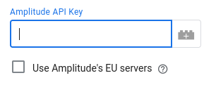
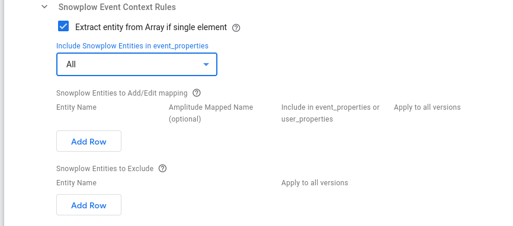
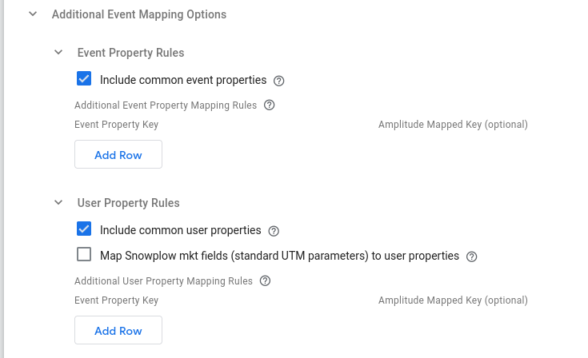
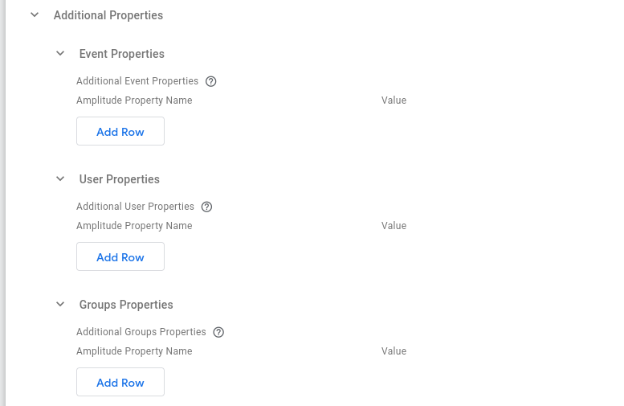
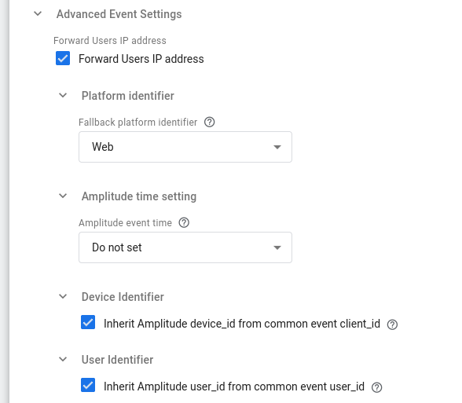
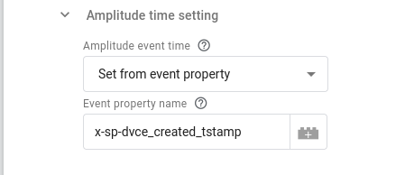

:::tip Populating the Amplitude Session ID

The [Session ID in Amplitude](https://help.amplitude.com/hc/en-us/articles/115002323627-Track-sessions-in-Amplitude) is the session's start time in milliseconds since epoch, so it cannot be derived directly from the `session_id` of your forwarded Snowplow events, which is a UUID. Therefore, in order to populate the Session ID so that your events are stitched into sessions correctly in Amplitude, your Snowplow events need to have the [`client_session` context entity](/docs/collecting-data/collecting-from-own-applications/javascript-trackers/web-tracker/tracker-setup/initialization-options/index.md#session-context) attached. Then the Amplitude Tag will automatically populate the Amplitude Session ID based on the `firstEventTimestamp` property of the session the event belongs to.

:::

## Amplitude API Key (Required)

Set this to the API of your Amplitude HTTP API Data Source.



### Use Amplitude's EU servers

Enable this option to send the data to Amplitude's EU Residency Server [endpoint](https://www.docs.developers.amplitude.com/analytics/apis/http-v2-api/#endpoints), instead of the default standard server endpoint.

## Snowplow Event Mapping Options

### Include Self Describing event

Indicates if a Snowplow Self Describing event should be in the `event_properties` object of the Amplitude event.

### Snowplow Event Context Rules

This section describes how the Amplitude tag will use the context Entities attached to a Snowplow Event.



#### Extract entity from Array if single element

Snowplow Entities are always in Arrays, as multiple of the same entity can be attached to an event. This option will pick the single element from the array if the array only contains a single element.

#### Include Snowplow Entities in event_properties

Using this drop-down menu you can specify whether you want to Include `All` or `None` of the Snowplow context entities in Amplitude's `event_properties`.

#### Snowplow Entities to Add/Edit mapping

Using this table you can specify in each row a specific mapping for a particular context entity. In the columns provided you can specify:

- The Entity name to add/edit-mapping (required).¹
- The key you could like to map it to (optional: leaving the mapped key blank keeps the same name).
- Whether to add in `event_properties` or `user_properties` of the Amplitude event (default value is `event_properties`).
- Whether you wish the mapping to apply to all versions of the entity (default value is `False`).¹

#### Snowplow Entities to Exclude

Using this table (which is only available if `Include Snowplow Entities in event_properties` is set to `All`), you can specify the context entities you want to exclude from the Amplitude event. In its columns you can specify:

- The Entity name (required).¹
- Whether the exclusion applies to all versions of the entity (default value is `False`).¹

:::note

¹ How to specify the **Entity Name** and its relation to **Apply to all versions** option:

Entity Names can be specified in 3 ways:

1. By their Iglu Schema tracking URI (e.g. `iglu:com.snowplowanalytics.snowplow/client_session/jsonschema/1-0-2`)

2. By their enriched name (e.g. `contexts_com_snowplowanalytics_snowplow_client_session_1`)

3. By their key in the client event object, which is the GTM SS Snowplow prefix (`x-sp-`) followed by the enriched entity name (e.g. `x-sp-contexts_com_snowplowanalytics_snowplow_client_session_1`)

Depending on the value set for the **Apply to all versions** column, the major version number from the 2nd and 3rd naming option above may be excluded. More specifically, this is only permitted if **Apply to all versions** is set to `True`.

:::

<details>

<summary><i>pre-v0.2.0</i></summary>

#### Snowplow Event Context Rules

##### Extract entity from Array if single element

Snowplow Entities are always in Arrays, as multiple of the same entity can be attached to an event. This option will pick the single element from the array if the array only contains a single element.

##### Include all Entities in event_properties

Leaving this option enabled ensures that all Entities on an event will be included within the Event Properties of the Amplitude event.

If disabling this, individual entities can be selected for inclusion. These entities can also be remapped to have different names in the Amplitude event, and can be included in either event properties or user properties. The entity can be specified in two different formats:

- Major version match: `x-sp-contexts_com_snowplowanalytics_snowplow_web_page_1` where `com_snowplowanalytics_snowplow` is the event vendor, `web_page` is the schema name and `1` is the Major version number. `x-sp-` can also be omitted from this if desired
- Full schema match: `iglu:com.snowplowanalytics.snowplow/web_page/jsonschema/1-0-0`

##### Include unmapped entities in event_properties

If remapping or moving some entities to User Properties with the above customization, you may wish to ensure all unmapped entities are still included in the event. Enabling this option will ensure that all entities are mapped into the Amplitude event.

</details>

## Additional Event Mapping Options

If you wish to map other properties from a Client event into an Amplitude event they can be specified in this section.



### Event Property Rules

#### Include common event properties

Enabling this ensures properties from the [Common Event](https://developers.google.com/tag-platform/tag-manager/server-side/common-event-data) are automatically mapped to the Amplitude Event Properties.

#### Additional Event Property Mapping Rules

Specify the Property Key from the Client Event, and then the key you could like to map it to or leave the mapped key blank to keep the same name. You can use Key Path notation here (e.g. `x-sp-tp2.p` for a Snowplow events platform or `x-sp-contexts.com_snowplowanalytics_snowplow_web_page_1.0.id` for a Snowplow events page view id (in array index 0) or pick non-Snowplow properties if using an alternative Client. These keys will populate the Amplitude `eventProperties` object.

### User Property Rules

#### Include common user properties

Enabling this ensures user_data properties from the [Common Event](https://developers.google.com/tag-platform/tag-manager/server-side/common-event-data) are automatically mapped to the Amplitude Event Properties.

#### Map Snowplow mkt fields (standard UTM parameters) to user properties

Enabling this option automatically maps all the marketing (`mkt_` prefixed) fields of the Snowplow event to the standard UTM parameters in Amplitude's user properties.

#### Additional User Property Mapping Rules

Specify the Property Key from the Client Event, and then the key you could like to map it to or leave the mapped key blank to keep the same name. You can use Key Path notation here (e.g. `x-sp-tp2.p` for a Snowplow events platform or `x-sp-contexts.com_snowplowanalytics_snowplow_web_page_1.0.id` for a Snowplow events page view id (in array index 0) or pick non-Snowplow properties if using an alternative Client. These keys will populate the Amplitude `eventProperties` object.

### Groups Property Rules

:::note

This configuration option is relevant **only if** you have set up [account-level reporting in Amplitude](https://help.amplitude.com/hc/en-us/articles/115001765532).

:::

#### Groups Property Mapping Rules

Specify the Property Key from the GTM Event, and the key you would like to map it to or leave the mapped key blank to keep the same name. You can use Key Path notation here (e.g. `x-sp-tp2.p` for a Snowplow events platform or `x-sp-contexts.com_snowplowanalytics_snowplow_web_page_1.0.id` for a Snowplow events page view id (in array index 0). These keys will populate the Amplitude `groups` object.

## Additional Properties

In this section you can additionally set specified event or user properties to custom values (e.g. through a GTM Server-side variable).



### Event Properties

Using the **Additional Event Properties** table allows you to set additional **event** properties in Amplitude payload. To do so add a row and simply specify the property name for Amplitude `event_properties` and then the value you would like to set it to.

### User Properties

Using the **Additional User Properties** table allows you to set additional **user** properties in Amplitude payload. Similarly to the previous table in the section, add a row and specify the property name for Amplitude `user_properties` and then the value you would like to set it to.

### Groups Properties

:::note

This configuration option is relevant **only if** you have set up [account-level reporting in Amplitude](https://help.amplitude.com/hc/en-us/articles/115001765532).

:::

Using the **Additional Groups Properties** table allows you to set additional **groups** properties in Amplitude payload. Similarly to the previous tables in the section, add a row and specify the property name for Amplitude `groups` object and then the value you would like to set it to.

## Advanced Event Settings

In this section you can find advanced configuration parameters.



### Forward User IP address

Enabling this will forward the IP Address to Amplitude, otherwise Amplitude will not receive the users IP Address (default: `True`).

### Fallback platform identifier

If there is no Platform property on the Client event, this is the value which the Tag will forward to Amplitude (default: `Web`).

### Amplitude time setting

This option allows you to decide whether the event time of the Amplitude event will be set. The available options are:

- `Do not set` (default): this means the event time will be set automatically by Amplitude.
- `Set to current timestamp`: sets the Amplitude event time to the current timestamp.
- `Set from event property`: sets the Amplitude event time from the client event property. For example, in the image below the Amplitude's event time will be set from the device created timestamp (`dvce_created_tstamp`) of the Snowplow event (`x-sp-` prefix in the client event):



### Device Identifier

#### Inherit Amplitude `device_id` from common event `client_id`

By default the Amplitude tag sets the `device_id` property of the Amplitude event from the `client_id` property of the common event. Unchecking this tick box allows you to override the value for `device_id` in Amplitude event payload.

### User Identifier

#### Inherit Amplitude `user_id` from common event `user_id`

By default the Amplitude tag sets the `user_id` property of the Amplitude event from the `user_id` property of the common event. Unchecking this tick box allows you to override the value for `user_id` in Amplitude event payload.

## Logs Settings

Through the Logs Settings you can control the logging behavior of the Amplitude Tag. The available options are:

- `Do not log`: This option allows you to completely disable logging. No logs will be generated by the Tag.
- `Log to console during debug and preview`: This option enables logging only in debug and preview containers. This is the **default** option.
- `Always`: This option enables logging regardless of container mode.

:::note

Please take into consideration that the logs generated may contain event data.

:::

The logs generated by the Amplitude GTM SS Tag are standardized JSON strings.
The standard log properties are:

```json
{
    "Name": "Amplitude HTTP API V2", // the name of the tag
    "Type": "Message",   // the type of log (one of "Message", "Request", "Response")
    "TraceId": "xxx",    // the "trace-id" header if exists
    "EventName": "xxx"   // the name of the event the tag fired at
}
```

Depending on the type of log, additional properties are logged:

| Type of log | Additional information                                         |
|-------------|----------------------------------------------------------------|
| Message     | “Message”                                                      |
| Request     | “RequestMethod”, “RequestUrl”, “RequestHeaders”, “RequestBody” |
| Response    | “ResponseStatusCode”, “ResponseHeaders”, “ResponseBody”        |
