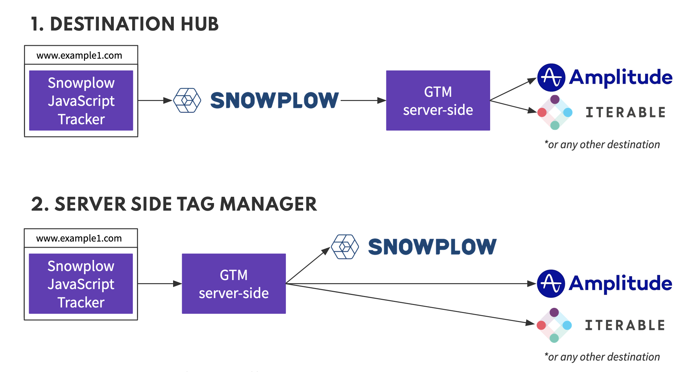

To support sending events to adjacent destinations, Snowplow works with Google Tag Manager Server Side. There are both Snowplow Authored and Vendor/Community authored Tags which will allow event data to be forwarded to different destinations.

Before reading this documentation, we recommend you become familiar with [the fundamentals of Server Side tagging](https://developers.google.com/tag-platform/tag-manager/server-side/intro).

Taking an approach with Snowplow and GTM SS offers many additional flexibility and control:

- Full visibility into all transformations on the data
- Ability to evolve sophistication over time
- All data remains in your private cloud until you choose to forward it
- Ease of setup due to rich libraries of tags and familiar GTM UI

## Configuration Options

GTM SS with Snowplow can be setup in two different configurations.

### Destinations Hub (Post-pipeline)

Use GTM SS to relay enriched events to destinations. Events are sent to GTM SS after being processed by your Snowplow Pipeline.

* For Open Source, see [Snowbridge](/docs/destinations/forwarding-events/snowbridge/index.md).
* For Snowplow BDP, you can [request setup](https://console.snowplowanalytics.com/destinations/catalog) through the Console.

### Server Side Tag Manager (Pre-pipeline)

Use GTM SS to relay raw events before the Snowplow pipeline to destinations, including to your Snowplow pipeline.

### Principles for AWS deployment

:::info For Snowplow BDP customers

GTM SS **should** be deployed into a different account to the Snowplow sub-account to maintain full segmentation of the infrastructure that Snowplow manages from that which is managed by the Snowplow customer.  

It would be possible to set up a separate VPC within the Snowplow sub-account but it is discouraged. VPC peering would be required to keep the traffic private otherwise traffic would go over public internet.

GTM SS as a Destination Hub is normally intended to be public facing, however as a Server Side Tag Manager it could use both public internet routes and VPC peering to fan out traffic via private routes.
:::

## Deploying Google Tag Manager Server Side

GTM SS must first be deployed before it can be used. This can easily achieved by deploying to GCP App Engine from directly within the GTM User Interface. Alternatively, docker images are available for other deployment options, such as on AWS or with Kubernetes.

- [App Engine Setup Guide](https://developers.google.com/tag-platform/tag-manager/server-side/script-user-guide)
- [Manual Setup](https://developers.google.com/tag-platform/tag-manager/server-side/manual-setup-guide)

## Snowplow Client

To receive events in your GTM SS container, the Snowplow Client must be installed. This works for both events direct from the tracker, or enriched events from the pipeline.

The Snowplow Client populates the common event data so many GTM SS tags will just work, however it also populates a set of additional properties to ensure the rich Snowplow event data is available to Tags which wish to take advantage of this, such as the Snowplow Authored Tags.

## Snowplow Tag

If using GTM SS as a Server Side Tag Manager for Snowplow JavaScript Tracker events, you will want to ensure you forward these events to your Snowplow Collector. The Snowplow Tag will automatically forward any events the Snowplow Client receives once it has been configured with your Collector URL. It can also construct Snowplow events from other GTM SS Clients such as GAv4.

## Snowplow Authored Tags

Snowplow have created a number of GTM SS Tags which work best with the Snowplow Client and make use of the rich data available from Snowplow tracker or Enriched events.
