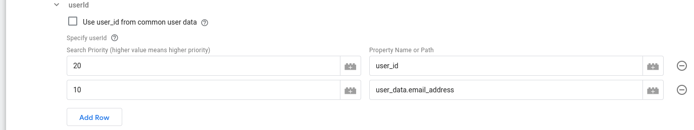
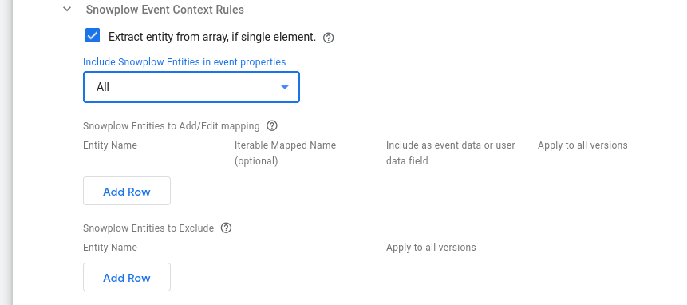

## Iterable API Key (Required)

Set this to the API of your Iterable HTTP API Data Source.

Iterable provides four different types of API keys, each of which can access a different subset of Iterable's API endpoints. For the endpoints currently in use (`events/track` and `users/update`) the Javascript type key has enough permissions. The Mobile and Standard key types have more permissions than the Javascript type, so can also be used.

## Identity Settings

Iterable requires users to be identified to work best. The options in this section configure how you wish to identify users to Iterable based on your Snowplow events.

### Identifiers

#### Use client_id for anonymous users

Specify whether `client_id` is used to create a placeholder email for anonymous users. This is useful for implementations where there is no identifiers for a user besides device identifiers (such as Browser Cookies).

#### email

##### Use email_address from common user data

For Snowplow Tracking, the common user data can be populated by using the `iglu:com.google.tag-manager.server-side/user_data/jsonschema/1-0-0` context entity. This schema is available on [Iglu Central](https://github.com/snowplow/iglu-central/blob/853357452300b172ebc113d1d75d1997f595142a/schemas/com.google.tag-manager.server-side/user_data/jsonschema/1-0-0).

This option is enabled by default. Disabling it allows for any other properties of the event to be selected for the `email` property on the Iterable event.

##### Specify email

As mentioned above, this table is revealed when disabling the "Use email_address from common user data" configuration option. Using this table allows you to specify key paths to look for the `email` value. You can also set the search priority to denote the preference for the value to use.

The columns of this table are:

- **Search Priority**: The priority of a key path when looking for `email` (higher number means higher priority).
- **Property Name or Path**: The key path to look for in the server-side common event.

#### userId

##### Use user_id from common user data

Iterable can also accept a User Id, rather than the preferred e-mail address. Enabling this property will use the `user_id` property from the server-side common event as the `userId` identifier of the user.

##### Specify userId

This table is revealed when disabling the "Use user_id from common user data" configuration option. Using this table allows you to specify key paths to look for the `userId` value. You can also set the search priority to denote the preference for the value to use.

The columns of this table are:

- **Search Priority**: The priority of a key path when looking for `userId` (higher number means higher priority).
- **Property Name or Path**: The key path to look for in the server-side common event.

As an example of how Search Priority works, according to the following setup, in order to set the value for Iterable's `userId`, the Tag will first look for `user_id` in common event. If that is not found, then it will use the value of `user_data.email_address`:



### Identity Events

#### Use the default `identify` event

Iterable allows for user information to be updated once a user has identified themselves (for example, to update their placeholder email to their real email address).

To Identify a user to Iterable, you can send a Self Describing `identify` event. This schema is [available on Iglu Central](https://github.com/snowplow/iglu-central/blob/master/schemas/com.snowplowanalytics.snowplow/identify/jsonschema/1-0-0).

For example, using the JavaScript Tracker v3, this would look like:

```javascript
window.snowplow('trackSelfDescribingEvent', {
  schema: 'iglu:com.snowplowanalytics.snowplow/identify/jsonschema/1-0-0',
  data: {
    id: '2c5ba856-ee07-47b5-a3a6-63100026ed63',
    email: 'john.doe@example.com'
  }
})
```

If you would like to specify your own event, disabling this option allows you to select your own event name and properties which can used to fire identity updates to Iterable.

#### Specify identity event(s) by event name

This multi-line text box is revealed when disabling the "Use the default `identify` event" configuration option above.

In general, "identity events" are the event names which will make the Iterable Tag call the `/users/update` [API endpoint](https://api.iterable.com/api/docs#users_updateUser) (create or update a user), using the identifiers and the user\_data specified by the tag configuration. These events might be different than the default Snowplow Identify schema, for example sign\_up, login etc, from your own custom event schemas.

## Snowplow Event Mapping Options

### Include Self Describing event

Indicates if a Snowplow Self Describing event should be in the `dataFields` object.

### Snowplow Event Context Rules

This section describes how the Iterable tag will use the context Entities attached to a Snowplow Event.



#### Extract entity from Array if single element

Snowplow Entities are always in Arrays, as multiple of the same entity can be attached to an event. This option will pick the single element from the array if the array only contains a single element.

#### Include Snowplow Entities in event properties

Using this drop-down menu you can specify whether you want to Include `All` or `None` of the Snowplow context entities in Iterable's within the Event Data fields of the Iterable event.


If disabling this, individual entities can be selected for inclusion. These entities can also be remapped to have different names in the Iterable event, and can be included in either event data or user data. The entity can be specified in two different formats:

- Major version match: `x-sp-contexts_com_snowplowanalytics_snowplow_webPage_1` where `com_snowplowanalytics_snowplow` is the event vendor, `webPage` is the schema name and `1` is the Major version number. `x-sp-` can also be omitted from this if desired
- Full schema match: `iglu:com.snowplowanalytics.snowplow/webPage/jsonschema/1-0-0`

#### Snowplow Entities to Add/Edit mapping

Using this table you can specify in each row a specific mapping for a particular context entity. In the columns provided you can specify:

- The Entity name to add/edit-mapping (required).¹
- The key you could like to map it to (optional: leaving the mapped key blank keeps the same name).
- Whether to add in event data fields or user data fields of the Iterable event (default value is `event data`).
- Whether you wish the mapping to apply to all versions of the entity (default value is `False`).¹

#### Snowplow Entities to Exclude

Using this table (which is only available if `Include Snowplow Entities in event properties` is set to `All`), you can specify the context entities you want to exclude from the Iterable event. In its columns you can specify:

- The Entity name (required).¹
- Whether the exclusion applies to all versions of the entity (default value is `False`).¹

:::note

¹ How to specify the **Entity Name** and its relation to **Apply to all versions** option:

Entity Names can be specified in 3 ways:

1. By their Iglu Schema tracking URI (e.g. `iglu:com.snowplowanalytics.snowplow/client_session/jsonschema/1-0-2`)

2. By their enriched name (e.g. `contexts_com_snowplowanalytics_snowplow_client_session_1`)

3. By their key in the client event object, which is the GTM SS Snowplow prefix (`x-sp-`) followed by the enriched entity name (e.g. `x-sp-contexts_com_snowplowanalytics_snowplow_client_session_1`)

Depending on the value set for the **Apply to all versions** column, the major version number from the 2nd and 3rd naming option above may be excluded. More specifically, this is only permitted if **Apply to all versions** is set to `True`.

:::

<details>

<summary><i>pre-v0.2.0</i></summary>

#### Snowplow Event Context Rules

##### Extract entity from Array if single element

Snowplow Entities are always in Arrays, as multiple of the same entity can be attached to an event. This option will pick the single element from the array if the array only contains a single element.

##### Include all Entities in event_properties

Leaving this option enabled ensures that all Entities on an event will be included within the Event Data of the Iterable event.

If disabling this, individual entities can be selected for inclusion. These entities can also be remapped to have different names in the Iterable event, and can be included in either event data or user data. The entity can be specified in two different formats:

- Major version match: `x-sp-contexts_com_snowplowanalytics_snowplow_webPage_1` where `com_snowplowanalytics_snowplow` is the event vendor, `webPage` is the schema name and `1` is the Major version number. `x-sp-` can also be omitted from this if desired
- Full schema match: `iglu:com.snowplowanalytics.snowplow/webPage/jsonschema/1-0-0`

##### Include unmapped entities in event_properties

If remapping or moving some entities to User Data with the above customization, you may wish to ensure all unmapped entities are still included in the event. Enabling this option will ensure that all entities are mapped into the Iterable event.

</details>

### Additional Event Mapping Options

If you wish to map other properties from a Client event into an Iterable event they can be specified in this section.

#### Event Property Rules

##### Include common event properties

Enabling this ensures properties from the [Common Event](https://developers.google.com/tag-platform/tag-manager/server-side/common-event-data) are automatically mapped to the Iterable Event Data.

##### Additional Event Property Mapping Rules

Specify the Property Key from the Client Event, and then the key you could like to map it to or leave the mapped key blank to keep the same name. You can use Key Path notation here (e.g. `x-sp-tp2.p` for a Snowplow events platform or `x-sp-contexts.com_snowplowanalytics_snowplow_web_page_1.0.id` for a Snowplow events page view id (in array index 0) or pick non-Snowplow properties if using an alternative Client.

#### User Property Rules

##### Include common user properties

Enabling this ensures user_data properties from the [Common Event](https://developers.google.com/tag-platform/tag-manager/server-side/common-event-data) are automatically mapped to the Iterable Event Properties.

##### Additional User Property Mapping Rules

Specify the Property Key from the Client Event, and then the key you could like to map it to or leave the mapped key blank to keep the same name. You can use Key Path notation here (e.g. `x-sp-tp2.p` for a Snowplow events platform or `x-sp-contexts.com_snowplowanalytics_snowplow_web_page_1.0.id` for a Snowplow events page view id (in array index 0) or pick non-Snowplow properties if using an alternative Client.

## Advanced Event Settings

### Merge user dataFields

Enabling this option will merge the user dataFields when updating an Iterable user, instead of replacing with the new user data, which is the default behavior.

## Logs Settings

_(Available since v0.2.0)_

Through the Logs Settings you can control the logging behavior of the Iterable Tag. The available options are:

- `Do not log`: This option allows you to completely disable logging. No logs will be generated by the Tag.
- `Log to console during debug and preview`: This option enables logging only in debug and preview containers. This is the **default** option.
- `Always`: This option enables logging regardless of container mode.

:::note

Please take into consideration that the logs generated may contain event data.

:::

The logs generated by the Iterable GTM SS Tag are standardized JSON strings.
The standard log properties are:

```json
{
    "Name": "Iterable",  // the name of the tag
    "Type": "Message",   // the type of log (one of "Message", "Request", "Response")
    "TraceId": "xxx",    // the "trace-id" header if exists
    "EventName": "xxx"   // the name of the event the tag fired at
}
```

Depending on the type of log, additional properties are logged:

| Type of log | Additional information                                         |
| ----------- | -------------------------------------------------------------- |
| Message     | “Message”                                                      |
| Request     | “RequestMethod”, “RequestUrl”, “RequestHeaders”, “RequestBody” |
| Response    | “ResponseStatusCode”, “ResponseHeaders”, “ResponseBody”        |
