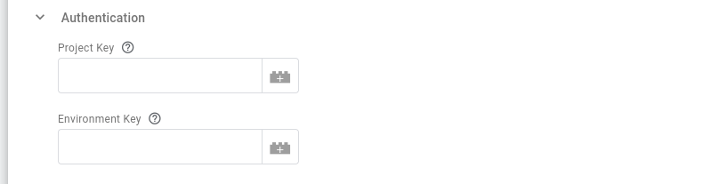

This is the configuration of the LaunchDarkly Tag.

## Event Name (Required)

This is the value that identifies your metric. When you create your metric in LaunchDarkly, its Event name must exactly match this value.

## Metric Type


This section allows you to select the Metric Type for this Tag. The options are:

1. **Numeric Metric** (default): Choosing this metric type reveals the [Metric Options](#metric-options) configuration section, where you must specify a Metric Value.
2. **Conversion**: Conversion Metrics should just be triggered and the metric name will be sent as a conversion.

## Authentication



### Project Key (Required)

In this text box you need to provide the key for the **project** your metric events pertain to. You can find it under Environments on the Projects tab on your LaunchDarkly Account settings page.

### Environment Key (Required)

In this text box you need to provide the key for the **environment** your metric events pertain to. You can find it under Environments on the Projects tab on your LaunchDarkly Account settings page.

## Authorization


### Access Token (Required)

In this text box you need to provide the access token to be used for authorizing the requests to the LaunchDarkly API. This can be either a personal or service token. The access token must have a role that allows the `importEventData` environment action. It is strongly recommended to use a dedicated access token with this permission.

## Metric Options


This configuration section is available only if your [Metric Type](#metric-type) is set to **Numeric Metric**. In that case, this configuration option is required to be set.

### Event property for Metric Value

In this section you can specify the event property whose value will populate the LaunchDarkly `metricValue` object.

:::warning

Since the metric value needs to be a number (e.g. `10.0`), the Tag **will fail**, if you specify an event property whose value is not a number.

:::

In order to specify the common event property of interest, Key Path notation can be used (e.g. `x-sp-contexts_com_acme_transaction_1.0.total` to select the `total` value from an entity (at array index 0)) as your metric value.

## Context Keys

### User Options


This section allows you to configure how to populate the value of the user property that uniquely identifies the context that the LaunchDarkly metric is about.

#### User Value

With this drop-down option you can select how to derive the value for the `user` in your `contextKeys`. The available options are:

1. **Common User ID** (default): Using this option the Tag will populate the `user` from the `user_id` property of the common event.
2. **Custom**: This option allows you to specify an alternative property of the event to be used. Selecting this option reveals the following text-box to specify which event property to use.
3. **Do not populate**: Selecting this option will not populate `user` as a context key.

#### Event property for user context key


This option is revealed if you have previously selected **Custom** as the option for the [User Value](#user-value). In this text box you can specify the Property Key from the GTM Event to use. You can use Key Path notation here if you want to denote a nested key (e.g. `x-sp-contexts_com_snowplowanalytics_snowplow_client_session_1.0.userId` to use the `userId` from the Snowplow client session entity (in array index 0)).

### Other Context Keys


#### Context Keys to Add

Using this table you can specify context keys depending on your experiment's [randomization units](https://docs.launchdarkly.com/home/creating-experiments/allocation#randomization-units).

## Advanced Event Settings


### LaunchDarkly event creation time

In this section you can specify how to derive the creation time of the event, which populates the `creationDate` in LaunchDarkly payload.

The available options are:

1. **Set to current time** (default): sets the event time to the current timestamp.
2. **Set from event**: sets the event time from a client event property.

#### Event property name


This text box is revealed if the [LaunchDarkly event creation time](#launchdarkly-event-creation-time) is set to "Set from event". Here you can specify the event property to use in order to set the event time (in Unix milliseconds). For example in the above image, the LaunchDarkly creation date will be set from the device created timestamp (`dvce_created_tstamp`) of the Snowplow event (prefixed with `x-sp-` in the client common event).

## Versioning


The LaunchDarkly event import REST API accepts a `User-Agent` header, which helps identify the source of traffic and debug issues. One of the components to construct this header is the `Version`, which can be any format.

### Version

This configuration section allows you to define the version to be used. For example, you could use the `Container Version` as the version to use. If this is not provided, the Tag will use the string `"1"` instead.

As an example using the default version, the User-Agent header could be like:

```
'User-Agent: MetricImport-Snowplow-int/1'
```

## Logs Settings


Through the Logs Settings you can control the logging behavior of the LaunchDarkly Tag. The available options are:

- `Do not log`: This option allows you to completely disable logging. No logs will be generated by the Tag.
- `Log to console during debug and preview`: This option enables logging only in debug and preview containers. This is the **default** option.
- `Always`: This option enables logging regardless of container mode.

:::note

Please take into consideration that the logs generated may contain event data.

:::

The logs generated by the LaunchDarkly GTM SS Tag are standardized JSON strings.
The standard log properties are:

```json
{
    "Name": "LaunchDarkly Metric Events", // the name of the tag
    "Type": "Message",   // the type of log (one of "Message", "Request", "Response")
    "TraceId": "xxx",    // the "trace-id" header if exists
    "EventName": "xxx"   // the name of the event the tag fired at
}
```

Depending on the type of log, additional properties are logged:

| Type of log | Additional information                                         |
| ----------- | -------------------------------------------------------------- |
| Message     | "Message"                                                      |
| Request     | "RequestMethod", "RequestUrl", "RequestHeaders", "RequestBody" |
| Response    | "ResponseStatusCode", "ResponseHeaders", "ResponseBody"        |
