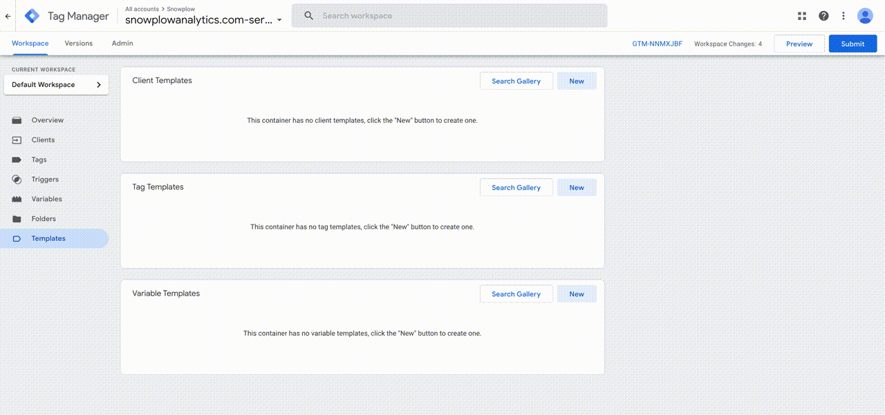
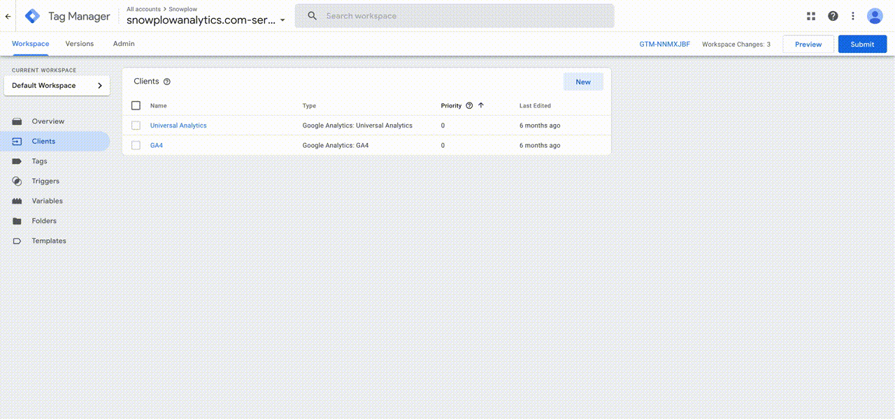
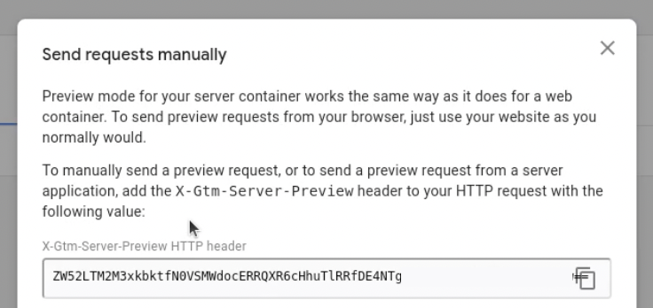

To receive events in your GTM SS container, the Snowplow Client must be installed. This works for both events direct from the tracker, or enriched events from the pipeline.

The Snowplow Client populates the common event data so many GTM SS tags will just work, however it also populates a set of additional properties to ensure the rich Snowplow event data is available to Tags which wish to take advantage of this, such as the Snowplow Authored Tags.

## Template Installation

There are two methods to install the Snowplow Client.

### Tag Manager Gallery

**Coming Soon.** The Gallery for Clients has not yet been made public.

### Manual Installation

1. Download [template.tpl](https://raw.githubusercontent.com/snowplow/snowplow-gtm-server-side-client/main/template.tpl) - Ctrl+S (Win) or Cmd+S (Mac) to save the file, or right click the link on this page and select "Save Link As..."
2. Create a new Client in the Templates section of a Google Tag Manager Server container
3. Click the More Actions menu, in the top right hand corner, and select Import
4. Import `template.tpl` downloaded in Step 1
5. Click Save



## Snowplow Client Setup

With the template installed, you can now add the Snowplow Client to your GTM SS Container.

1. From the Clients tab, select "New", then select the Snowplow Client as your Client Configuration
2. Click Save



## Testing

You can test your Snowplow Client setup by using GTM SS [preview mode](https://developers.google.com/tag-platform/tag-manager/server-side/debug).

Once your debug container is running, obtain your preview header value:




Now you can use the cURL command below. Note:
* Replace `{{your-gtm-ss-url}}` with the URL of your GTM SS container.
* Replace `{{your-preview-header}}` with the value obtained above.

```bash
curl --request POST \
  --url https://{{your-gtm-ss-url}}/com.snowplowanalytics.snowplow/enriched \
  --header 'Content-Type: application/json' \
  --header 'x-gtm-server-preview: {{your-preview-header}}' \
  --data '{
  "app_id": "example-website",
  "platform": "web",
  "etl_tstamp": "2021-11-26T00:01:25.292Z",
  "collector_tstamp": "2021-11-20T00:02:05Z",
  "dvce_created_tstamp": "2021-11-20T00:03:57.885Z",
  "event": "unstruct",
  "event_id": "c6ef3124-b53a-4b13-a233-0088f79dcbcb",
  "txn_id": null,
  "name_tracker": "sp1",
  "v_tracker": "js-3.1.6",
  "v_collector": "ssc-2.3.0-stdout$",
  "v_etl": "snowplow-micro-1.1.2-common-2.0.1",
  "user_id": "jon.doe@email.com",
  "user_ipaddress": "92.231.54.234",
  "user_fingerprint": null,
  "domain_userid": "de81d764-990c-4fdc-a37e-adf526909ea6",
  "domain_sessionidx": 3,
  "network_userid": "ecdff4d0-9175-40ac-a8bb-325c49733607",
  "geo_country": "US",
  "geo_region": "CA",
  "geo_city": "San Francisco",
  "geo_zipcode": "94109",
  "geo_latitude": 37.443604,
  "geo_longitude": -122.4124,
  "geo_location": "37.443604,-122.4124",
  "geo_region_name": "San Francisco",
  "ip_isp": "AT&T",
  "ip_organization": "AT&T",
  "ip_domain": "att.com",
  "ip_netspeed": "Cable/DSL",
  "page_url": "https://snowplowanalytics.com/use-cases/",
  "page_title": "Snowplow Analytics",
  "page_referrer": null,
  "page_urlscheme": "https",
  "page_urlhost": "snowplowanalytics.com",
  "page_urlport": 443,
  "page_urlpath": "/use-cases/",
  "page_urlquery": "",
  "page_urlfragment": "",
  "refr_urlscheme": null,
  "refr_urlhost": null,
  "refr_urlport": null,
  "refr_urlpath": null,
  "refr_urlquery": null,
  "refr_urlfragment": null,
  "refr_medium": null,
  "refr_source": null,
  "refr_term": null,
  "mkt_medium": null,
  "mkt_source": null,
  "mkt_term": null,
  "mkt_content": null,
  "mkt_campaign": null,
  "contexts_org_w3_performance_timing_1": [
    {
      "navigationStart": 1415358089861,
      "unloadEventStart": 1415358090270,
      "unloadEventEnd": 1415358090287,
      "redirectStart": 0,
      "redirectEnd": 0,
      "fetchStart": 1415358089870,
      "domainLookupStart": 1415358090102,
      "domainLookupEnd": 1415358090102,
      "connectStart": 1415358090103,
      "connectEnd": 1415358090183,
      "requestStart": 1415358090183,
      "responseStart": 1415358090265,
      "responseEnd": 1415358090265,
      "domLoading": 1415358090270,
      "domInteractive": 1415358090886,
      "domContentLoadedEventStart": 1415358090968,
      "domContentLoadedEventEnd": 1415358091309,
      "domComplete": 0,
      "loadEventStart": 0,
      "loadEventEnd": 0
    }
  ],
  "se_category": null,
  "se_action": null,
  "se_label": null,
  "se_property": null,
  "se_value": null,
  "unstruct_event_com_snowplowanalytics_snowplow_link_click_1": {
    "targetUrl": "http://www.example.com",
    "elementClasses": [
      "foreground"
    ],
    "elementId": "exampleLink"
  },
  "tr_orderid": null,
  "tr_affiliation": null,
  "tr_total": null,
  "tr_tax": null,
  "tr_shipping": null,
  "tr_city": null,
  "tr_state": null,
  "tr_country": null,
  "ti_orderid": null,
  "ti_sku": null,
  "ti_name": null,
  "ti_category": null,
  "ti_price": null,
  "ti_quantity": null,
  "pp_xoffset_min": null,
  "pp_xoffset_max": null,
  "pp_yoffset_min": null,
  "pp_yoffset_max": null,
  "useragent": null,
  "br_name": null,
  "br_family": null,
  "br_version": null,
  "br_type": null,
  "br_renderengine": null,
  "br_lang": null,
  "br_features_pdf": true,
  "br_features_flash": false,
  "br_features_java": null,
  "br_features_director": null,
  "br_features_quicktime": null,
  "br_features_realplayer": null,
  "br_features_windowsmedia": null,
  "br_features_gears": null,
  "br_features_silverlight": null,
  "br_cookies": null,
  "br_colordepth": null,
  "br_viewwidth": null,
  "br_viewheight": null,
  "os_name": null,
  "os_family": null,
  "os_manufacturer": null,
  "os_timezone": null,
  "dvce_type": null,
  "dvce_ismobile": null,
  "dvce_screenwidth": null,
  "dvce_screenheight": null,
  "doc_charset": null,
  "doc_width": null,
  "doc_height": null,
  "tr_currency": null,
  "tr_total_base": null,
  "tr_tax_base": null,
  "tr_shipping_base": null,
  "ti_currency": null,
  "ti_price_base": null,
  "base_currency": null,
  "geo_timezone": null,
  "mkt_clickid": null,
  "mkt_network": null,
  "etl_tags": null,
  "dvce_sent_tstamp": null,
  "refr_domain_userid": null,
  "refr_dvce_tstamp": null,
  "contexts_com_snowplowanalytics_snowplow_ua_parser_context_1": [
    {
      "useragentFamily": "IE",
      "useragentMajor": "7",
      "useragentMinor": "0",
      "useragentPatch": null,
      "useragentVersion": "IE 7.0",
      "osFamily": "Windows XP",
      "osMajor": null,
      "osMinor": null,
      "osPatch": null,
      "osPatchMinor": null,
      "osVersion": "Windows XP",
      "deviceFamily": "Other"
    }
  ],
  "domain_sessionid": "2b15e5c8-d3b1-11e4-b9d6-1681e6b88ec1",
  "derived_tstamp": "2021-11-20T00:03:57.886Z",
  "event_vendor": "com.snowplowanalytics.snowplow",
  "event_name": "link_click",
  "event_format": "jsonschema",
  "event_version": "1-0-0",
  "event_fingerprint": "e3dbfa9cca0412c3d4052863cefb547f",
  "true_tstamp": "2021-11-20T00:03:57.886Z"
}'
```
