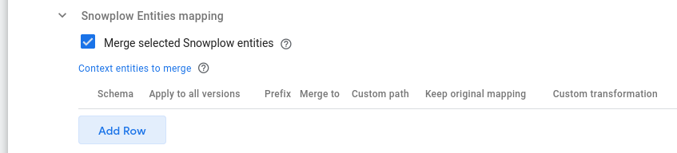
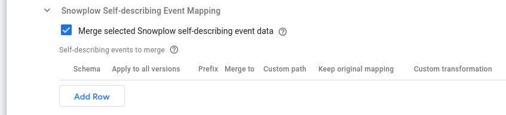
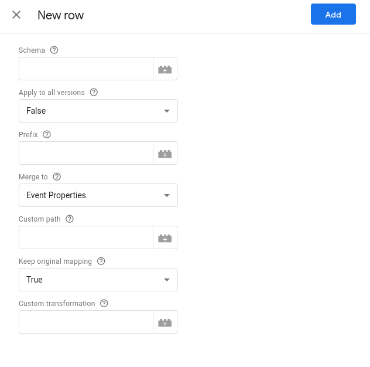

:::tip Populating common User Data

The [GTM Common Event](https://developers.google.com/tag-platform/tag-manager/server-side/common-event-data) has a `user_data` property. To populate this, you can attach a context Entity to your events of this schema: `iglu:com.google.tag-manager.server-side/user_data/jsonschema/1-0-0`, which can be found on [Iglu Central](https://github.com/snowplow/iglu-central/blob/853357452300b172ebc113d1d75d1997f595142a/schemas/com.google.tag-manager.server-side/user_data/jsonschema/1-0-0).

:::

## Forward User IP address

As the container sits between the website user and the Snowplow collector (or other downstream destinations), the users IP will be unknown to the destination. By enabling this option, the users IP address will be included in the events sent to Tags.

By disabling this, you are able to use GTM SS as a proxy which can string user IP addresses from requests. Many tags also offer this functionality at the tag level.

## Populate GAv4 Client Properties

Enabled by default, this option will populate additional properties which the GAv4 requires, that is useful if you want to forward your Snowplow events to the GAv4 Tag.

## sp.js settings

This setting allows for your GTM SS Container to serve your `sp.js` JavaScript Tracker file. This allows you to have first party hosting of your tracker without the need to set up separate hosting or use a third party CDN.

It is recommended to rename `sp.js` if enabling this setting, as many adblockers will block requests to files named `sp.js`. A random string is the best option here.


You can request _any_ version of the Snowplow JavaScript Tracker with this setting enabled. e.g. `https://{{gtm-ss-url}}/3.1.6/776b5b25.js` will load v3.1.6, or `https://{{gtm-ss-url}}/2.18.2/776b5b25.js` will load v2.18.2.

## Additional Options

### Custom POST Path

As many ad blockers will block the default `/com.snowplowanalytics.snowplow/tp2` POST path, it is recommended to change this and then update your trackers initialization to use this custom POST path.

### Claim GET Requests

The default Snowplow path for GET requests is `/i`, as this is so short there is a chance it could conflict with other Clients within your GTM SS Container. If you'd only like your Snowplow Client to listen for POST requests, you can disable this GET endpoint with this setting.

### Include Original `tp2` Event

If using this Client to receive Snowplow Tracker events and then forward to a Snowplow Collector with the Snowplow Tag, you should leave this option enabled as it will allow the Snowplow Tag to forward the original tracker event with no extra processing.

### Include Original Self Describing Event

By default, the self describing event will be "shredded" into a key using the schema name as the key, this is a "lossy" transformation, as the Minor and Patch parts of the jsonschema version will be dropped. This flag populates the original, lossless, Self Describing Event as `x-sp-self_describing_event`.

Let's assume we have a self-describing event following the schema `iglu:com.acme/foobar/jsonschema/1-0-0`. By default, the option to *Include Original Self Describing Event* is disabled. So the Snowplow client by default will include it in the common event as:

```json
"x-sp-self_describing_event_com_acme_foobar_1": {
    "foo": "bar"
}
```

In case the option to *Include Original Self Describing Event* is enabled, then the Snowplow client, if it finds the original event (see note below), will also include it in the common event, resulting in:

```json
"x-sp-self_describing_event_com_acme_foobar_1": {
    "foo": "bar"
},
"x-sp-self_describing_event": {
    "schema": "iglu:com.acme/foobar/jsonschema/1-0-0",
    "data": {
        "foo": "bar"
    }
}
```

:::note

This option only makes sense when using GTM in a [**Server Side Tag Manager (pre-pipeline)**](/docs/destinations/forwarding-events/google-tag-manager-server-side/index.md#configuration-options) architecture, because it only makes a difference when the input is a _raw_ Snowplow event.

In a [**Destinations Hub (post-pipeline)**](/docs/destinations/forwarding-events/google-tag-manager-server-side/index.md#configuration-options) architecture, this option **does not apply**. Effectively, it’s always disabled, regardless of the setting. In the example above, this would mean that the data will contain `x-sp-self_describing_event_com_acme_foobar_1`, but not`x-sp-self_describing_event`.

:::

### Include Original Contexts Array

By default, the contexts will be "shredded" into separate keys using the context name as the key, this is a "lossy" transformation, as the Minor and Patch parts of the jsonschema version will be dropped. If you would like to keep the original "lossless" contexts array (as `x-sp-contexts`), enable this option.

## Advanced common event options


### `client_id`

#### Use default settings for client_id mapping in common event

By default the Snowplow Client sets the `client_id` as follows: If the Snowplow event has the `client_session` context entity attached, its `userId` property is used. Else the `domain_userid` atomic property is used. Disabling this option reveals the following table that allows you to override the default behavior.

#### Specify client_id

You can use this table to specify the rules to set the `client_id` of the common event. For consistency downstream it is suggested to specify properties that apply to all Snowplow events (atomic or through global context entities). The columns of this table are:

- **Priority**: Using this column you can set the priority (higher values mean higher priority) with which the Client will look into the Snowplow event to locate the value to set the `client_id`.
- **Property name or path**: This column refers to the common event, so you can define alternative Snowplow properties using the `x-sp-` prefix before the enriched property name or nested path (using dot notation). Example values: `x-sp-network_userid` or `x-sp-contexts_com_acme_user_1.0.anonymous_identifier`.

### `user_id`

#### Use default settings for user_id mapping in common event

By default the Snowplow Client sets the `user_id` from the corresponding `user_id` property of the Snowplow event. Disabling this option reveals the following table that allows you to override the default behavior.

#### Specify user_id

You can use this table to specify the rules to set the `user_id` of the common event, which will override the default Snowplow Client behavior. For consistency downstream it is suggested to specify properties that apply to all Snowplow events (atomic or through global context entities). The columns of this table are:

- **Priority**: Using this column you can set the priority (higher values mean higher priority) with which the Client will look into the Snowplow event to locate the value to set the `user_id`.
- **Property name or path**: This column refers to the common event, so you can define alternative Snowplow properties using the `x-sp-` prefix before the enriched property name or nested path (using dot notation). For example: `x-sp-contexts_com_acme_user_entity_1.0.email`.

### Snowplow Entities Mapping

:::note

This is an advanced feature and we recommend that you first explore the configuration options of your Tag(s) in case they are enough to cover your use case.

:::

#### Merge selected Snowplow entities

Enable this option to allow merging of Snowplow context data to the Common Event. Checking this box reveals the following table:



#### Context entities to merge

Using this table you can specify the rules to merge Snowplow context entity data to the Common Event. The columns of this table are:


1. **Schema**: (Required) The schema of the context entity to merge.

:::info

The **Schema** can be specified in 3 ways:

- Iglu URI (e.g. `iglu:com.acme/test/jsonschema/1-0-0` )
- Enriched name (e.g. `contexts_com_acme_test_1`)
- Common Event name (e.g. `x-sp-contexts_com_acme_test_1`)

:::

2. **Apply to all versions**: (False/True) Whether the rule applies to all versions of the context entity schema. Default is False.

:::info

When you set **Apply to all versions** to `True`, it will apply the same rule to all versions of the schema, independently of the one mentioned in the **Schema** field.

:::

3. **Prefix**: (Optional) Specify a prefix to use for property names when merging.

4. **Merge to**: (Event Properties/Custom) Specify where to merge the context entity's properties. Default is Event Properties, i.e. to the root level of the common event.

5. **Custom path**: (Optional) The path for custom merging.

:::info

The **Custom path** option applies only if the **Merge to** column is set to `Custom`, else the row is considered invalid.

:::

6. **Keep original mapping**: (True/False) Whether to keep the original context mapping. Default is True.

7. **Custom transformation**: (Optional) Specify a Variable returning **a function** that represents a custom transformation of the context data to the desired object before merging. The default behaviour is the following: It first checks whether the context array contains a single entity object and if so, it merges this single object. In case the context specified contains multiples of entity objects, the rule is not applied (in those cases you will need to provide a custom transformation function through a Variable).

:::info

The function signature must be: `(contextArray, event) => Object`

The Client guarantees that it will call this function providing as arguments the original context (Array) specified and the Common Event (Object) it has constructed. The event argument is provided in order to enable merging logic to optionally be based on event properties. Please note that it is not possible to modify the event inside the function you will define. The Client expects the function to return an Object, otherwise the value is ignored.

:::

#### Example: Custom transformation function for context mapping

You can define and return the function in a **Variable Template**, which you can then use to create a **Variable** to reference.

The following is an example code of such a **Variable Template**:

```javascript
// Variable template code
function selectFirst(contextArray, event) {
  // the function must return an object
  return contextArray[0];
}

// The Variable must return the function
return selectFirst;
```

### Snowplow Self-describing Event Mapping

:::note

This is an advanced feature and we recommend that you first explore the configuration options of your Tag(s) in case they are enough to cover your use case.

:::

#### Merge selected Snowplow self-describing event data

Enable this option to allow merging of Snowplow self-describing event data to the Common Event. Checking this box reveals the following table:



#### Self-describing events to merge

Using this table you can specify the rules to merge Snowplow self-describing event data to the Common Event. The columns of this table are:



**Schema**: (Required) The schema of the self-describing event.

:::info

The **Schema** can be specified in 3 ways:

- Iglu URI (e.g. `iglu:com.acme/myevent/jsonschema/1-0-0` )
- Enriched name (e.g. `contexts_com_acme_myevent_1`)
- Common Event name (e.g. `x-sp-contexts_com_acme_myevent_1`)

:::

**Apply to all versions**: (False/True) Whether the rule applies to all versions of the self-describing event schema. Default is False.

:::info

When you set **Apply to all versions** to `True`, it will apply the same rule to all versions of the schema, independently of the one mentioned in the **Schema** field.

:::

**Prefix**: (Optional) Specify a prefix to use for property names when merging.

**Merge to**: (Event Properties/Custom) Specify where to merge the self-describing event’s properties. Default is Event Properties, i.e. to the root level of the common event.

**Custom path**: (Optional) The path for custom merging.

:::info

The **Custom path** option applies only if the **Merge to** column is set to `Custom`, else the row is considered invalid.

:::

**Keep original mapping**: (True/False) Whether to keep the original context mapping. Default is True.

**Custom transformation**: (Optional) Specify a Variable returning **a function** that represents a custom transformation of the self-describing data to the desired object before merging. The default behaviour is to merge the self-describing data object as is.

:::info

The function signature must be: `(selfDescObject, event) => Object`

The Client guarantees that it will call this function providing as arguments the original self-describing data (Object) specified and the Common Event (Object) it has constructed. The event argument is provided in order to enable merging logic to optionally be based on other event properties. Please note that it is not possible to modify the event inside the function you will define. The Client expects the function to return an Object, otherwise the value is ignored.

:::

#### Example: Custom transformation function for self-describing event mapping

You can define and return the function in a **Variable Template**, which you can then use to create a **Variable** to reference.

The following is an example code of such a **Variable Template**:

```javascript
// Variable template code
const Object = require('Object');

function addKeySuffix(selfDescObject, event) {
  // the function must return an object
  return Object.keys(selfDescObject).reduce((acc, curr) => {
    acc[curr.concat('_suffix')] = selfDescObject[curr];
    return acc;
  }, {});
}

// The Variable must return the function
return addKeySuffix;
```
