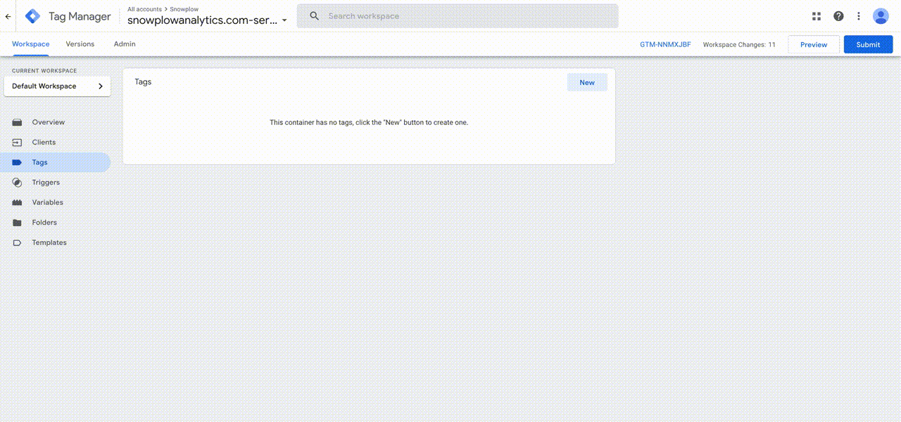

The [Snowplow Tag for GTM SS](https://tagmanager.google.com/gallery/#/owners/snowplow/templates/snowplow-gtm-server-side-tag) is most useful if using GTM SS as a Server Side Tag Manager for Snowplow JavaScript Tracker events, as you will want to ensure you forward these events to your Snowplow Collector. The Snowplow Tag will automatically forward any events the Snowplow Client receives once it has been configured with your Collector URL.

The Snowplow Tag can also construct Snowplow events from other GTM SS Clients such as GAv4.

## Template Installation

:::note

The server Docker image must be 2.0.0 or later.

:::

### Tag Manager Gallery

1. From the Templates tab in GTM SS, click "Search Gallery" in the Tag Templates section
2. Search for "Snowplow" and select the official "By Snowplow" tag
3. Click Add to Workspace
4. Accept the permissions dialog by clicking "Add"

## Snowplow Tag Setup

With the template installed, you can now add the Snowplow Tag to your GTM SS Container.

1. From the Tag tab, select "New", then select the Snowplow Tag as your Tag Configuration
2. Select your desired Trigger - If using the Snowplow JavaScript Tracker and Snowplow Client, you want to select "All Events"
3. Enter your Snowplow Collector Endpoint, and confirm the Cookie Name matches that of your Collector
4. Click Save

