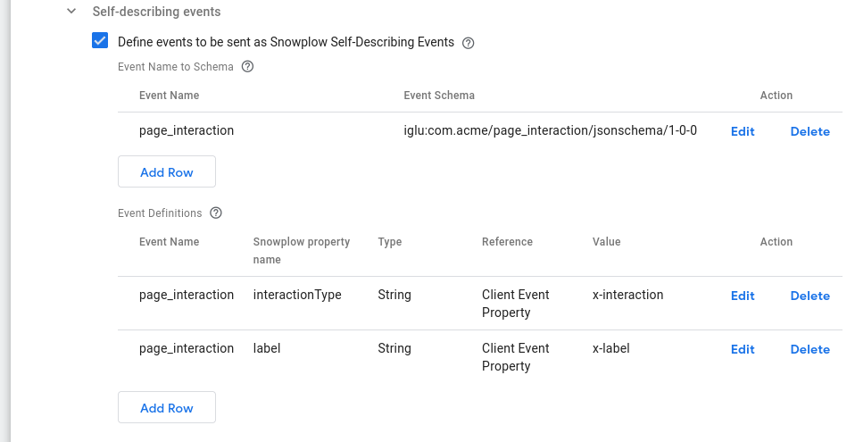
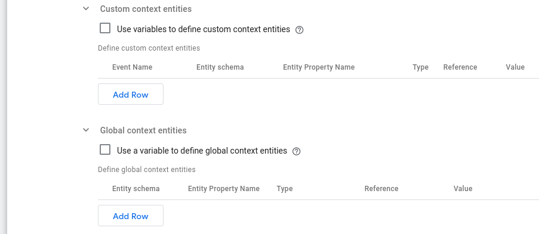
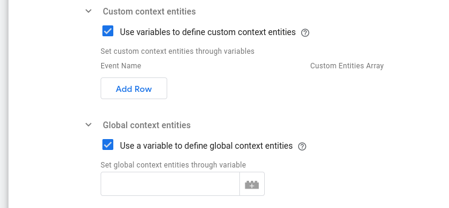
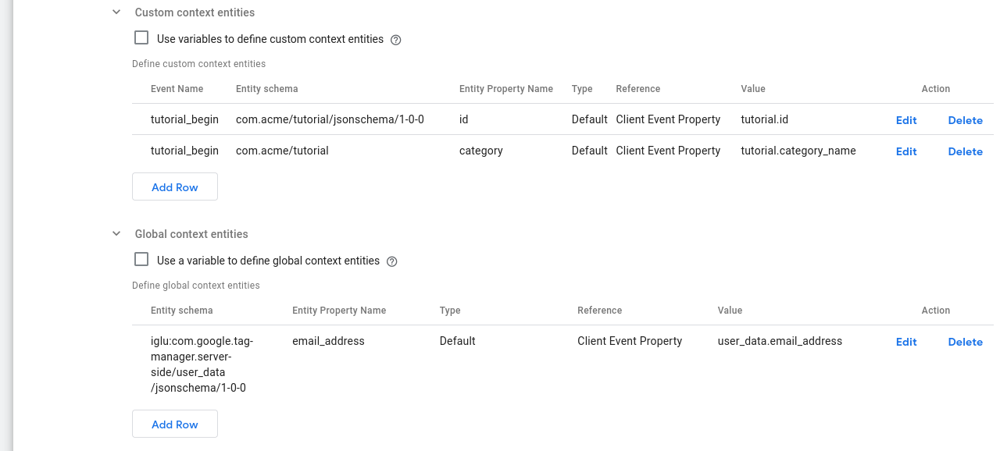
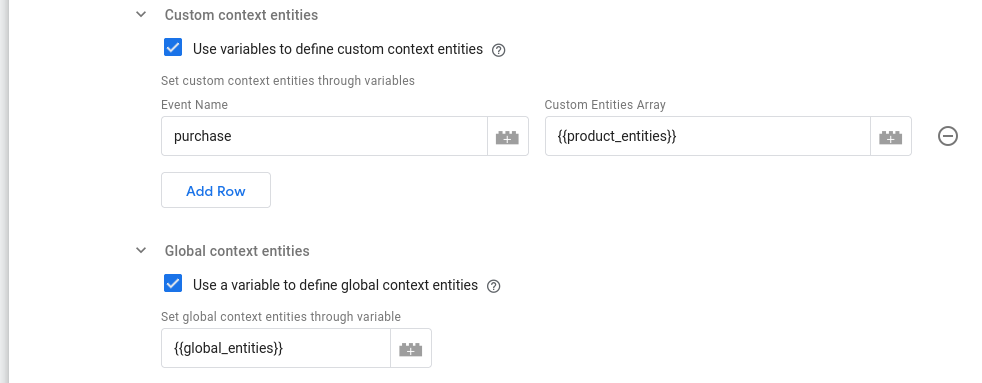

## Structured events

This section allows you to specify which incoming events will be tracked as custom Snowplow events. It only targets events that follow the event/category/label/value Universal Analytics model.

### Send selected events as Snowplow Structured Events

Enabling this check-box reveals a multi-line text field to allow you to set custom Structured Events.

### Event name(s) selected

Add the event names (in separate lines) to be tracked as custom structured Snowplow events.

## Self-describing events

This section allows you to define [Snowplow self-describing events](/docs/collecting-data/collecting-from-own-applications/javascript-trackers/web-tracker/tracking-events/index.md#tracking-custom-self-describing-events).



### Define events to be sent as Snowplow Self-Describing Events

Enable this to allow custom self-describing event definitions.

### Event Name to Schema

A table of the events (event names and corresponding schemas) to be tracked as custom self-describing Snowplow events.

Add events which you would like to capture and convert into Self Describing Events. The `Event Name` should equal the Clients `event_name` property, if this is found when the Snowplow Tag fires, this tag will create a Self Describing Event using the specified schema.

### Event Definitions

A table of definitions for self-describing data properties. Each row maps a single data property of a custom self-describing Snowplow event to its value.

For each Event, you can also read properties off the client event object and add them as properties to the Self Describing Event.

## Context entities

### Apply context entities settings also to Snowplow events

Enable this tick box to also apply the Context entities settings to raw Snowplow events. This may be helpful in use cases where you want to modify the entities already attached to Snowplow events **before** they are relayed to your Snowplow collector.

### Context entities settings

This section allows you to define the context entities to be attached to your events using the following subsections.

You can define both custom and global context entities: Custom Entities are attached where the event_name matches the incoming event,
whereas Global Entities will be applied to all events.

Both subsections offer two ways to set your context entities:

1. Using the default tables in the UI:

  

2. Through GTM Server-side variables (best suited for advanced use-cases):

  


#### Custom context entities

:::tip

Custom context entities can be used to augment any standard Snowplow event, including self describing events, with additional data. The entities set in this subsection are attached _where the event name matches the incoming event_.

:::

##### Use variables to define custom context entities

Enabling this setting allows you to set custom context entities using variables that return the entities array to attach to the event.

##### Define custom context entities

This is the way to define custom context entities through table UI. The columns of this table are:

- **Event Name**: The event that this entity will be attached to.
- **Entity Schema**: The schema of the entity.
- **Entity Property Name**: The key path to the entity's data.
- **Type**: The type of the value. Available options are:
  - **Default**: This option means that the value remains to its original type.
  - **String**: This option means that the value will be interpreted as a string.
  - **Boolean**: This option means that the value will be interpreted as a boolean.
  - **Number**: This option means that the value will be interpreted as a number.
- **Reference**: What the value references. Available options are:
  - **Client Event Property** (default): This means that what is set in the **Value** column corresponds to a property path in the client event.
  - **Constant or Variable**: This means that what is set in the **Value** column is the actual value to be used.
- **Value**: The value to set the property name to.

##### Set custom context entities through variables

This table is revealed if **Use variables to define custom context entities** option is enabled. It provides an alternative way to set custom context entities for an even through a GTM Server-side variable. The variable specified must return an array of context entities.

The columns of this table are:

- **Event Name**: The event that this entity will be attached to.
- **Custom Entities Array**: The variable containing the array of entities to be attached to the event.

#### Global context entities

:::tip

Global context entities are custom entities that apply globally. This lets you define your own context entities once and have them sent _with **all** events_.

:::

##### Use a variable to define global context entities

Enabling this setting allows you to set global context entities using a variable that returns the entities array to attach to the event.

##### Define global context entities

This is the way to define global context entities through a table UI. The columns of this table are:

- **Entity Schema**: The schema of the entity.
- **Entity Property Name**: The key path to the entity's data.
- **Type**: The type of the value. Available options are:
  - **Default**: This option means that the value remains to its original type.
  - **String**: This option means that the value will be interpreted as a string.
  - **Boolean**: This option means that the value will be interpreted as a boolean.
  - **Number**: This option means that the value will be interpreted as a number.
- **Reference**: What the value references. Available options are:
  - **Client Event Property** (default): This means that what is set in the **Value** column corresponds to a property path in the client event.
  - **Constant or Variable**: This means that what is set in the **Value** column is the actual value to be used.
- **Value**: The value to set the property name to.


##### Set global context entities through variable

This text box is revealed if **Use a variable to define global context entities** option is enabled.

### Examples

In the following screenshots you can find examples of context entities settings using:

#### 1. The default table UI

_**Scenario**_: On a tutorial platform, we use GTM to send a `tutorial_begin` event type to our GTM Server-side container with parameters:

```javascript
dataLayer.push({
  'event': 'tutorial_begin',
  'tutorial.id': 'math101',
  'tutorial.category_name': 'mathematics',
  'user_data.email_address': 'foo@bar.baz',
});
```

We are using the Snowplow GTM SS Tag to forward it to our Snowplow pipeline, and we want to attach context entities. For our example, let's say:

- our `tutorial` Snowplow entity corresponds to this schema

    ```json
    {
        "$schema": "http://iglucentral.com/schemas/com.snowplowanalytics.self-desc/schema/jsonschema/1-0-0#",
        "self": {
            "vendor": "com.acme",
            "name": "tutorial",
            "version": "1-0-0",
            "format": "jsonschema"
        },
        "description": "Tutorial information",
        "type": "object",
        "properties": {
            "id": {
                "description": "The ID of the tutorial",
                "type": "string",
                "maxLength": 4096
            },
            "category": {
                "description": "The category of the tutorial",
                "type": ["string", "null"],
                "maxLength": 4096
            }
        },
        "required": ["id"]
        "additionalProperties": false
    }
    ```

- we also want user information, so we will use the `user_data` context entity ([available in Iglu Central](https://github.com/snowplow/iglu-central/blob/master/schemas/com.google.tag-manager.server-side/user_data/jsonschema/1-0-0)) attached to all events as well.

Then we can configure the Snowplow GTM SS Tag's Context entities settings as:



Here we have configured the Context entities settings in order to:

1. Attach the `tutorial` entity only to `tutorial_begin` event (using the **Custom context entities** section). Consequently we specify how to derive the data of the entity:

  - We set the `id` to the value found in the `tutorial.id` key path of the client event
  - We set the `category` property to the value found in the `tutorial.category_name` key path of the client event

2. Attach the `user_data` entity to all events (using the **Global context entities** section). In the row, we specify how to derive the `user_data` entity's data:

  - We set the `email_address` to the value found in the `user_data.email_address` key path of the client event

:::note

As you can see in the images above, the schema for an entity can be written in 2 equally correct ways:

1. With the `iglu:` prefix, e.g. `iglu:com.acme/product/jsonschema/1-0-0`
2. Without the `iglu:` prefix, e.g. `com.acme/product/jsonschema/1-0-0`

:::

#### 2. GTM SS Variables

As mentioned, it is also possible to reference GTM Server-side Variables in order to set both the Custom and the Global context entities. As a simple example:



Here:

1. We specify the Variable `product_entities` as the context entities to attach only to `purchase` events
2. We specify the Valiable `global_entities` as the context entities to attach to all events

The Variables referenced must return an array of context entities. For example, the return value of such a Variable should look like:

```javascript
[
  {
    schema: "iglu:com.example_company/page/jsonschema/1-2-1",
    data: {
      pageType: 'test',
      lastUpdated: '2022-11-18T17:59:00',
    }
  },
  {
    schema: "iglu:com.example_company/user/jsonschema/2-0-0",
    data: {
      userType: 'tester',
    }
  }
]
```

## Additional event settings

### Base64 encoding

Whether to encode the custom self-describing event data in base64.

### Platform identifier

When a platform is not specified on the event, this value will be used.
