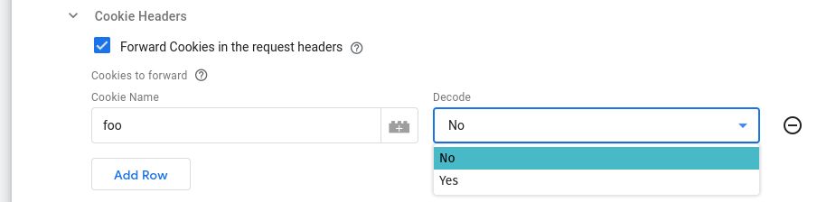
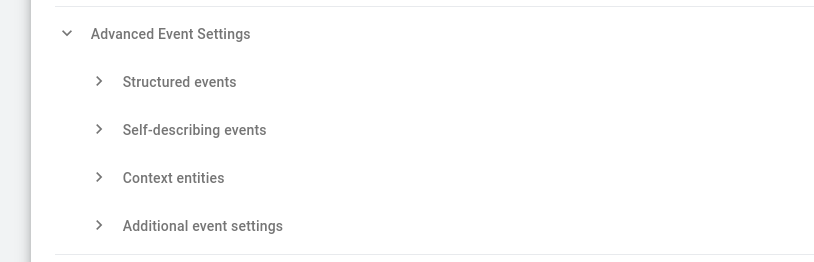

## Collector URL (Required)

Set this to the URL of your Snowplow Collector you wish to send events to.

## Cookies Settings

If you have configured your Snowplow collector to have different cookie details, you should ensure they match here.

### Name (Required)

This value must match the value of your Collector cookie name, this will allow the Snowplow Tag to find and return your Collector Cookie back to your users browser.

### Override Cookie Properties

If you'd like to overwrite your collectors cookie settings you can do that here.

#### Domain Override

To return a cookie with a different domain value than your collector, you can override it to another string here. "auto" will ensure the value is unchanged.

#### Path Override

This will override the path value of the cookie.

#### SameSite Override

This will override the SameSite flag on the cookie.

#### Expiration Override in Seconds

Allows the expiration time of the cookie to be altered. This value is in seconds, and defaults to 63072000 (2 years).

#### HttpOnly

Overwrites the HttpOnly flag on the cookie. Will be `true` if enabled (default), or `false` if disabled.

#### Secure

Overwrites the Secure flag on the cookie. Will be `true` if enabled (default), or `false` if disabled. Setting this to `false` and `SameSite` to `None` will prevent browsers from being able to store the cookie.

### Cookie Headers



#### Forward Cookies in the request headers

This option allows you to forward selected cookies in the request headers and it is disabled by default. Enabling it reveals the "Cookies to forward" table.

#### Cookies to forward

Using this table allows you to select the cookies to forward. Its columns are:

- **Cookie Name**: The name of the cookie to forward
- **Decode**: Whether to want to decode the cookie value(s) before forwarding (defaults to `No`)

## Advanced Event Settings



This section allows you to:

- Specify events to be tracked as Structured events
- Configure Self-describing event definitions
- Specify Context entities to be attached to events
- Customize additional event settings

You can find out more about all the available configuration options in the [Advanced Event Settings page](/docs/destinations/forwarding-events/google-tag-manager-server-side/snowplow-tag-for-gtm-ss/snowplow-tag-configuration/advanced-event-settings/index.md).

## Logs Settings

Through the Logs Settings you can control the logging behavior of the Snowplow Tag. The available options are:

- `Do not log`: This option allows you to completely disable logging. No logs will be generated by the Tag.
- `Log to console during debug and preview`: This option enables logging only in debug and preview containers. This is the default option.
- `Always`: This option enables logging regardless of container mode.

:::note

Please take into consideration that the logs generated may contain event data.

:::

The logs generated by the Snowplow GTM SS Tag are standardized JSON strings.
The standard log properties are:

```json
{
    "Name": "Snowplow", // the name of the tag
    "Type": "Message",  // the type of log (one of "Message", "Request", "Response")
    "TraceId": "xxx",   // the "trace-id" header if exists
    "EventName": "xxx"  // the name of the event the tag fired at
}
```

Depending on the type of log, additional properties are logged:

| Type of log | Additional information                                         |
|-------------|----------------------------------------------------------------|
| Message     | "Message"                                                      |
| Request     | "RequestMethod", "RequestUrl", "RequestHeaders", "RequestBody" |
| Response    | "ResponseStatusCode", "ResponseHeaders", "ResponseBody"        |
