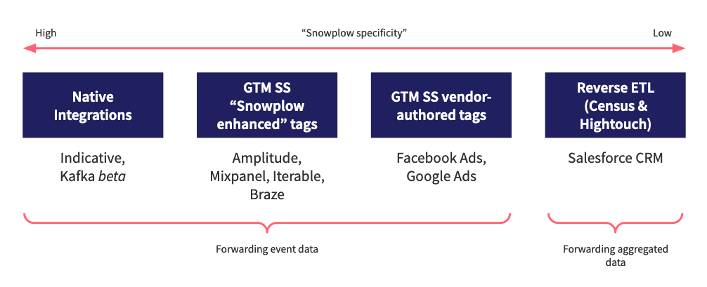

Snowplow supports many ways to forward events to a variety of platforms. Snowplow has native integrations as well as supporting Snowplow, vendor and community authored destinations via Google Tag Manager Server Side.

- Native Integrations (Kafka, Azure Event Hubs)
- Google Tag Manager Server Side Snowplow Tags (Amplitude, Iterable, Braze (Coming soon), Mixpanel (Coming soon), etc)
- Google Tag Manager Server Side Vendor and Community Tags (Facebook Conversions, Google Ads, etc)
- Custom Integrations (AWS Lambdas, GCP Cloud Functions, Kinesis and PubSub Applications)

