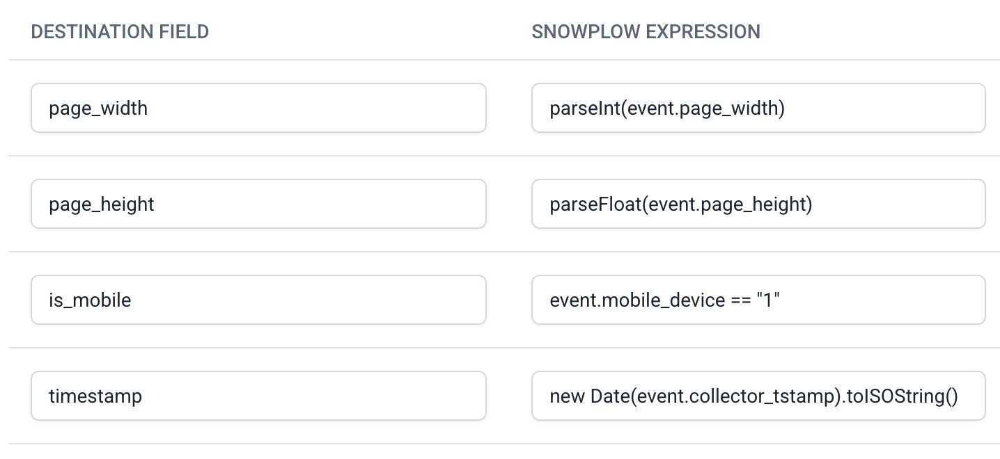

Event forwarders use JavaScript expressions for filtering events and mapping Snowplow data to destination fields. These expressions are entered during [forwarder setup](/docs/destinations/forwarding-events/index.md#getting-started) in Console, specifically in the **Event filtering**, **Field mapping**, and **Custom functions** sections. This reference covers the syntax and available data for these operations.

## Available event fields

You can reference any field in your Snowplow events for both filters and field mappings.

### Standard atomic fields

Access [standard Snowplow fields](/docs/fundamentals/canonical-event/index.md) in your filters and mappings using JavaScript dot notation:

```javascript
// Standard atomic fields
event.app_id
event.event_name
event.platform
event.collector_tstamp
event.event_id
event.domain_userid
event.user_id
event.page_url
event.page_title
event.useragent
event.network_userid
```

### Custom events and entities

You can also access fields in Snowplow or custom event and entity schemas.

Forwarders transform Iglu schema URIs to JavaScript-safe field names:

| Original schema                            | Transformed field name               |
| ------------------------------------------ | ------------------------------------ |
| `com.acme/signup/jsonschema/1-0-0`         | `unstruct_event_com_acme_signup_1`   |
| `com.acme/user_profile/jsonschema/2-1-0`   | `contexts_com_acme_user_profile_2`   |
| `nl.basjes/yauaa_context/jsonschema/1-0-4` | `contexts_nl_basjes_yauaa_context_1` |

Schema names follow these transformation rules:

- Self-describing events: `unstruct_event_` prefix
- Entities: `contexts_` prefix
- Dots and slashes become underscores
- Only major version number retained
- Hyphens in vendor/name become underscores

:::info Optional chaining
Always use [optional chaining](https://developer.mozilla.org/en-US/docs/Web/JavaScript/Reference/Operators/Optional_chaining) (`?.`) when accessing custom events and entities to handle cases where they're not present.
:::

For a self-describing event with schema `com.acme/signup/jsonschema/1-0-0`:

```javascript
// Access event properties
event?.unstruct_event_com_acme_signup_1?.signup_method
event?.unstruct_event_com_acme_signup_1?.user_type
```

For entities with schema `com.acme/user_profile/jsonschema/1-0-0`:

```javascript
// Access entity properties (entities are arrays)
event?.contexts_com_acme_user_profile_1?.[0]?.subscription_tier
event?.contexts_com_acme_user_profile_1?.[0]?.account_created
```

## Event filtering

Event filters determine which events are forwarded to your destination. Only events matching your filter criteria (JavaScript expression evaluating to `true`) will be processed and sent.

### Basic filters

Filter events can contain standard JavaScript comparison operators:

```javascript
// Single condition
event.app_id == "website"

// Multiple conditions with AND
event.app_id == "website" && event.event == "page_view"

// Multiple conditions with OR
event.event_name == "add_to_cart" || event.event_name == "purchase"

// Check if event is in a list
["page_view", "add_to_cart", "purchase"].includes(event.event_name)

// Exclude events
event.app_id == "website" && event.event_name != "link_click"
```

### Advanced filtering patterns

Regular expressions:

```javascript
// Match multiple domains
event.page_urlhost.match(/mysite\.(com|fr|de)/)

// Match event name patterns
event.event_name.match(/^purchase_/)

// Match custom field patterns
event?.unstruct_event_com_acme_product_view_1?.category.match(/electronics|computers/)
```

Define reusable logic in the Custom Functions section:

```javascript
// Defined in the Custom Function editor panel
function isHighValueUser(event) {
  const profile = event?.contexts_com_acme_user_profile_1?.[0];
  return profile?.subscription_tier == "premium" ||
         profile?.lifetime_value > 1000;
}

// Use in filter
isHighValueUser(event) && event.event_name == "purchase"
```

## Field mapping

Field mapping defines how Snowplow event data is transformed and sent to destination APIs. Each mapping consists of:

* A destination field name (key)
* A JavaScript expression that extracts the value from your Snowplow event (value)

:::info
The code snippets below contain JavaScript expressions that you can include in the **Snowplow expression** mapping field in the UI.
:::

### Basic mappings

Map standard event fields directly:


```json
// sample output
{ "event_type": "page_view" }
```

You can also apply fallback and conditional logic:


```json
// sample output
{
  "user_id": "a50d3dfe-ba21-432e-a165-1a1d2d633693"
  "source": "website"
}
```

You can also send static values:


```json
// sample output
{ "source": "snowplow" }
```

### Data transformation

Convert data types, such as strings, boolean values, and dates:



```json
// sample output
{
  "page_width": 720,
  "page_height": 600,
  "is_mobile": true,
  "timestamp": "2025-10-01T18:35:38.563Z"
}
```


Use standard [Javascript String methods](https://developer.mozilla.org/en-US/docs/Web/JavaScript/Reference/Global_Objects/String#instance_methods) to manipuate strings:

```javascript
// Case conversion
event.event_name.toLowerCase()
event.page_title.toUpperCase()

// String operations
event.page_url.replace("http://", "https://")
event.page_title.substring(0, 100)
event.page_urlpath.split('/')
```

Map to nested objects using dot notation in field names:


```json
// sample output
{
  "user": {
    "id": "user123"
  },
  "properties": {
    "page_title": "Home Page",
    "page_url": "https://example.com",
    "referrer": "google.com"
  }
}
```

### Custom mapping functions

Define complex transformations as functions in the custom functions section. You can then reference these functions in filters and mappings. Below are a few example transformations:

```javascript
// Event name formatting
function formatEventName(event) {
  const nameMap = {
    'page_view': 'Page Viewed',
    'add_to_cart': 'Product Added to Cart',
    'purchase': 'Purchase Completed'
  };
  return nameMap[event.event_name] || event.event_name;
}

// Extract product data
function extractProductInfo(event) {
  const product = event?.unstruct_event_com_acme_product_1;
  if (!product) return null;

  return {
    id: product.product_id,
    name: product.product_name,
    category: product.category,
    price: parseFloat(product.price),
    currency: product.currency || 'USD'
  };
}

// User profile enrichment
function buildUserProfile(event) {
  const session = event?.contexts_com_snowplowanalytics_snowplow_client_session_1?.[0];
  const geo = event?.contexts_com_snowplowanalytics_snowplow_geolocation_context_1?.[0];

  return {
    user_id: event.domain_userid,
    session_id: session?.sessionId,
    location: geo ? `${geo.latitude},${geo.longitude}` : null,
    user_agent: event.useragent,
    platform: event.platform
  };
}
```

## Other common patterns

Timestamp formatting:

```javascript
// ISO 8601 format
new Date(event.collector_tstamp).toISOString()

// Unix timestamp
Math.floor(new Date(event.collector_tstamp).getTime() / 1000)

// Readable format
new Date(event.collector_tstamp).toLocaleDateString()
```

Conditional field mapping:

```javascript
// Platform-specific mapping
event.platform == "web" ? event.page_url : event.screen_name

// Event-type specific properties
event.event_name == "purchase" ?
  event.unstruct_event_com_acme_purchase_1?.total_value :
  null
```

Array handling:

```javascript
// Get first entity
event?.contexts_com_acme_product_1?.[0]?.product_name

// Map all entities
event?.contexts_com_acme_product_1?.map(p => p.product_id)

// Filter and transform entities
event?.contexts_com_acme_product_1
  ?.filter(p => p.price > 10)
  ?.map(p => ({ id: p.product_id, name: p.product_name }))
```
