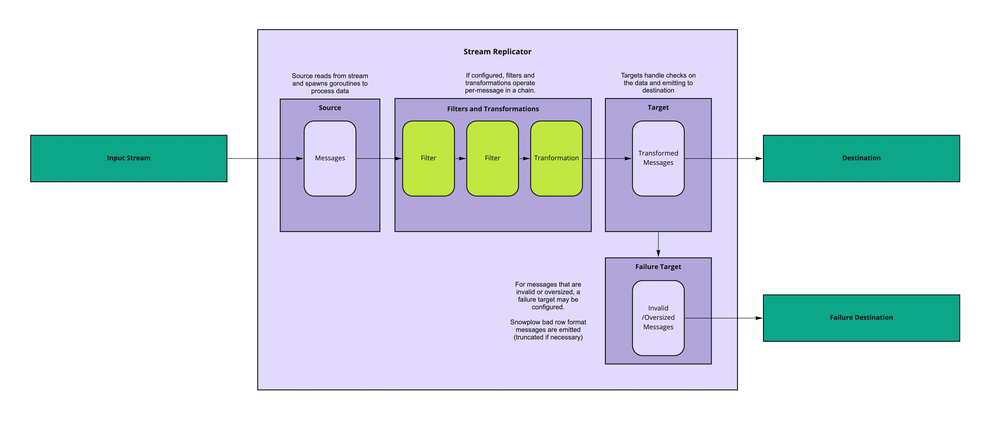

Snowbridge’s architecture is fairly simple: it receives data from one streaming technology (via [Sources](./sources/index.md)), optionally runs filtering and transformation logic on them (message-by-message, via [Transformations](./transformations/index.md)), and sends the data to another streaming technology or destination (via [Targets](./targets/index.md)). If it is not possible to process or retry the data [as per the failure model](./failure-model/index.md), it outputs a message to another destination (via [Failure Targets](./failure-model/index.md#failure-targets)).

Where the source supports acking, Snowbridge only acks messages once the data is successfully sent to either the target or the failure target (in the case of unrecoverable failure). In the case of a recoverable failure — for example when the target is temporarily unavailable — Snowbridge will not ack the messages and will retry them once the source technology’s ack deadline has passed.

## Operational details

Data is processed on an at-least-once basis, and there is no guarantee of order of messages. The application is designed to minimise duplicates as much as possible, but there isn’t a guarantee of avoiding them — for example if there’s a failure, it is possible for messages to be delivered without a successful response, and duplicates can occur.
