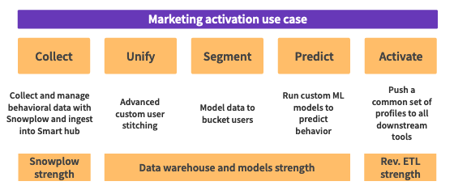

Snowplow and Reverse ETL represents best in class tooling for companies executing more sophisticated use cases with their behavioral data.

As one example of where this approach is beneficial, many organizations begin with marketing use cases by creating simple segments but quickly want to target their ads more effectively wanting to incorporate customer propensity to buy and predictive lifetime value. That increase in sophistication can only come from building a deep understanding of users in a place like a data warehouse with modeling tooling (AI/ML) and Reverse ETL.

This can only be done repeatedly, and with confidence with excellent governance practises which comes from Snowplow’s compliance controls (i.e. controlling which data is sent to 3rd parties), schematised workflows and UI/API for management. Targeting in a sophisticated way ensure resource is allocated best as well (e.g. don’t target users who have already purchased).

Snowplow and Reverse ETL is for organizations who want to:

- Adapt to changes in customer behavior and the business questions being asked.
- Use Rich, extensible behavioral data.
- Maintain high quality data due to validation and private cloud deployment.
- Activate very high value audiences based on propensity to convert.
- Execute well on dozens of other use cases.

## What problem does Reverse ETL solve?

Organizations have invested in building a high quality data asset in their data warehouse to power numerous use cases, so naturally want to use this to effectively target their users.

Reverse ETL enables organizations to take the output of the intelligence they've built using all their customer data (behavioral and non-behavioral) and publish that directly to marketing platforms where it can be activated.

## Reverse ETL Platforms

Reverse ETL helps organizations operationalize the data in their warehouse by syncing it with other SaaS solutions such as Salesforce and Google Ads.

Snowplow partners with and recommends Census as Reverse ETL platforms to allow organisations to achieve the use cases described above.

- [Census](https://www.getcensus.com/)
