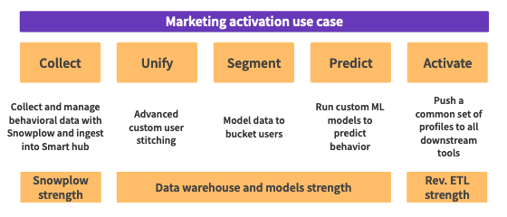

Reverse ETL tools sync data from your warehouse to external platforms such as Salesforce, Google Ads, and marketing automation tools. Combined with Snowplow's behavioral data, this lets you activate warehouse-derived audiences, scores, and attributes directly in the tools where your teams work.

Without reverse ETL, data in your warehouse is only available to tools that query it directly. Reverse ETL bridges that gap by continuously pushing selected data, such as customer segments or propensity scores, to downstream systems where it can be used for targeting, personalization, and outreach.

Common use cases include:
- Syncing propensity-to-buy scores to an ad platform to adjust bidding or exclude users who have already converted
- Pushing predicted lifetime value to a CRM to prioritize outreach
- Sending audience membership flags to an email platform for lifecycle campaigns

Snowplow recommends [Fivetran Activations](https://www.fivetran.com/data-movement/activations) for reverse ETL.
