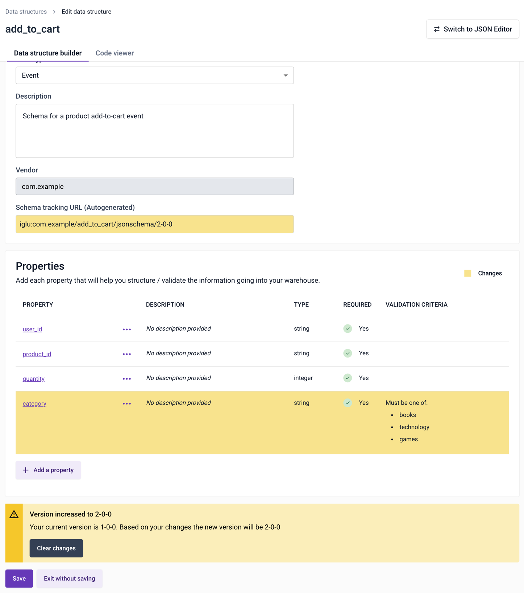
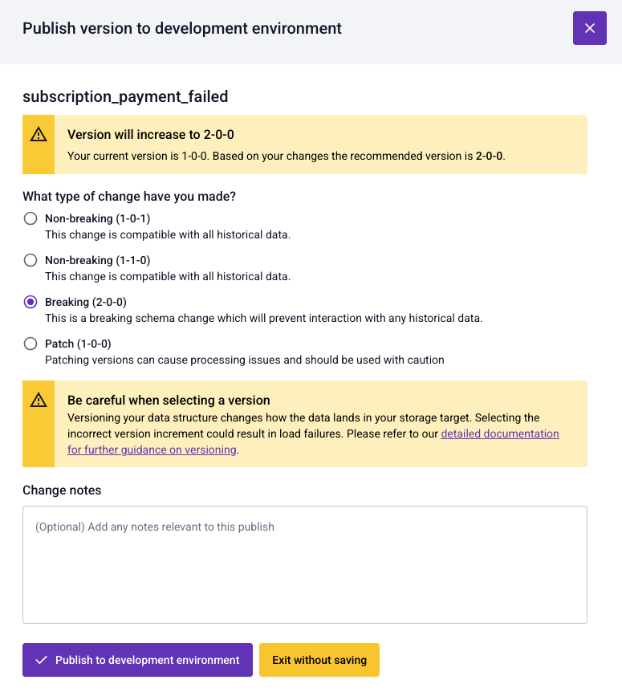

Every data structure is based on a [versioned schema](/docs/fundamentals/schemas/versioning/index.md).

```mdx-code-block
import Breaking from "/docs/reusable/schema-version-breaking-change/_breaking.md"

<Breaking/>
```

## Automatic versioning with the data structure builder

Versioning is automated when using the data structure builder to create or edit your custom data structures.

It will automatically select how to version up your data structure depending on the changes you have just made.

In this example, a new required property has been added to the data structure. This is a breaking change, so the builder will increment the first digit:



In this example, an additional enum option has been added to `category`. This is a non-breaking change, so the builder is incrementing the middle digit:


## Versioning with the JSON editor

When using the JSON editor, at the point of publishing a data structure you'll be asked to select which version you'd like to create.



## Patch a schema

To [patch a schema](/docs/fundamentals/schemas/versioning/index.md#patch-a-schema), i.e. apply changes to it without updating the version, select the **Patch** option when saving the schema.

Note that various pipeline components, most importantly Enrich (including Enrich embedded in Snowplow Mini and Snowplow Micro), cache schemas to improve performance. The default caching time is 10 minutes (it's controlled by the [Iglu Resolver configuration](/docs/api-reference/iglu/iglu-resolver/index.md)). This means that the effect of patching a schema will not be immediate.

:::note Self-Hosted users
If you are using Snowplow Self-Hosted, to patch a schema, don't increment the schema version when [uploading it with `igluctl`](/docs/api-reference/iglu/manage-schemas/index.md).

You'll need to explicitly enable patching in the [Iglu Server configuration](/docs/api-reference/iglu/iglu-repositories/iglu-server/reference/index.md) (`patchesAllowed`) at your own risk.
:::

## Mark a schema as superseded

To [mark a schema as superseded](/docs/fundamentals/schemas/versioning/index.md#mark-a-schema-as-superseded), use the JSON editor and add a `$supersedes` field.
