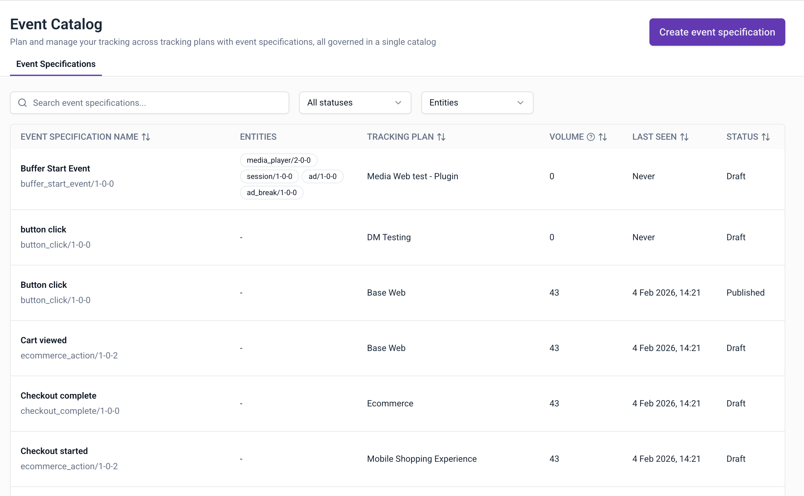
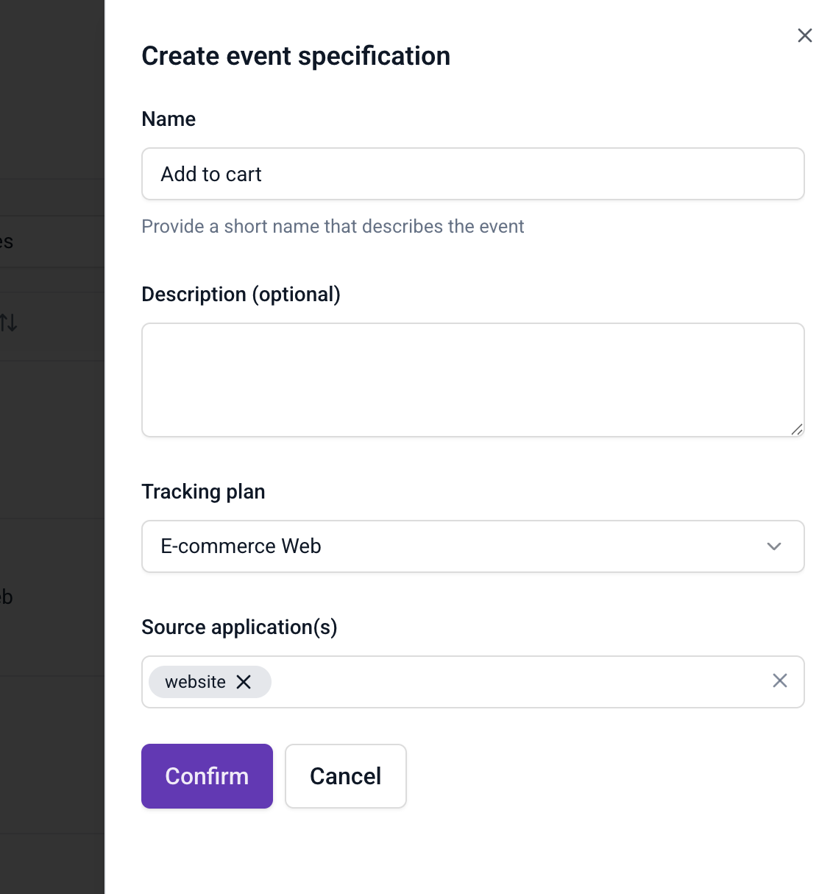

The Event Catalog provides a centralized location to discover and manage all event specifications across your [tracking plans](/docs/event-studio/tracking-plans/index.md). Instead of navigating through individual tracking plans to find specific events, you can browse, search, and filter all event specifications from a single view.

When your organization has multiple tracking plans across different teams and domains, finding specific event specifications can become challenging. The Event Catalog addresses this by:

- **Centralizing discovery**: browse all event specifications in one place rather than searching through individual tracking plans
- **Improving governance**: maintain oversight of all event specifications and their status across your organization
- **Streamlining onboarding**: help new team members understand what events are available and how they're organized
- **Enabling cross-team collaboration**: see how different teams have defined similar events and share best practices

## Access the Event Catalog

Navigate to **Event Catalog** in the main navigation.

## Browse event specifications

The Event Catalog provides a comprehensive list of all event specifications defined across your tracking plans. Each row displays:

| Column                   | Description                                                                |
| ------------------------ | -------------------------------------------------------------------------- |
| Event specification name | The name and schema identifier of the event specification                  |
| Entities                 | The [entities](/docs/fundamentals/entities/index.md) attached to the event |
| Tracking plan            | The tracking plan containing the event specification                       |
| Volume                   | The number of events collected                                             |
| Last seen                | When the event was last received                                           |
| Status                   | The status of the event specification                                      |

### Filter and search

You can filter and search the list to find specific event specifications. Use the controls at the top of the list:

- **Search**: enter text to filter by event specification name
- **Status filter**: show all specifications or filter by Draft or Published status
- **Entity filter**: filter specifications by attached entities

## Create event specifications

From the Event Catalog, you can create new event specifications without first navigating to a tracking plan.

To create an event specification:

1. Click **Create event specification**
2. Enter a name that describes the event
3. Optionally add a description
4. Select the tracking plan this event specification belongs to
5. Select the source applications where this event is tracked
6. Click **Confirm**

After creation, you can add event and entity data structures, triggers, and property instructions.

:::tip
Use descriptive names that reflect the business action being tracked. For example, "Add to cart" is clearer than "cart_event_1".
:::
