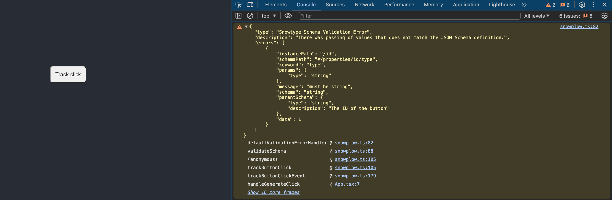
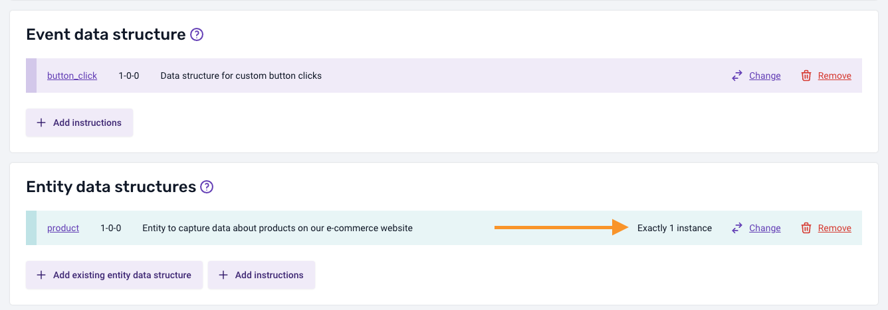
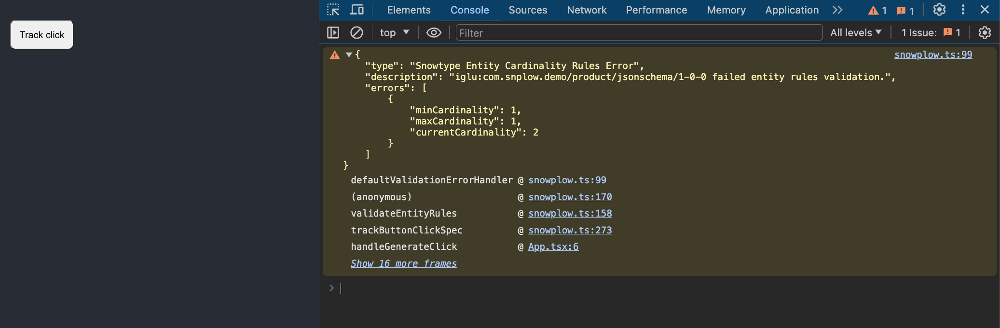
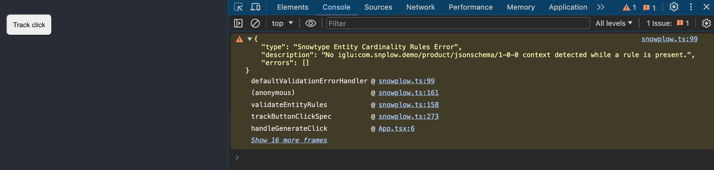
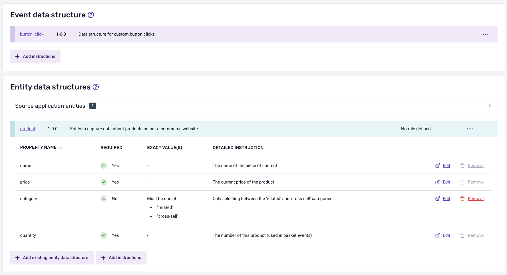
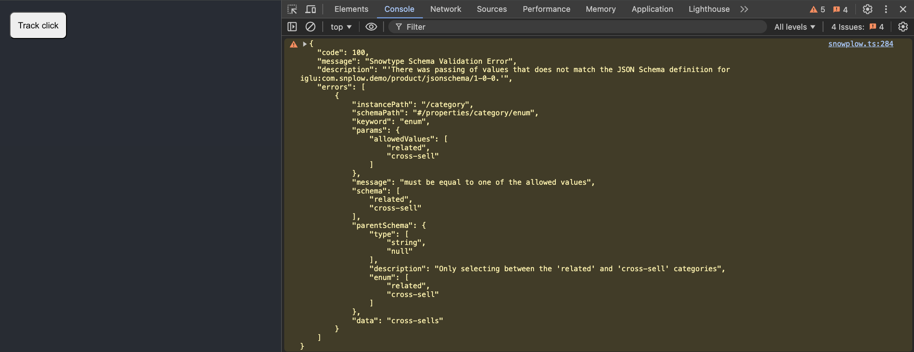

:::info
Client-side validation is available for the [Browser tracker](/docs/sources/web-trackers/quick-start-guide/index.md?platform=browser) in both JavaScript and TypeScript.
:::

Your Snowplow pipeline validates events server-side, but this means errors are only caught after events leave the browser. Client-side validation catches tracking errors at runtime — in the browser console, during development — so you can fix them before they reach production.

Snowtype can generate validation code alongside your tracking functions. When enabled, every event sent through generated code is checked against:

- **Schema rules**: does the event data match the schema definition?
- **Cardinality rules**: does the event include the correct number of each entity?
- **Property rules**: do entity values match the constraints defined in the event specification?

## Setup

To generate code with validation enabled, use the `--validations` flag:

```bash
npx snowtype generate --validations
```

Validation depends on the [Ajv](https://ajv.js.org/) JSON Schema validator. Install these peer dependencies:

```bash
npm install ajv@8 ajv-formats@2 ajv-draft-04@1
```

You can also enable validations permanently in your [configuration file](/docs/event-studio/implement-tracking/configuration-reference/index.md) instead of passing the flag each time.

## Schema validation

When you track an event using generated code, Snowtype validates the event data against the schema at runtime. If a property violates the schema (for example, passing a number where a string is expected), a warning appears in the browser console.

Suppose you are tracking against a custom schema for button clicks:

```json
{
    "type": "object",
    "description": "Data structure for custom button clicks",
    "properties": {
        "label": {
            "type": "string",
            "description": "The text on the button, or a user-provided override"
        },
        "id": {
            "type": "string",
            "description": "The identifier of the button"
        }
    }
}
```

If you pass a number instead of a string for `id`, the validation output in the browser console shows the violation, including the erroneous value under `errors[n].data` and a stack trace pointing to the calling function:



## Cardinality rules

[Cardinality rules](/docs/event-studio/tracking-plans/index.md) define how many of a given entity an event specification expects. For example:

- Exactly 1
- At least 1
- Between 1 and 2

With client-side validation enabled, Snowtype checks these rules at runtime. If the event includes too many, too few, or none of a required entity, a warning appears in the browser console.

For example, with a `product` entity that has a cardinality rule of "Exactly 1":



This code satisfies the rule:

```typescript
trackButtonClickSpec({
    label: "Product click",
    context: [createProduct({ name: "Product", price: 1, quantity: 1 })],
});
```

Adding a second `product` entity violates the rule:

```typescript
trackButtonClickSpec({
    label: "Product click",
    context: [
        createProduct({ name: "Product", price: 1, quantity: 1 }),
        // This violates the cardinality rule of Exactly 1
        createProduct({ name: "Product 2", price: 1, quantity: 1 }),
    ],
});
```



The warning includes the `minCardinality` and `maxCardinality` expected, the `currentCardinality` (how many were actually passed), and a stack trace.

A warning also appears when a required entity is missing entirely:



## Property rules

[Property rules](/docs/event-studio/tracking-plans/index.md) are constraints you define on entity properties within an event specification. They let you restrict the allowed values for a specific event. For example, you might require the `category` property of a `product` entity to only accept `"related"` or `"cross-sell"` for a particular event specification.



This code satisfies the property rule:

```typescript
trackRelatedSpec({
    label: "Related product",
    context: [
        createProductRelated({
            category: "cross-sell",
            name: "product",
            quantity: 1,
            price: 10,
        }),
    ],
});
```

Passing a value outside the allowed set triggers a warning:

```typescript
trackRelatedSpec({
    label: "Related product",
    context: [
        createProductRelated({
            // "cross-sells" is not a valid category
            category: "cross-sells",
            name: "product",
            quantity: 1,
            price: 10,
        }),
    ],
});
```



## Custom violation handlers

By default, violations are logged to the browser console using `console.warn`. You can override this behavior with a custom handler using the `snowtype.setOptions` API:

```typescript
import { snowtype } from "{{outpath}}/snowplow";

function myViolationsHandler(error) {
    // Custom violation handling logic
}

snowtype.setOptions({ violationsHandler: myViolationsHandler });
```

The `error` argument has the following shape:

```typescript
type ErrorType = {
    /** Error code number (e.g. 100, 200, 201) */
    code: number;
    /** Error message */
    message: string;
    /** Description of the violation */
    description: string;
    /** Details of the violations */
    errors: (ErrorObject | Record<string, unknown>)[];
};
```

This is useful for:

- **Unit testing**: throw an `Error` so that tests fail automatically when a violation occurs.
- **Error monitoring**: report violations to a service like Sentry in staging or production.

:::tip
When `NODE_ENV` is set to `test` (as many testing libraries do automatically), the default handler throws an `Error` instead of logging a warning. This means tracking violations will cause your tests to fail without any extra configuration.
:::

## Caveats

### Bundle size

Validation depends on Ajv and related libraries, which increase your application bundle size. Consider enabling validations only in development and test environments, not in production builds.

### Differences from pipeline validation

Client-side validation and pipeline validation use different execution environments, so results can occasionally diverge. The most common case is regular expressions in schema `pattern` attributes — JavaScript's regex engine may behave differently from the pipeline's. Snowtype prints a warning during generation if it detects `pattern` keys in your schemas.
