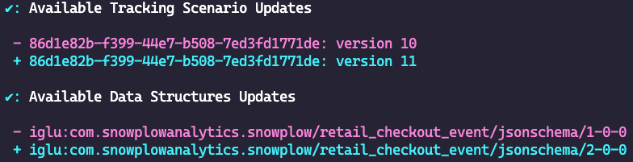

Schemas evolve over time. When an event specification or data structure gets a new version, your generated tracking code falls behind. Outdated code loses type safety and may send events that [fail validation](/docs/fundamentals/failed-events/index.md), because the generated types no longer match what the pipeline expects.

Snowtype provides commands to check for updates, apply them selectively, and keep your configuration clean.

## How version tracking works

The first time you run `snowtype generate`, Snowtype creates a `.snowtype-lock.json` file next to your configuration file. This lock file pins the exact schema versions used for code generation.

On subsequent runs, `generate` reads from the lock file rather than fetching the latest versions. This ensures reproducible builds — running `generate` twice produces the same output, even if a schema was updated in between.

To pick up newer schema versions, use the `snowtype update` command.

:::note
Commit `.snowtype-lock.json` to version control. It ensures everyone on your team generates code from the same schema versions.
:::

## Check for updates

Run `snowtype update` to check whether any of your pinned schemas have newer versions available:

```bash
npx snowtype update
```

The command outputs a diff showing the available version updates:



You can then choose to accept the updates and regenerate your tracking code. To skip the confirmation prompt and automatically update and regenerate, use the `--yes` flag:

```bash
npx snowtype update --yes
```

### Scope updates

You can limit the update check to a subset of your configuration:

```bash
# Check specific event specifications only
npx snowtype update --eventSpecs <id1> <id2>

# Check specific data products only
npx snowtype update --dataProducts <id1> <id2>
```

### Check draft versions

By default, `update` only checks published schema versions. To include the latest draft version, use the `--latestDraft` flag:

```bash
npx snowtype update --latestDraft
```

## Control update notifications

For data structure updates, you can filter what `update` shows you based on the [SchemaVer](https://docs.snowplow.io/docs/pipeline-components-and-applications/iglu/common-architecture/schemaver/) bump level TODO. The `--maximumBump` flag sets the highest level of update to include. It defaults to `major`, meaning all updates are shown.

For example, if your configuration pins `iglu:com.acme_company/page_unload/jsonschema/1-0-0` and versions `1-0-1`, `1-1-0`, and `2-0-0` are available:

```bash
npx snowtype update --maximumBump=major
# Shows all updates, including 2-0-0.

npx snowtype update --maximumBump=minor
# Shows 1-1-0 and 1-0-1 only.

npx snowtype update --maximumBump=patch
# Shows 1-0-1 only.
```

You can also set this in your [configuration file](/docs/event-studio/implement-tracking/snowtype-config/index.md) so it applies to every `update` run:

```json title="snowtype.config.json"
{
  "options": {
    "commands": {
      "update": {
        "maximumBump": "minor"
      }
    }
  }
}
```

## Add new schemas

Use `snowtype patch` to add new event specifications, data structures, or other schema sources to your configuration file without editing it by hand:

```bash
# Add event specifications
npx snowtype patch --eventSpecificationIds <id1> <id2>

# Add data products
npx snowtype patch --dataProductIds <id1> <id2>

# Add data structures
npx snowtype patch --dataStructures iglu:com.example/my_entity/jsonschema/1-0-0

# Add Iglu Central schemas
npx snowtype patch --igluCentralSchemas iglu:com.snowplowanalytics.snowplow/web_page/jsonschema/1-0-0

# Add local schema repositories
npx snowtype patch --repositories ./local-schemas
```

The `patch` command updates your configuration file and, by default, regenerates your tracking code. You can disable automatic regeneration in your [configuration file](/docs/event-studio/implement-tracking/snowtype-config/index.md) by setting `regenerateOnPatch` to `false`.

## Clean up stale entries

Over time, your lock file may accumulate entries for schemas you've removed from your configuration. Use `snowtype purge` to clean them up:

```bash
npx snowtype purge
```

This removes any entries in `.snowtype-lock.json` that are no longer referenced by your configuration file.

## Automate with CI/CD

You can run Snowtype in a CI/CD pipeline to catch outdated tracking code before it reaches production. A typical approach:

1. Run `snowtype update --yes` to check for updates and regenerate if any are found.
2. If the generated output changes, fail the pipeline or open a pull request with the updated code.

The `--yes` flag runs non-interactively, accepting all available updates and regenerating automatically.

Combine this with [`--disallowDevSchemas`](/docs/event-studio/implement-tracking/generate-tracking-code/index.md#prevent-generation-from-development-schemas) on the `generate` step to also prevent development-only schemas from reaching production:

```bash
npx snowtype update --yes
npx snowtype generate --disallowDevSchemas
```
