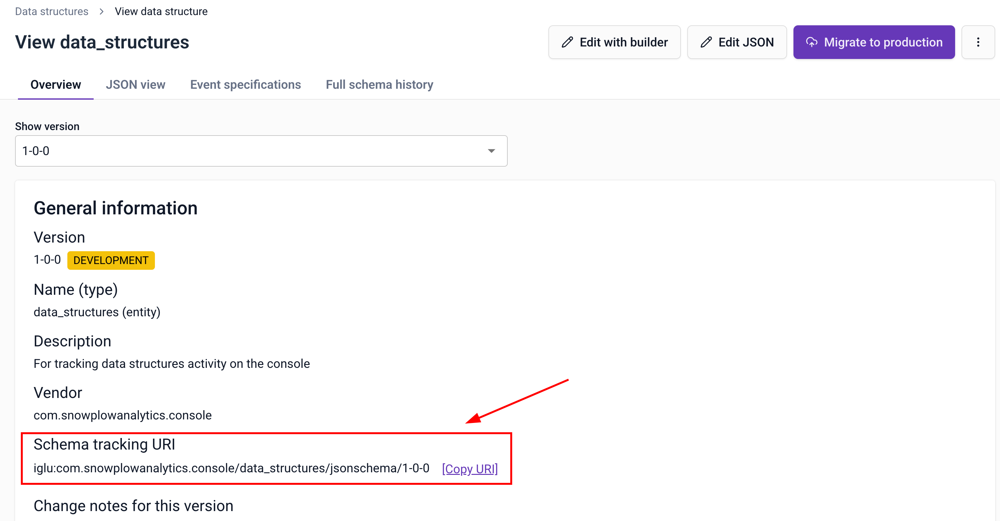
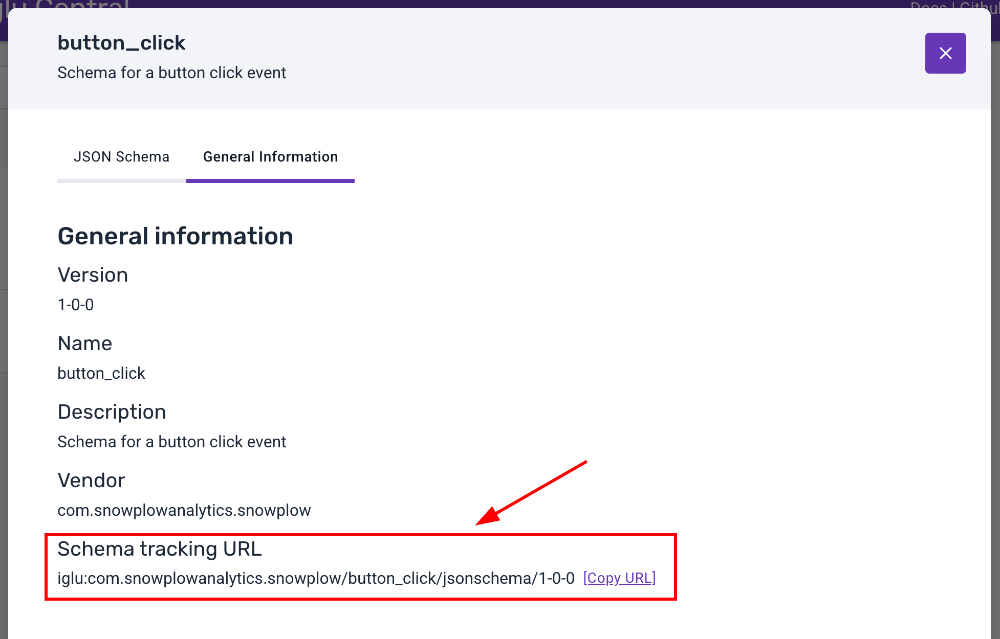

import Tabs from '@theme/Tabs';
import TabItem from '@theme/TabItem';
import TrackingPlansNomenclature from '@site/docs/reusable/tracking-plans-nomenclature/_index.md';

Snowtype reads from the configuration file you created with `snowtype init` to determine which schemas to generate code for, and what language the code should be generated in. You can combine multiple source types in a single configuration.

<TrackingPlansNomenclature />

## Configuration file structure

The configuration file TODO

This example uses all available options for data sources:

```json
{
    "organizationId": "a654321b-c111-33d3-e321-1f123456789g",
    "tracker": "@snowplow/browser-tracker",
    "language": "typescript",
    "outpath": "./src/snowtype",
    "dataProductIds": [
      "a123456b-c222-11d1-e123-1f12345678dp"
    ],
    "eventSpecificationIds": [
      "a123456b-c222-11d1-e123-1f123456789g"
    ],
    "dataStructures": ["iglu:com.myorg/custom_web_page/jsonschema/1-1-0"],
    "igluCentralSchemas": ["iglu:com.snowplowanalytics.snowplow/web_page/jsonschema/1-0-0"],
    "repositories": ["../data-structures"],
}
```


TODO
The Snowtype CLI configuration can be saved in a `.json`, `.js`, or `.ts` file after initialization. For example: `snowtype.config.json`, `snowtype.config.js`, or `snowtype.config.ts`. **We highly recommend you keep this file in the root of your project folder.**

The properties are:
* `organizationId`: your Snowplow account [organization ID](/docs/account-management/index.md). This is required to fetch event specifications and data structures from Console.
* `tracker`: the Snowplow tracker you want to generate code for. This determines the structure of the generated code and which trackers it will work with. See list of available trackers ADD LINK.
* `language`: the programming language you want to generate code in. See list of available languages ADD LINK.
* `outpath`: the output path where Snowtype should write the generated code, relative to the current working directory when running the script.
* `dataProductIds`: an array of tracking plan IDs to generate code for.
* `eventSpecificationIds`: an array of event specification IDs to generate code for.
* `dataStructures`: an array of schema URIs for data structures published in Console to generate code for.
* `igluCentralSchemas`: an array of schema URIs for [Iglu Central](https://iglucentral.com/) schemas to generate code for.
* `repositories`: an array of paths to local schema repositories to generate code for.

TODO list of trackers and languages

### `options`

this probably goes somewhere else TODO
Options related to Snowtype behavior and are described by the following TypeScript type:

```ts
options?: {
  /* Command related options. */
  commands: {
    generate?: {
      /* Generate implementation instructions. */
      instructions?: boolean;
      /* Add runtime validations. */
      validations?: boolean;
      /* Disallow generation of code using schemas only deployed on DEV environment. */
      disallowDevSchemas?: boolean;
      /* Show deprecation warnings only when there are PROD available schema updates. */
      deprecateOnlyOnProdAvailableUpdates?: boolean;
    }
    update?: {
      /* Update your configuration file automatically and regenerate the code of the latest available update. */
      regenerateOnUpdate?: boolean;
      /* The maximum SchemaVer update to show an available update notification for. */
      maximumBump?: "major" | "minor" | "patch";
      /* The `update` command will only display updates for Data Structures that have been deployed to production environment. */
      showOnlyProdUpdates?: boolean;
    }
    patch?: {
      /* Automatically regenerate the code after a successful patch operation. */
      regenerateOnPatch?: boolean;
    }
  }
}
```

### `namespace`
TODO

:::info

This option only applies when generating Swift code.

:::

The namespace for the generated code. All classes generated will be included in this namespace, which can be used to avoid naming conflicts.


For example, setting `namespace` to `Snowtype` will result in classes being accessed with the `Snowtype` prefix:

```swift
let data = Snowtype.AccountConfirmed(companyCountry: "", companyName:
"", ...)
```

_Keep in mind that CLI flags take precedence over configuration file options._


### Example configuration file TODO

TODO why in different languages? test init command

<Tabs groupId="config" queryString>
  <TabItem value="json" label="JSON" default>

  ```json
{
    "igluCentralSchemas": ["iglu:com.snowplowanalytics.snowplow/web_page/jsonschema/1-0-0"],
    "repositories": ["../data-structures"],
    "dataStructures": ["iglu:com.myorg/custom_web_page/jsonschema/1-1-0"],
    "eventSpecificationIds": [
      "a123456b-c222-11d1-e123-1f123456789g"
    ],
    "dataProductIds": [
      "a123456b-c222-11d1-e123-1f12345678dp"
    ],
    "organizationId": "a654321b-c111-33d3-e321-1f123456789g",
    "tracker": "@snowplow/browser-tracker",
    "language": "typescript",
    "outpath": "./src/snowtype"
}
```
  </TabItem>

  <TabItem value="javascript" label="JavaScript" default>

```javascript
const config = {
  "igluCentralSchemas": ["iglu:com.snowplowanalytics.snowplow/web_page/jsonschema/1-0-0"],
  "repositories": ["../data-structures"],
  "dataStructures": ["iglu:com.myorg/custom_web_page/jsonschema/1-1-0"],
  "eventSpecificationIds": [
    "a123456b-c222-11d1-e123-1f123456789g"
  ],
  "dataProductIds": [
    "a123456b-c222-11d1-e123-1f12345678dp"
  ],
  "organizationId": "a654321b-c111-33d3-e321-1f123456789g",
  "tracker": "@snowplow/browser-tracker",
  "language": "typescript",
  "outpath": "./src/snowtype"
}

module.exports = config;

```
  </TabItem>

  <TabItem value="typescript" label="TypeScript">

```typescript
type SnowtypeConfig = {
  tracker:
    | "@snowplow/browser-tracker"
    | "@snowplow/javascript-tracker"
    | "snowplow-android-tracker"
    | "snowplow-ios-tracker"
    | "@snowplow/node-tracker"
    | "snowplow-golang-tracker"
    | "@snowplow/react-native-tracker"
    | "snowplow-flutter-tracker";
  language: "typescript" | "javascript" | "kotlin" | "swift" | "go" | "dart";
  outpath: string;
  organizationId?: string;
  igluCentralSchemas?: string[];
  repositories?: string[];
  dataStructures?: string[];
  eventSpecificationIds?: string[];
  dataProductIds?: string[];
  options?: {
    commands: {
      generate?: {
        instructions?: boolean;
        validations?: boolean;
        disallowDevSchemas?: boolean;
        deprecateOnlyOnProdAvailableUpdates?: boolean;
      }
      update?: {
        regenerateOnUpdate?: boolean;
        maximumBump?: "major" | "minor" | "patch";
        showOnlyProdUpdates?: boolean;
      }
      patch?: {
        regenerateOnPatch?: boolean
      }
    }
  }
};

const config: SnowtypeConfig = {
  "igluCentralSchemas": ["iglu:com.snowplowanalytics.snowplow/web_page/jsonschema/1-0-0"],
  "repositories": ["../data-structures"],
  "dataStructures": ["iglu:com.myorg/custom_web_page/jsonschema/1-1-0"],
  "eventSpecificationIds": [
    "a123456b-c222-11d1-e123-1f123456789g"
  ],
  "dataProductIds": [
    "a123456b-c222-11d1-e123-1f12345678dp"
  ],
  "organizationId": "a654321b-c111-33d3-e321-1f123456789g",
  "tracker": "@snowplow/browser-tracker",
  "language": "typescript",
  "outpath": "./src/snowtype"
};

export default config;

```
  </TabItem>

</Tabs>

## Add sources

Add sources to your configuration manually by editing the file, or with `snowtype patch`. The command will prompt you for the source type and ID, then update your configuration file:

```bash
npx snowtype patch
```

### Tracking plans

A [tracking plan](/docs/event-studio/tracking-plans/index.md) groups related event specifications together. Adding a tracking plan to your configuration generates code for all of its event specifications at once.

To find the tracking plan ID, click **Implement tracking** on the tracking plan page in Console to get the command directly:


You can also copy the ID from the URL bar and add it to the `dataProductIds` array in your configuration file. The ID is the last part of the URL after `/data-products/`:


```json
{
  "dataProductIds": ["dp-id-1", "dp-id-2"]
}
```

### Event specifications

You can add individual [event specifications](/docs/event-studio/tracking-plans/event-specifications/index.md) if you don't need the full tracking plan. Find the event specification ID on its page in Console. The ID is the last part of the URL after `/event-specifications/`:


Add the ID to the `eventSpecificationIds` array in your configuration file:

```json
{
  "eventSpecificationIds": ["es-id-1", "es-id-2"]
}
```

### Data structures

To generate code for a specific [data structure](/docs/fundamentals/schemas/index.md), you need its schema tracking URI. Find it on the data structure page in Console, under the **Overview** tab:



Add the URI to the `dataStructures` array in your configuration file:

```json
{
  "dataStructures": [
    "iglu:com.example/my_event/jsonschema/1-0-0"
  ]
}
```

### Iglu Central schemas

[Iglu Central](http://iglucentral.com/) hosts schemas that you can use in your tracking. Find the schema tracking URI on the Iglu Central website under **General Information**:



Add the URI to the `igluCentralSchemas` array in your configuration file:

```json
{
  "igluCentralSchemas": [
    "iglu:com.snowplowanalytics.snowplow/web_page/jsonschema/1-0-0"
  ]
}
```

### Local data structure repositories

If you manage schemas locally using [Snowplow CLI](/docs/event-studio/programmatic-management/snowplow-cli/data-structures/index.md), you can point Snowtype at your local repository paths. Add them to the `repositories` array:

```json
{
  "repositories": ["./schemas"]
}
```
