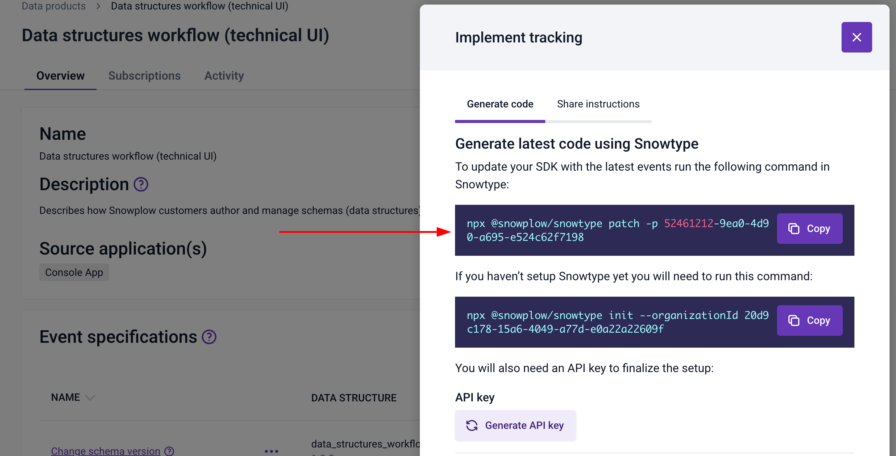
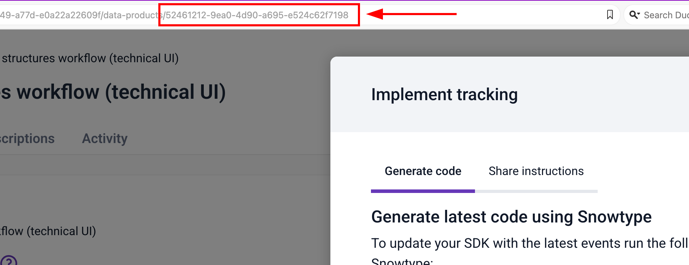
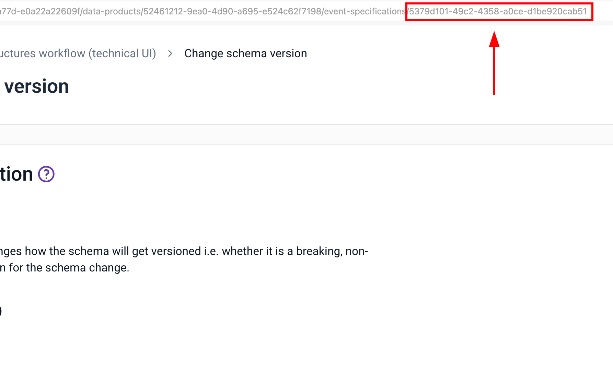

import Tabs from '@theme/Tabs';
import TabItem from '@theme/TabItem';

Once you have [installed and initialized Snowtype](/docs/event-studio/implement-tracking/snowtype/get-started/index.md), you can generate tracking code from different sources. This page explains each source, how to add it to your configuration, and how to use the generated code in your application.

## Add sources

Snowtype reads from your configuration file to determine which schemas to generate code for. You can combine multiple source types in a single configuration.

Add sources to your configuration manually by editing the file, or with `snowtype patch`. The command will prompt you for the source type and ID, then update your configuration file:

```bash
npx snowtype patch
```

### Tracking plans

A [tracking plan](/docs/event-studio/tracking-plans/index.md) groups related event specifications together. Adding a tracking plan to your configuration generates code for all of its event specifications at once.

To find the tracking plan ID, click **Implement tracking** on the tracking plan page in Console to get the command directly:



You can also copy the ID from the URL bar and add it to the `dataProductIds` array in your configuration file. The ID is the last part of the URL after `/data-products/`:



```json
{
  "dataProductIds": ["dp-id-1", "dp-id-2"]
}
```

### Event specifications

You can add individual [event specifications](/docs/event-studio/tracking-plans/event-specifications/index.md) if you don't need the full tracking plan. Find the event specification ID on its page in Console. The ID is the last part of the URL after `/event-specifications/`:



Add the ID to the `eventSpecificationIds` array in your configuration file:

```json
{
  "eventSpecificationIds": ["es-id-1", "es-id-2"]
}
```

### Data structures

To generate code for a specific [data structure](/docs/fundamentals/schemas/index.md), you need its schema tracking URI. Find it on the data structure page in Console, under the **Overview** tab:


Add the URI to the `dataStructures` array in your configuration file:

```json
{
  "dataStructures": [
    "iglu:com.example/my_event/jsonschema/1-0-0"
  ]
}
```

### Iglu Central schemas

[Iglu Central](http://iglucentral.com/) hosts schemas that you can use in your tracking. Find the schema tracking URI on the Iglu Central website under **General Information**:


Add the URI to the `igluCentralSchemas` array in your configuration file:

```json
{
  "igluCentralSchemas": [
    "iglu:com.snowplowanalytics.snowplow/web_page/jsonschema/1-0-0"
  ]
}
```

### Local data structure repositories

If you manage schemas locally using [Snowplow CLI](/docs/event-studio/programmatic-management/snowplow-cli/data-structures/index.md), you can point Snowtype at your local repository paths. Add them to the `repositories` array:

```json
{
  "repositories": ["./schemas"]
}
```

## Generate tracking code

TODO need event spec examples

To generate tracking code, run:

```bash
npx snowtype generate
```

When you run `snowtype generate`, Snowtype will produce a single output file, at the path set in your configuration file. The contents will vary based on the tracker and language you selected, but generally include:
- Types, interfaces, or classes for each schema
- Functions to track the schemas as self-describing events or entities
- For event specifications, functions to track the events with the correct schemas and instructions defined in the specification

Snowtype will generate code for you to track all schemas as either a self-describing event or entity, regardless of how you've defined your data structures in Console.

The first time you run `generate`, Snowtype creates a `.snowtype-lock.json` file next to your configuration file. This pins the schema versions used for generation, so subsequent runs produce consistent output. To check for newer schema versions, use `snowtype update` ADD LINK.

If an event specification includes [instructions](/docs/event-studio/tracking-plans/event-specifications/index.md), Snowtype will generate a type that reflects the adjusted schema, with the event specification name as a suffix to avoid naming conflicts. TODO huh?

The generated code isn't minified and includes inline documentation. You can modify it to suit your project, but any changes will be overwritten the next time you run `generate`.

The code expects the relevant [Snowplow tracker](/docs/sources/index.md) to already be installed in your project. Snowtype doesn't install trackers for you.

:::tip Generated code in Console
In Console, the **Implementation** tab on any event specification shows the same generated code that Snowtype produces. You can toggle between languages and copy the code directly, which is useful for quick reference, or if you want to review the output before generating locally.

TODO move this all up a section and merge the Console code snippets?
:::

### Example output

This example shows generated Browser tracker TypeScript code for the `web_page` schema from Iglu Central, and a custom `product` data structure. To see the output for different trackers and languages, check out the [full examples page](/docs/event-studio/implement-tracking/snowtype/generate-tracking-code/example-output/index.md).

```json title="snowtype.config.json"
{
  "orgId": "your-org-id",
  "tracker": "@snowplow/browser-tracker",
  "language": "typescript",
  "outpath": "./src/tracking/snowplow",
  "igluCentralSchemas": [
    "iglu:com.snowplowanalytics.snowplow/web_page/jsonschema/1-0-0"
  ],
  "dataStructures": [
    "iglu:com.example/product/jsonschema/1-0-0"
  ]
}
```

```tsx title="Generated output"
import {
  trackSelfDescribingEvent,
  CommonEventProperties,
  SelfDescribingJson,
} from "@snowplow/browser-tracker";
// Automatically generated by Snowtype

/**
 * web_page
 */
export type WebPage = {
  /** An identifier for the web page. */
  id: string;
};

/**
 * product
 */
export type Product = {
  /**
   * The product ID.
   */
  id: string;
  /**
   * The product name.
   */
  name: string;
  /**
   * The currency the product is listed in.
   */
  currency: string;
  /**
   * The price of the product.
   */
  price: number;
  /**
   * The product category.
   */
  category: string;
};

type ContextsOrTimestamp<T = any> = Omit<
  CommonEventProperties<T>,
  "context"
> & { context?: SelfDescribingJson<T>[] | null | undefined };

/**
 * Track a Snowplow event for WebPage.
 * web_page
 */
export function trackWebPage<T extends {} = any>(
  webPage: WebPage & ContextsOrTimestamp<T>,
  trackers?: string[]
) {
  const { context, timestamp, ...data } = webPage;
  const event: SelfDescribingJson = {
    schema: 'iglu:com.snowplowanalytics.snowplow/web_page/jsonschema/1-0-0',
    data
  };

  trackSelfDescribingEvent({
    event,
    context,
    timestamp,
  }, trackers);
}

/**
 * Creates a Snowplow WebPage entity.
 */
export function createWebPage(webPage: WebPage) {
  return {
    schema: 'iglu:com.snowplowanalytics.snowplow/web_page/jsonschema/1-0-0',
    data: webPage
  }
}

/**
 * Track a Snowplow event for Product.
 * product
 */
export function trackProduct<T extends {} = any>(
  product: Product & ContextsOrTimestamp<T>,
  trackers?: string[]
) {
  const { context, timestamp, ...data } = product;
  const event: SelfDescribingJson = {
    schema: 'iglu:com.example/product/jsonschema/1-0-0',
    data
  };

  trackSelfDescribingEvent({
    event,
    context,
    timestamp,
  }, trackers);
}

/**
 * Creates a Snowplow Product entity.
 */
export function createProduct(product: Product) {
  return {
    schema: 'iglu:com.example/product/jsonschema/1-0-0',
    data: product
  }
}
```

## Use the generated code

How to implement the generated code depends on the tracker and language you're using.

This example demonstrates how to use Snowtype's generated code for the Browser tracker, based on the example generated code above.

Check out the [full examples page](/docs/event-studio/implement-tracking/snowtype/generate-tracking-code/example-output/index.md) for more examples in different languages and trackers.

```tsx
import {
  trackWebPage,
  createProduct,
  WebPage,
  Product,
  createWebPage,
} from "./{outpath}/snowplow";

/* Track a self-describing event */
trackWebPage({ id: "212a9b63-1af7-4e96-9f35-e2fca110ff43" });

/* Track an event with an entity attached */
const product = createProduct({
  id: "Product id",
  name: "Snowplow product",
  currency: "EUR",
  price: 10,
  category: "Snowplow/Shoes",
});
trackWebPage({
  id: "212a9b63-1af7-4e96-9f35-e2fca110ff43",
  context: [product],
});

/* Enforce specific entity types using type arguments */
const webPage = createWebPage({
  id: "212a9b63-1af7-4e96-9f35-e2fca110ff43",
});
trackWebPage<Product | WebPage>({
  id: "212a9b63-1af7-4e96-9f35-e2fca110ff43",
  context: [product, webPage],
});
```

## Prevent generation from development schemas

When you are developing new data structures, they may only be deployed to your development environment. Generating and using tracking code from development-only schemas and shipping it to production can cause [failed events](/docs/fundamentals/failed-events/index.md), because the production pipeline doesn't have those schemas.

By default, Snowtype prints a warning when it detects development-only schemas. To turn this into a hard error that stops generation, use the `--disallowDevSchemas` flag:

```bash
npx snowtype generate --disallowDevSchemas
```

This is especially useful in CI/CD pipelines where you want to catch the problem before code reaches production.

## Event specification instructions as Markdown

When generating code for event specifications, you can also produce a Markdown file containing the implementation instructions defined for each specification. Use the `--instructions` flag:

```bash
npx snowtype generate --instructions
```

The generated Markdown includes:

- Trigger descriptions
- Implementation rules
- Images uploaded on your event specification triggers
- App identifiers and URLs where the event should fire
- Links to the generated code for each event specification

This is useful for sharing implementation requirements with developers who may not have access to Console.

TODO add example
