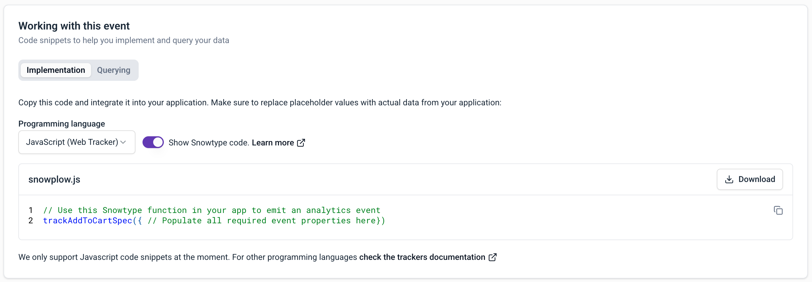

```mdx-code-block
import AvailabilityBadges from '@site/src/components/ui/availability-badges';

<AvailabilityBadges
  available={['cloud', 'pmc']}
  helpContent="Snowtype is available for Snowplow CDI customers only."
/>
```

Once you've defined your [tracking plans](/docs/event-studio/tracking-plans/index.md) and [event specifications](/docs/event-studio/tracking-plans/event-specifications/index.md), the next step is implementing the tracking code in your applications.

The best way to implement tracking is to use our CLI code generation tool, Snowtype. Snowtype reads your [event specifications](/docs/event-studio/tracking-plans/event-specifications/index.md) and [data structures](/docs/event-studio/data-structures/index.md) from your Snowplow account, and generates type-safe tracking code for the language and tracker you specify.

This provides several key advantages over manual implementation:
* Quicker implementation: reduce the work needed to produce production-ready tracking code
* Type safety: ensure your tracking code is consistent with your schemas and catch errors before they reach your pipeline
* Workflow integration: use CI/CD GitOps-like processes to keep your tracking code in sync with your schemas

For custom tracking on web, you also have the option of using the ready-to-use event specification code snippets from [Console](https://console.snowplowanalytics.com). See below for details.

## Snowtype workflow

The workflow for using Snowtype is:

1. **Define** your events and entities in [Console](https://console.snowplowanalytics.com) or [programmatically](/docs/event-studio/programmatic-management/index.md).
2. **Generate** tracking code by running Snowtype in your project. It produces typed functions you call instead of constructing event payloads manually.
3. **Track** events using the generated functions in your application code.
4. **Update** when schemas change. Snowtype can detect new versions and regenerate your code.

You can run Snowtype from the command line, or you can find its output in the Console on the **Implementation** tab of any [event specification](/docs/event-studio/tracking-plans/event-specifications/index.md).

## Supported trackers

Snowtype generates code for the following Snowplow trackers:

| Tracker                                                         | Language               |
| --------------------------------------------------------------- | ---------------------- |
| [Browser](/docs/sources/web-trackers/index.md)                  | TypeScript, JavaScript |
| [JavaScript](/docs/sources/web-trackers/index.md)               | JavaScript             |
| [iOS](/docs/sources/mobile-trackers/index.md)                   | Swift                  |
| [Android](/docs/sources/mobile-trackers/index.md)               | Kotlin                 |
| [React Native](/docs/sources/react-native-tracker/index.md)     | TypeScript             |
| [Flutter](/docs/sources/flutter-tracker/index.md)               | Dart                   |
| [Node.js](/docs/sources/node-js-tracker/index.md)               | TypeScript, JavaScript |
| [Go](/docs/sources/golang-tracker/index.md)                     | Go                     |
| [Java](/docs/sources/java-tracker/index.md)                     | Java                   |
| [Google Tag Manager](/docs/sources/google-tag-manager/index.md) | JavaScript             |


## Console code snippets

When viewing an [event specification](/docs/event-studio/tracking-plans/event-specifications/index.md) in Console, the **Working with this event** section provides ready-to-use code snippets.

The snippets in the **Implementation** tab show the exact tracking calls needed for each event, including all required properties and entities.

:::note Available for custom web events only
Code snippets are available for the JavaScript tracker only, for event specifications with custom event data structures.
:::

Here's an example snippet for the JavaScript tracker. It provides a `trackSelfDescribingEvent` call for the event specification, with the correct schema references and properties.

The example event specification has an event data structure named `article_click`, and one entity data structure, `article`. The snippet also includes an autogenerated `event_specification` entity. This helps with analysis as it's a direct link between the tracked event and the tracking plan.

To use your snippet, paste it into your application code, and provide the appropriate property values.

```javascript
window.snowplow("trackSelfDescribingEvent", {
    "event": {
        "schema": "iglu:com.example/article_click/jsonschema/1-0-1",
        "data": {
            "name": "", // string - Required - maxLength: 1000
            "location": "", // string - Nullable - maxLength: 1000
        }
    },
    "context": [
        // Entity: article (min: 0)
        {
            "schema": "iglu:com.example/article/jsonschema/3-0-0",
            "data": {
                "publish_date": "", // string - Nullable
                "content_id": "", // string - Nullable
            }
        },
        // System entity. Please do not edit it.
        {
            "schema": "iglu:com.snowplowanalytics.snowplow/event_specification/jsonschema/1-0-3",
            "data": {
                "id": "0a0ef8bb-314c-4973-8988-f192e8714d68",
                "name": "Article Click",
                "data_product_id": "28a6316a-47fd-473b-b5a1-00c555ba25e4",
                "data_product_name": "Article Performance",
                "data_product_domain": "Marketing"
            }
        }
    ]
});
```

Use the **Show Snowtype code** toggle to display the specific Snowtype function name to call for tracking implementation. TODO this needs to go somewhere else


