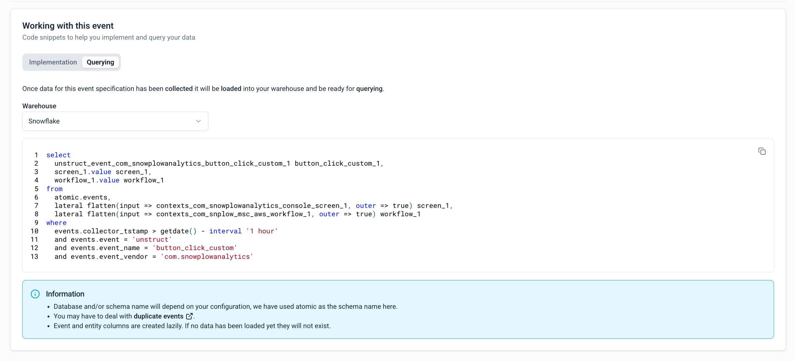

When viewing an [event specification](/docs/event-studio/tracking-plans/event-specifications/index.md) in Console, the **Working with this event** section provides ready-to-use code snippets.

The **Querying** tab provides example queries to help you retrieve and analyze your event data. Choose your warehouse to see appropriately optimized SQL.

