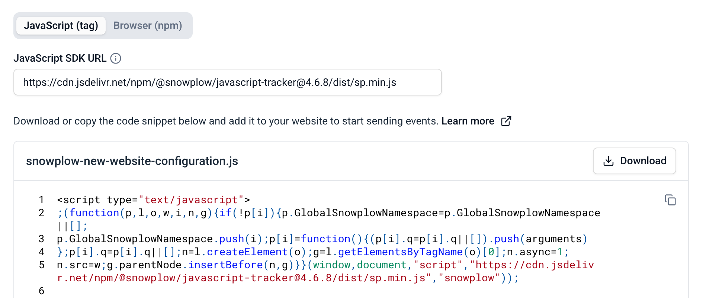

import Badges from '@site/src/components/Badges';
import Tabs from '@theme/Tabs';
import TabItem from '@theme/TabItem';

<Badges badgeType="Actively Maintained"></Badges>

For data collection, you will often have different sources of information that correspond to applications designed for a particular purpose. These are what we refer to as Source Applications.

:::tip
A guideline, which will address your needs most of the time, is to think of a Source Application as an independently deployable application system. For example:

* An Android mobile application
* An iOS mobile application
* A web application

This will let you best manage changes you make to the available application entities and make sure it reflects as closely as possible the current data state.
:::

To illustrate, consider Snowplow. We can identify several applications designed for distinct purposes, each serving as a separate data source for behavioral data, or in other words, a Source Application:

* The Snowplow website that corresponds to the application served under www.snowplow.io
* The Console application that is served under console.snowplowanalytics.com
* The documentation website serving as our information hub for all things related to our product, served under docs.snowplow.io

Source Applications are a foundational component that enables you to establish the overarching relationships that connect application IDs and [application entities](/docs/sources/web-trackers/custom-tracking-using-schemas/global-context/index.md) and [tracking plans](/docs/event-studio/tracking-plans/index.md).

## Application IDs

Each Source Application should have a unique application ID to distinguish it in analysis. For each of these applications you would set up a unique application ID using the [`app_id`](/docs/events/ootb-data/app-information/index.md#atomic-event-properties) field to distinguish them later on in analysis.

:::tip
We often see, and recommend as a best practice, setting up a unique application ID for each deployment environment you are using. For example, `${appId}-qa` for staging and `${appId}-dev` for development environments.
:::

## Application entities

Application entities, also referred to as [global context](/docs/sources/web-trackers/custom-tracking-using-schemas/global-context/index.md), are a set of entities that can be sent with every event recorded in the application. Using Source Applications you can document which application entities are expected. This is useful for tracking implementation, data discovery, and preventing information duplication in tracking plans.

:::info Conditional application entities
Since application entities can also be set conditionally, you can mark any of them as optional with a note to better understand the condition or any extra information required. The method for conditionally adding an application entity is through [rulesets](/docs/sources/web-trackers/custom-tracking-using-schemas/global-context/index.md#rulesets), [filter functions](/docs/sources/web-trackers/custom-tracking-using-schemas/global-context/index.md#filter-functions) and [context generators](/docs/sources/web-trackers/custom-tracking-using-schemas/global-context/index.md#context-generators).
:::

## Initialize tracking with the tracker configuration

Once you have created a source application, you can use the **Set up tracking** tab to configure tracking and generate ready-to-use code snippets. This guided configuration simplifies the instrumentation process and helps you start receiving events.

:::info
The Set up tracking tab currently supports the JavaScript tracker. You can always customize your tracking further by referring to the [tracker documentation](/docs/sources/index.md).
:::

### Configure tracker settings

The Set up tracking tab provides a visual interface to configure your tracker and generates code snippets based on your selections.

#### Initialize tracker

Configure the basic tracker settings:

- **Collector URL**: the endpoint where your events will be sent
- **App ID**: select one of the application IDs associated with your source application

<!-- placeholder  -->

#### Automatic tracking

Enable out-of-the-box tracking features to capture common user interactions without additional code:

- **Page views**: automatically track when pages are viewed
- **Link clicks**: capture clicks on links
- **Form interactions**: track form submissions and field interactions
- **Page pings**: monitor user engagement with periodic activity pings

Toggle these features based on your tracking requirements.

<!-- placeholder  -->

#### Implementation

The code snippet at the bottom of the Set up tracking tab updates in real-time as you modify settings. Copy the code snippet and integrate it into your application to begin tracking.

Choose your implementation method:

<Tabs groupId="implementation" queryString>
  <TabItem value="tag" label="JavaScript (tag)" default>
    Add a `<script>` tag to your website.

    The SDK URL is pre-filled with the latest version from a CDN but can be edited if you are hosting on your own domain.

    <!-- placeholder  -->

  </TabItem>
  <TabItem value="npm" label="Browser (npm)">
    Install the tracker as an npm package for bundled applications and any required plugins using your preferred package manager.

    <!-- placeholder  -->
  </TabItem>
</Tabs>
