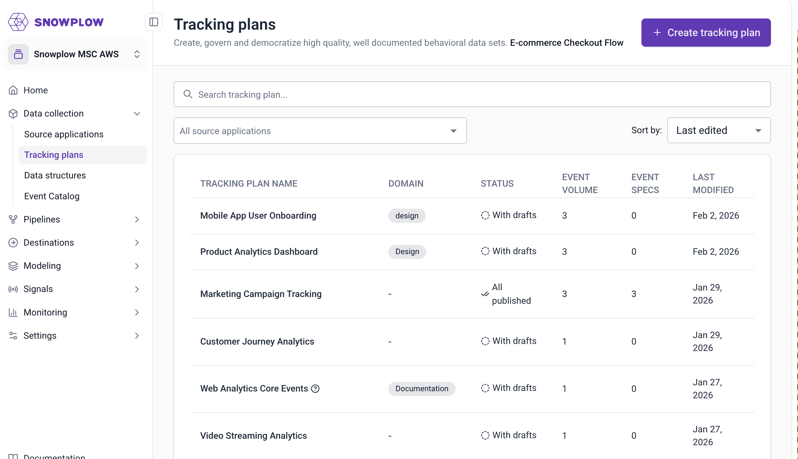
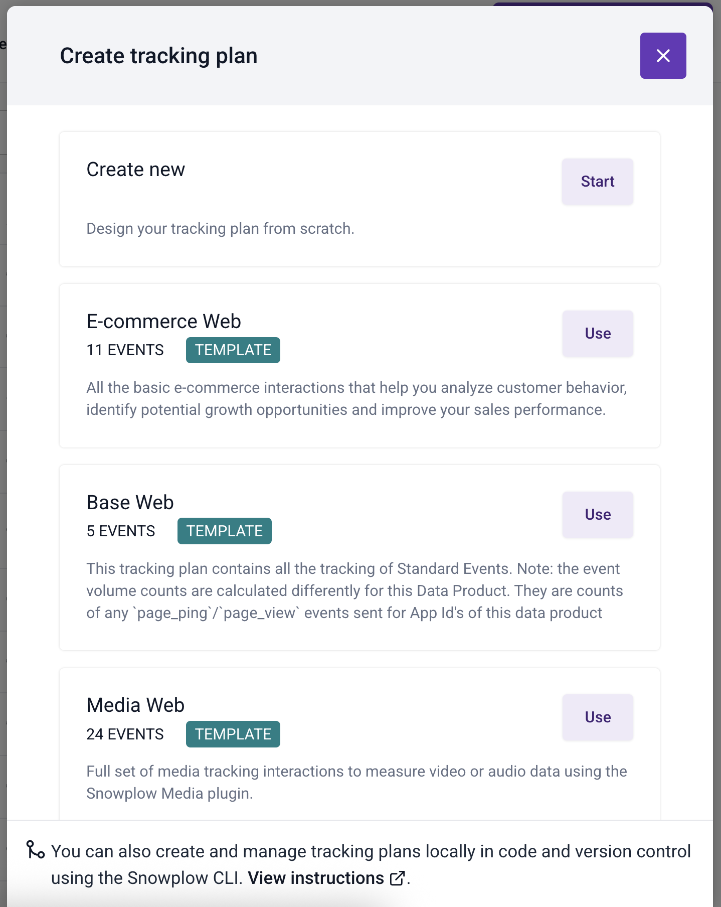
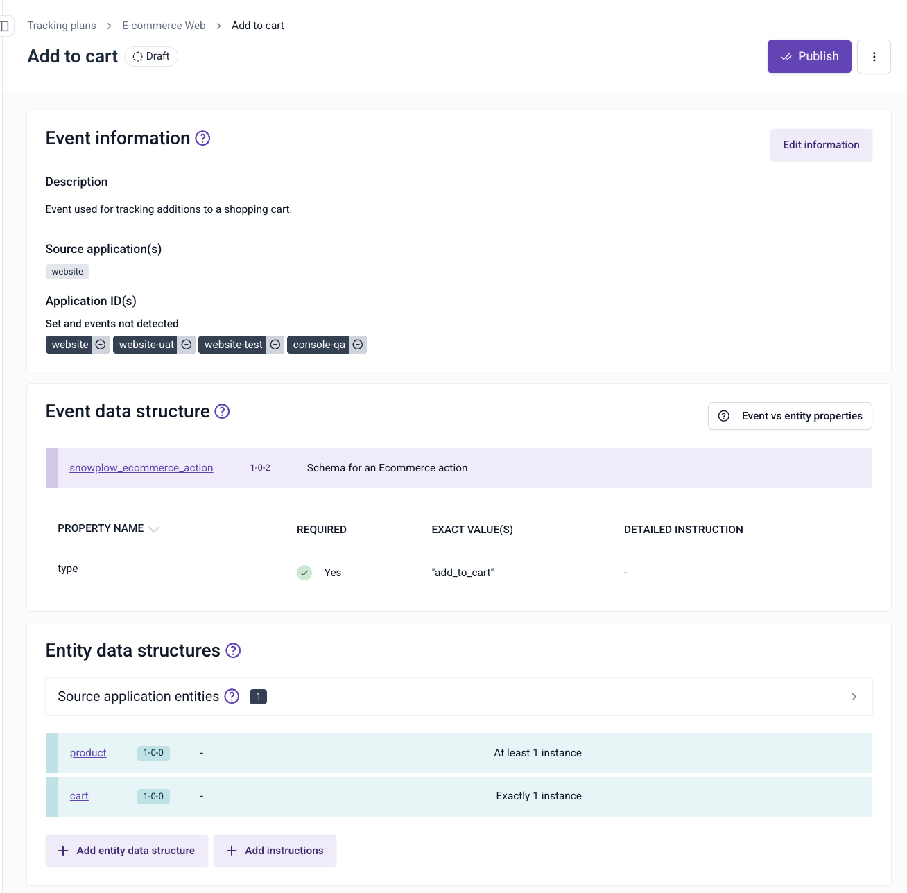
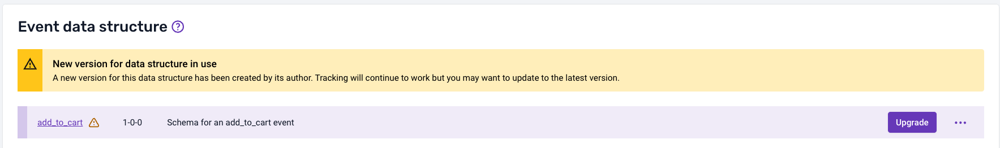
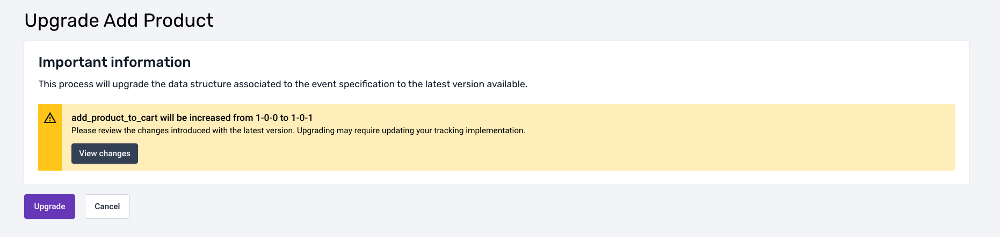
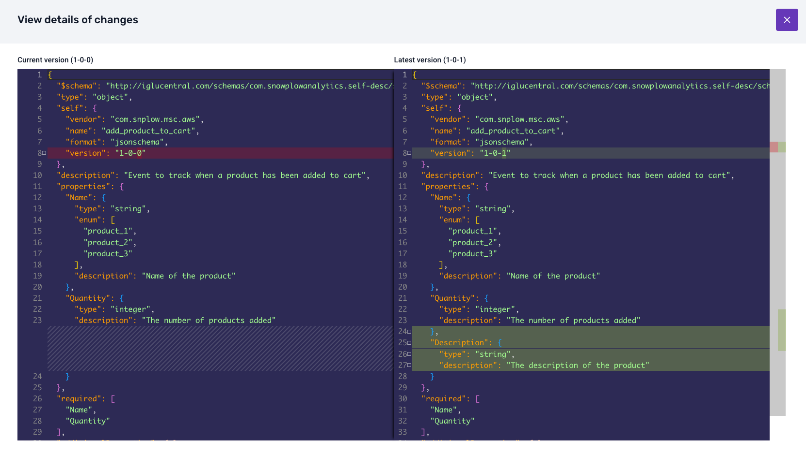
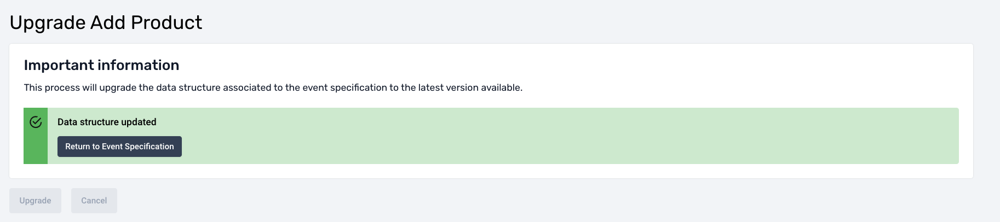
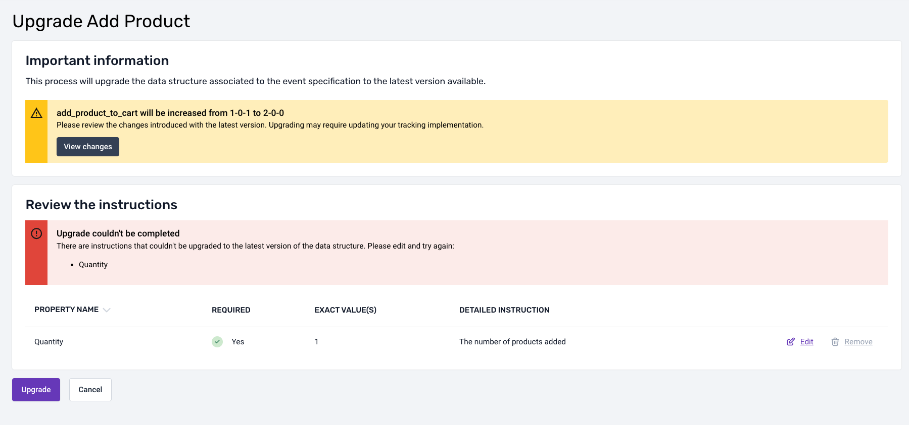

To create a new tracking plan, navigate to the "Tracking plans" section from the navigation bar and click the "Create tracking plan" button.

A modal will appear on the page, giving you the possibility to quickly create a tracking plan by using one of the existing templates or create one from scratch.

After selecting "Create new" a form will appear on the page. Enter your tracking plan information and click "Create and continue" to navigate to the event specification page.

:::note
The name of your tracking plan must be unique to ensure proper identification and avoid conflicts.
:::

The next page allows you to create multiple event specifications. You can click on any row to enter the details on this screen, or you can complete the information later.

When clicking on an event specification row, a page will allow you to enter additional information into separate modals:

- **Event information**; describes information such as which applications the event fires in
- **Event data structure**; determines how your data is structured and define the types of properties of the event
- **Entity data structures**; describes which entities to attach to the event when it is triggered
- **Event triggers**; specify the places and circumstances under which the event is triggered
- **Properties**; specify instructions about how each schema property should be set for this event specification

The breadcrumb navigation allows you to quickly navigate to the tracking plan overview as well as to the list of tracking plans. Alternatively, you can access the list of available tracking plans by clicking `Tracking plans` prominently displayed in the navigation bar on the left.

In the image below, you can see an example of a tracking plan. It not only provides an overview of all the event specifications but also allows you to access three important pieces of functionality.

- **Share**; allow other members of your organization to access the tracking plan
- **Subscribe**; receive notifications of any changes in the tracking plan
- **Implement tracking**; automatically generate the code for your tracking plan to be included in your application (to learn more visit [Code Generation - automatically generate code for Snowplow tracking SDKs](/docs/event-studio/implement-tracking/index.md))

:::note
Sharing and subscribing is only available for users registered in Snowplow Console.
:::

If you need to edit a tracking plan at any time, select it from the tracking plans listing accessible from the main menu.

## Upgrading Event Specification Instructions

When working with Event Specifications of a Tracking Plan, it's essential to account for the evolution of underlying [Data Structures](/docs/event-studio/data-structures/index.md). Data Structures define reusable JSON schemas, which can be referenced by different Event Specifications (events and entities). Each Event Specification may contain instructions, which rely on a specific version of a Data Structure, adding another layer to specialize or constraint Event Specifications in a more granular way.

### Versioning of Data Structures

As data and events evolve, Data Structures may be updated to new versions, which can be either compatible or incompatible with previous ones. These changes may cause potential conflicts with the instructions in Event Specifications (both events and entities) that reference an older version of the Data Structure.

### Semi-Automatic Upgrade of Event Specifications via the UI

To streamline the process of upgrading an Event Specification to the latest version of a Data Structure, we've implemented a mechanism that allows you to update Event Specification instructions through the UI. Here's how it works:

When a new version of a Data Structure becomes available, the system will indicate that the event or entities referenced by the data structure has a new version available, showing an **'Upgrade'** button in the UI.

Clicking the button navigates to a new page, informing the user of the new version they are upgrading to, along with a **'View Changes'** button.

When clicked it will show the differences between the current version of the Data Structure and the one the user intends to upgrade to.

At the bottom, a button will allow users to confirm the upgrade. One of two things can happen when the upgrade is confirmed:

#### 1. Successful automatic upgrade

- If the Event Specification instructions are compatible with the new Data Structure version, the system will automatically upgrade the Event Specification to the latest version of the Data Structure.
- All instructions will be updated seamlessly without any further user intervention.

#### 2. Conflict detection and resolution

If the new version of the Data Structure introduces incompatibilities with the existing Event Specification instructions, the system will flag the conflicting properties.

- The UI will prompt the user to resolve these conflicts before the Event Specification can be upgraded.
- The conflict resolution UI provides options to the user to modify or delete each instruction depending on the type of incompatibility:
  - **Remove conflicting instructions**: If a specific property is no longer present in the new Data Structure.
  - **Modify conflicting instructions**: If a property in the new Data Structure has been changed in an incompatible way (e.g., type change, added/removed enum values, added pattern, etc.).

This mechanism ensures that teams can benefit from updated Data Structures while maintaining the integrity and accuracy of their Event Specifications. Users are empowered to make informed decisions during the upgrade process, with clear visual cues and options to handle conflicts effectively.
