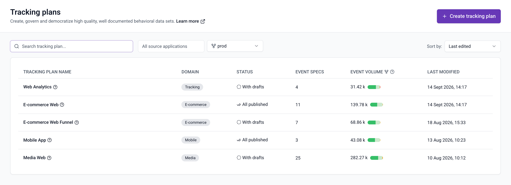
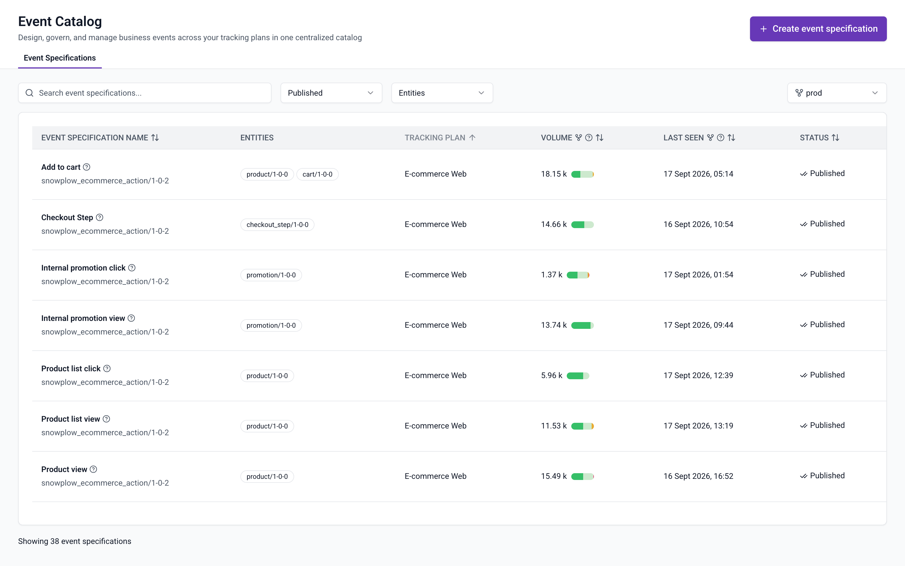
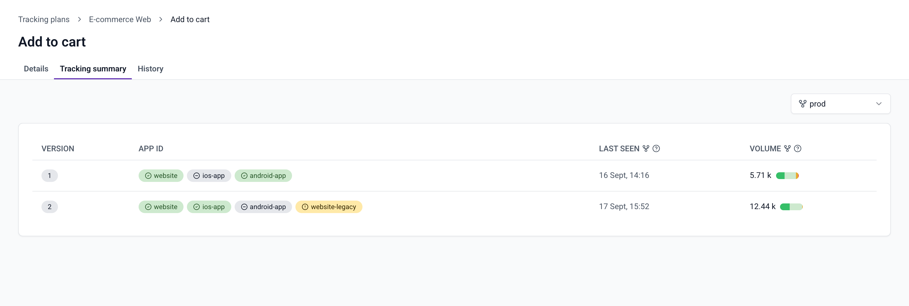

Console shows the results of [event specification inference](/docs/event-studio/tracking-plans/event-specification-inference/index.md) and [event specification validation](/docs/event-studio/tracking-plans/event-specification-validation/index.md) next to your tracking plans and event specifications. Every event volume figure is split into valid events, inferred events, events with violations, and failed events. You can see how well an implementation matches its specification without querying your warehouse.

Metrics cover the last 30 days for one pipeline at a time. Every view that shows them has a pipeline selector, which defaults to your production pipeline.

## Understand the event categories

Console sorts every event that the pipeline matches to a published event specification into one of four categories:

| Category               | Meaning                                                                                                                                                                                                                                                                                                        |
| ---------------------- | -------------------------------------------------------------------------------------------------------------------------------------------------------------------------------------------------------------------------------------------------------------------------------------------------------------- |
| Valid events           | Events that arrived with an `event_specification` entity and passed validation                                                                                                                                                                                                                                 |
| Inferred events        | Events that the pipeline matched to the specification by inference. Inferred events are valid events too, but the pipeline doesn't validate them                                                                                                                                                              |
| Events with violations | Events that arrived with an `event_specification` entity, failed validation, and were loaded to your warehouse with an `event_specification_validation` entity attached                                                                                                                                                                                       |
| Failed events          | Events attributed to the specification that ended up in [failed events](/docs/fundamentals/failed-events/index.md). This includes events with schema violations, and events that failed validation in a tracking plan that [sends them to failed events](/docs/event-studio/tracking-plans/event-specification-validation/index.md#send-invalid-events-to-failed-events) |

Only events that arrive with an `event_specification` entity go through validation, so only they can end up as valid events or events with violations. Tracking code generated with [Snowtype](/docs/event-studio/implement-tracking/index.md) attaches this entity for you. Events without it can only be matched by inference.

The total volume is the sum of the four categories. Where Console shows a bar next to a volume, each segment is one category. Hover over the bar to see the count for each category.

Failed event counts come from your [data quality dashboard](/docs/monitoring/index.md), not from the Console API. They are available when the selected pipeline loads failed events into your warehouse, the data quality dashboard is connected to that pipeline, and you have permission to view it. Otherwise the failed events category shows N/A, volumes exclude failed events, and a warning icon next to the volume explains why.

## View data quality for a tracking plan

Open a tracking plan to see its **Data quality** panel. The chart shows the total number of events across all event specifications in the plan, split by category, with the share and count of each. Click **View details** to open the data quality dashboard for the selected pipeline, or the failed events page when the dashboard isn't connected.

The event specifications table shows the same breakdown per event specification in its **Volume** column. The **Last seen** column shows the most recent event for the specification, whether it was valid or failed.

The **Data quality rules** button in the page header controls whether events that fail validation count as events with violations or as failed events. See [Send invalid events to failed events](/docs/event-studio/tracking-plans/event-specification-validation/index.md#send-invalid-events-to-failed-events).

## Compare tracking plans and event specifications

The **Tracking plans** list shows the volume breakdown for every tracking plan in its **Event volume** column. The [Event Catalog](/docs/event-studio/event-catalog/index.md) shows it for every event specification across all tracking plans in its **Volume** column. Both views have a pipeline selector next to the filters.

## Track specification versions and application IDs

Each event specification has a **Tracking summary** tab that breaks the metrics down by specification version and application ID. Use it to check that a new version has reached all applications, or that an application still sends an old version.

Each row is one version of the specification that the pipeline saw events for in the last 30 days. The **App ID** column lists the application IDs that sent those events, with a status for each:

| Status         | Meaning                                                                                                         |
| -------------- | --------------------------------------------------------------------------------------------------------------- |
| Green check    | The app ID belongs to a source application of this version and sent events                                      |
| Yellow warning | The app ID sent events, but doesn't belong to any source application of this version                            |
| Gray minus     | The app ID belongs to a source application of this version, but didn't send events in the last 30 days          |

A yellow status usually means that an application tracks the event without being listed in the specification. Add its [source application](/docs/event-studio/source-applications/index.md) to the specification, or remove the tracking from that application.
