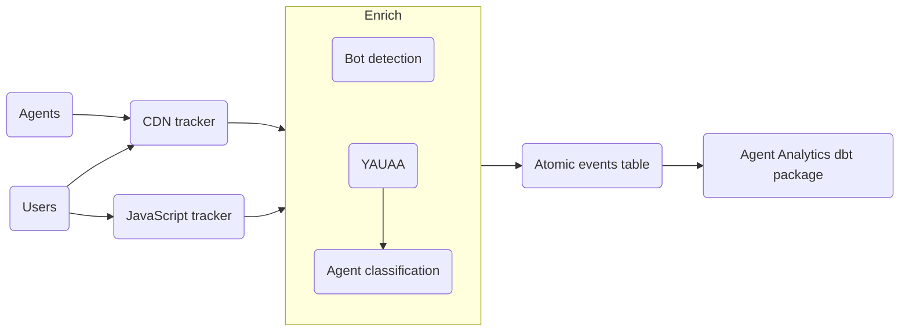

import AvailabilityBadges from '@site/src/components/ui/availability-badges';

<AvailabilityBadges
  available={['cloud', 'pmc', 'addon']}
  helpContent="These features are part of the paid Agent Intelligence package for Snowplow CDI."
/>

AI platforms such as ChatGPT, Claude, and Perplexity send agents to your website to train models, index content for AI search, and fetch pages on behalf of their users. Traditional analytics doesn't see this traffic, because most agents don't execute JavaScript and so never trigger client-side tracking.

Measuring agent traffic helps you answer questions such as:

* Which AI platforms engage with your content, and for what purpose?
* How much content does each platform consume compared to how many users it refers back to your site?
* Which pages are popular with users but not with agents, and vice versa?

Agent traffic analysis is the opposite of [filtering bot events](/docs/events/filtering-bot-events/index.md): instead of removing automated traffic from your analytics, you capture it and study it.

## Agent Intelligence components

The Agent Intelligence package consists of three components. Each one covers a different stage of the pipeline.

### CDN trackers

[CDN trackers](/docs/sources/cdn-trackers/index.md) track requests at the CDN level, so they capture every request to your site, including requests from agents that don't run JavaScript. Snowplow processes each request as a page view [event](/docs/fundamentals/events/index.md).

Snowplow supports [Cloudflare](/docs/sources/cdn-trackers/cloudflare/index.md) and [CloudFront](/docs/sources/cdn-trackers/cloudfront/index.md).

### Agent classification enrichment

The [agent classification enrichment](/docs/pipeline/enrichments/available-enrichments/agent-classification-enrichment/index.md) identifies known agents by the name that the [YAUAA enrichment](/docs/pipeline/enrichments/available-enrichments/yauaa-enrichment/index.md) parses from the user agent string. It attaches an [entity](/docs/fundamentals/entities/index.md) with the organization operating the agent, for example `OpenAI`, and the agent's purpose, for example `AI_TRAINING` or `AI_USER_FETCH`.

Snowplow CDI provides the classification dataset.

### Agent Analytics dbt package

The [Agent Analytics dbt package](/docs/modeling-your-data/modeling-your-data-with-dbt/dbt-models/dbt-agent-analytics-data-model/index.md) is an incremental data model that produces BI-ready tables describing agent activity and AI-referred human page views, broken down by operator, page, and agent. It includes scorecards that compare how many pages each operator requests against how many sessions its products refer.

## How the components fit together

CDN trackers and the [JavaScript tracker](/docs/sources/web-trackers/index.md) send events through the same pipeline. Enrichments identify and classify the agents, and the dbt package combines both event sources into derived tables in your warehouse.

The CDN tracker captures requests from both agents and users. The JavaScript tracker captures user page views, as well as page views from agents that run JavaScript. In the pipeline:

* The [bot detection enrichment](/docs/pipeline/enrichments/available-enrichments/bot-detection-enrichment/index.md) separates agent requests from human page views
* The YAUAA enrichment identifies each agent by name
* The agent classification enrichment adds the agent's operator and purpose
* The [referrer parser enrichment](/docs/pipeline/enrichments/available-enrichments/referrer-parser-enrichment/index.md) identifies human page views referred by AI products

The dbt package then counts agent requests per page, deduplicating agents that appear in both event sources, and attributes referred human page views to the operator whose product referred them.

## Set up agent traffic measurement

To start measuring agent traffic:

1. Request the Agent Intelligence package [in Console](https://console.snowplowanalytics.com/all-products)
2. Deploy a CDN tracker for [Cloudflare](/docs/sources/cdn-trackers/cloudflare/index.md) or [CloudFront](/docs/sources/cdn-trackers/cloudfront/index.md)
3. Enable the enrichments listed in the Agent Analytics [requirements](/docs/modeling-your-data/modeling-your-data-with-dbt/dbt-quickstart/agent-analytics/index.md#requirements), including the agent classification enrichment
4. Follow the Agent Analytics [Quick Start](/docs/modeling-your-data/modeling-your-data-with-dbt/dbt-quickstart/agent-analytics/index.md) to install and run the dbt package
