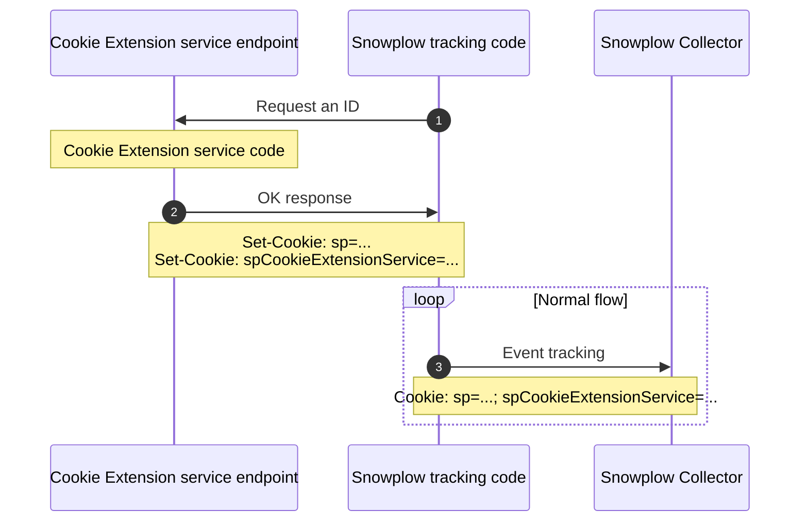

import Tabs from '@theme/Tabs';
import TabItem from '@theme/TabItem';

A Cookie Extension service works with the Snowplow [browser tracker](/docs/sources/trackers/web-trackers/index.md) to help you maintain consistent user identification despite browser privacy restrictions like Safari's Intelligent Tracking Prevention.

Deployed within your website's IP space, the service creates and manages persistent browser identifiers.

## Why use a Cookie Extension service?

Browsers, including iOS browsers (Safari, Chrome, Firefox) and desktop Safari, have limited the lifetime of some cookies, which limits the effectiveness of tracking a customer journey where the user is not regularly returning to your website.

As of Safari 16.4, released in April 2023, Safari sets the [lifetime of server-set first-party cookies](https://webkit.org/tracking-prevention/#cname-and-third-party-ip-address-cloaking-defense) to a maximum of 7 days in the following cases:

1. The server setting the cookie is behind a CNAME that resolves (at any point) to a host that is third-party to the website the user is currently browsing.
2. The server setting the cookie is set with A/AAAA records that resolve to an IP address (IP4 or IP6) where the first half of the address does not match the first half of the IP address for the server on the website the user is currently browsing. (e.g. 203.52.1.2 and 203.52.56.22 are okay, 201.55.1.2 is not).

By using a Cookie Extension service, you can extend the lifetime of browser identifiers, and therefore maintain high-quality knowledge of your customer journeys.

## Using the service

You will need to deploy and execute your Cookie Extension service code from the same IP space that serves the main web document of your application. This is probably the web application system, or the CDN in front of the application.

This code has minimal functionality and could be:

- An **API endpoint** that is part of the main web application.
- **A function running in an edge worker.** Almost all modern CDNs allow the addition of 'middleware' code which runs on requests at edge nodes in front of the client's application domain.
- **A custom middleware based on the customer's framework**, e.g. ExpressJS middleware, Next.js middleware, Play custom action etc. that can run on every document request.
- **A low-footprint application with a single endpoint**, e.g. a Go web server.



## Developing the service

The responsibilities of this service are:
1. Create a unique identifier (UUID v4) for this browser, set it in a cookie and return it in a `Set-Cookie` response header on a domain accessible by the service at all times.
2. Increase the expiry for the cookie used as the network_userid identifier (by default, a cookie named `sp`, configured via `collector.config.name`) which should have the same value as the first cookie.

On this page, we've called the new unique identifier cookie  `spCookieExtensionService`.

### Business logic

The Cookie Extension service code should include the following logic:

- If the Cookie Extension service new identifier cookie already exists on the request, then it should re-set the cookies with the same values and updated expiration for both the `spCookieExtensionService` and `sp` cookies.
- If `spCookieExtensionService` does not exist, but the collector's `sp` cookie does exist, then the it should set `spCookieExtensionService value = sp cookie value`. _This will make sure we keep old identifiers in place and not lose any data._
- If `spCookieExtensionService` and `sp` are both missing, then it generates a new ID in the `spCookieExtensionService` and `sp` cookies with the same unique identifier generation algorithm with the Snowplow pipeline, currently UUID v4.
- The HTTP response should have a 200 OK status code but any additional payload is not necessary.

### Example code

Here are two examples of code for Cookie Extension service API endpoints.

<Tabs groupId="cookie-extension-service" queryString>
<TabItem value="nextjs" label="Next.js TypeScript" default>

```ts reference
https://github.com/snowplow-industry-solutions/cookie-extension-service-examples/blob/main/examples/typescript/Next.js/api-route.ts
```

</TabItem>
<TabItem value="php" label="PHP">

```php reference
https://github.com/snowplow-industry-solutions/cookie-extension-service-examples/blob/main/examples/php/wordpress/api-route.php
```

</TabItem>

</Tabs>

## Configuring the browser tracker

:::note
Before version 4.5.0 of the tracker this attribute was available as `idService`.
:::

When the Cookie Extension service has been deployed on a system with the same resolved IP as the main document, the tracker can then be configured to orchestrate the required Cookie Extension service API calls.

This process is opt-in by using the `cookieExtensionService` option during tracker initialization:

<Tabs groupId="platform" queryString>
  <TabItem value="js" label="JavaScript (tag)" default>

```tsx
window.snowplow("newTracker", "sp", "{{collector_url_here}}", {
  /* ...Rest of the tracker options */
  cookieExtensionService: "/cookie-extension-service-endpoint"
});
```

  </TabItem>
  <TabItem value="browser" label="Browser (npm)">

```tsx
newTracker('sp1', 'c.customer.com', {
  cookieExtensionService: "/cookie-extension-service-endpoint",
  /* ...Rest of the tracker options */
 });
```

  </TabItem>
</Tabs>

When the tracker detects this option it will send an HTTP request during initialization on this endpoint to have the service set the required identifiers before sending any event.
