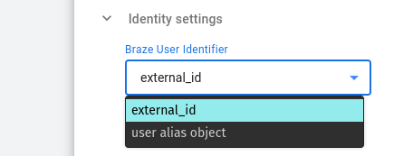
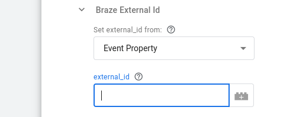
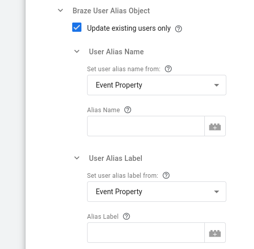
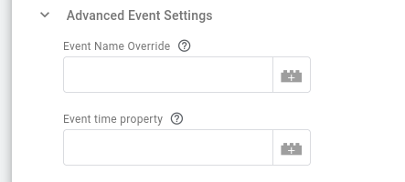

## Configuration options

### Braze REST API Endpoint (required)

Set this to the URL of your Braze REST [endpoint](https://www.braze.com/docs/api/basics/#endpoints).

### Braze API Key (required)

Set this to your Braze [API Key](https://www.braze.com/docs/api/basics/#app-group-rest-api-keys) that will be included in each request. The minimum permission that you need to assign for this API Key is to access the `/users/track` endpoint.


### Identity settings

#### Braze User Identifier

This section allows you to select which Braze user identifier (external user ID (`external_id`) or [User Alias](https://www.braze.com/docs/api/objects_filters/user_alias_object#user-alias-object-specification) `user_alias`) will be used by the tag. The default value is `external_id`.



##### Braze external_id

This configuration section is enabled if you have selected the `external_id` as the **Braze User Identifier**.



- **Set external_id from:**

  Use this option to select how you want to set the `external_id`, either from the Event Property you specify or directly from the Value you provide.

- **external_id**

  Depending on the previous selection, here you can specify the value or the client event property (e.g. client_id) that corresponds to the `external_id` user identifier for Braze API.

##### Braze User Alias Object

This configuration section is enabled if you have selected the `user_alias` as the **Braze User Identifier**.



###### Update existing users only

When enabled(default), this option will only update existing users. Uncheck this box to allow creating alias-only users.

###### User Alias Name

- **Set user alias name from:**

  Using this section you can select how you want to set the name of the user alias object: from an Event Property or directly from a Value you provide.

- **Alias Name**

  Depending on the previous selection, here you can specify the value or the client event property that corresponds to the User Alias Name.

###### User Alias Label

- **Set user alias label from:**

  Using this section you can select how you want to set the label of the user alias object: from an Event Property or directly from a Value you provide.

- **Alias Label**

  Depending on the previous selection, here you can specify the value or the client event property that corresponds to the User Alias Label.

<details>

<summary><i>pre-v0.2.0</i></summary>

#### Identity settings

##### Braze external_id (required)

Set this key to the client event property (e.g. `client_id`) that corresponds to your users' `external_id` and will be used as the [Braze User Identifier](https://www.braze.com/docs/api/basics/#external-user-id-explanation).

</details>

## Snowplow Event Mapping Options

This section includes the mapping rules that concern a Snowplow event as claimed by the [Snowplow Client](/docs/forwarding-events-to-destinations/forwarding-events/google-tag-manager-server-side/snowplow-client-for-gtm-ss/index.md):

### Include Self Describing event

This option indicates if the Snowplow Self-Describing event data will be included in the event's properties object that will be sent to Braze. By default, this option is enabled.

### Snowplow Event Context Rules

This section describes how the Braze Tag will use the context Entities attached to a Snowplow Event.

#### Extract entity from Array if single element

Snowplow Entities are always in Arrays, as multiple of the same entity can be attached to an event. This option will pick the single element from the array if the array only contains a single element.

#### Include Snowplow Entities in event object

Using this drop-down menu you can specify whether you want to Include `All` or `None` of the Snowplow context entities in Braze's `event_object`.

#### Snowplow Entities to Add/Edit mapping

Using this table you can specify in each row a specific mapping for a particular context entity. In the columns provided you can specify:

- The Entity name to add/edit-mapping (required).¹
- The key you could like to map it to (optional: leaving the mapped key blank keeps the same name).
- Whether to add in `event_object` or `user_attributes_object` of the Braze event (default value is `event_object`).
- Whether you wish the mapping to apply to all versions of the entity (default value is `False`).¹

#### Snowplow Entities to Exclude

Using this table (which is only available if `Include Snowplow Entities in event object` is set to `All`), you can specify the context entities you want to exclude from the Braze event. In its columns you can specify:

- The Entity name (required).¹
- Whether the exclusion applies to all versions of the entity (default value is `False`).¹

:::note

¹ How to specify the **Entity Name** and its relation to **Apply to all versions** option:

Entity Names can be specified in 3 ways:

1. By their Iglu Schema tracking URI (e.g. `iglu:com.snowplowanalytics.snowplow/client_session/jsonschema/1-0-2`)

2. By their enriched name (e.g. `contexts_com_snowplowanalytics_snowplow_client_session_1`)

3. By their key in the client event object, which is the GTM-SS Snowplow prefix (`x-sp-`) followed by the enriched entity name (e.g. `x-sp-contexts_com_snowplowanalytics_snowplow_client_session_1`)

Depending on the value set for the **Apply to all versions** column, the major version number from the 2nd and 3rd naming option above may be excluded. More specifically, this is only permitted if **Apply to all versions** is set to `True`.

:::

<details>

<summary><i>pre-v0.2.0</i></summary>

#### Snowplow Event Context Rules

##### Extract entity from Array if single element

Snowplow Entities are always in Arrays, as multiple of the same entity can be attached to an event. This option will pick the single element from the array if the array only contains a single element.

##### Include all Entities in event object

Leaving this option enabled (default) ensures that all Entities on an event will be included within the Braze event's properties object.

Disabling this option, reveals the options so that individual entities can be selected for inclusion.

##### Snowplow Entity Mapping

Using the "Snowplow Entity Mapping" table, the entities can also be remapped to have different names in the Braze and can be included in either event's properties or user attributes object.. The entity can be specified in two different formats:

- Major version match: `x-sp-contexts_com_snowplowanalytics_snowplow_web_page_1` where `com_snowplowanalytics_snowplow` is the event vendor, `web_page` is the schema name and `1` is the Major version number. `x-sp-` can also be omitted from this if desired
- Full schema match: `iglu:com.snowplowanalytics.snowplow/webPage/jsonschema/1-0-0`

##### Include unmapped entities in event

When remapping or moving some entities to User Attributes with the above customization, this option enables you to ensure that all unmapped entities (i.e. any entites not found in the "Snowplow Entity Mapping" rules above) will be included in the properties object of the Braze event.

</details>

## Additional Event Mapping Options

If you wish to pick other properties from the Client event and map them onto the Braze event, these can be specified in this section.

### Event Property Rules

#### Include common event properties

Enabled by default, this option sets whether to automatically include the event properties from the [Common Event definition](https://developers.google.com/tag-platform/tag-manager/server-side/common-event-data) in the properties of the Braze event.

#### Additional Event Property Mapping Rules

Specify the Property Key from the Client Event, and then the properties' object key you could like to map it to or leave the mapped key blank to keep the same name. You can use Key Path notation here (e.g. `x-sp-tp2.p` for a Snowplow events platform or `x-sp-contexts_com_snowplowanalytics_snowplow_web_page_1.0.id` for a Snowplow events page view id (in array index 0) or pick non-Snowplow properties if using an alternative Client. These keys will populate the Braze event's properties object.

#### Include common user properties

Enabled by default, this option sets whether to include the `user_data` properties from the common event definition in the Braze User Attributes object.

#### Additional User Property Mapping Rules

Using this table, you can additionally specify the Property Key from the Client Event, and then the User Attribute key you could like to map it to (or leave the mapped key blank to keep the same name). You can use Key Path notation here (e.g. `x-sp-tp2.p` for a Snowplow events platform or `x-sp-contexts_com_snowplowanalytics_snowplow_web_page_1.0.id` for a Snowplow events page view id (note the array index 0) or pick non-Snowplow properties if using an alternative Client.

## Advanced Event Settings



This section offers additional configuration options on the Braze event object:

### Event Name Override

You can use this option to override the name of the Braze event object or leave it blank to inherit from common event properties, which is the default. Please note that the `name` property of the [Braze event object](https://www.braze.com/docs/api/objects_filters/event_object/#event-object), that this option populates, is a required property according to Braze API.

### Event time property

This option enables you to specify the client event property to populate the event time (in ISO-8601 format) or leave it empty to use the current time (default behaviour).

## Logs Settings

_(Available since v0.2.0)_

Through the Logs Settings you can control the logging behaviour of the Braze Tag. The available options are:

- `Do not log`: This option allows you to completely disable logging. No logs will be generated by the Tag.
- `Log to console during debug and preview`: This option enables logging only in debug and preview containers. This is the **default** option.
- `Always`: This option enables logging regardless of container mode.

_Note_: Please take into consideration that the logs generated may contain event data.

The logs generated by the Braze GTM-SS Tag are standardized JSON strings.
The standard log properties are:

```json
{
    "Name": "Braze",    // the name of the tag
    "Type": "Message",  // the type of log (one of "Message", "Request", "Response")
    "TraceId": "xxx",   // the "trace-id" header if exists
    "EventName": "xxx"  // the name of the event the tag fired at
}
```

Depending on the type of log, additional properties are logged:

| Type of log | Additional information                                         |
|-------------|----------------------------------------------------------------|
| Message     | “Message”                                                      |
| Request     | “RequestMethod”, “RequestUrl”, “RequestHeaders”, “RequestBody” |
| Response    | “ResponseStatusCode”, “ResponseHeaders”, “ResponseBody”        |
