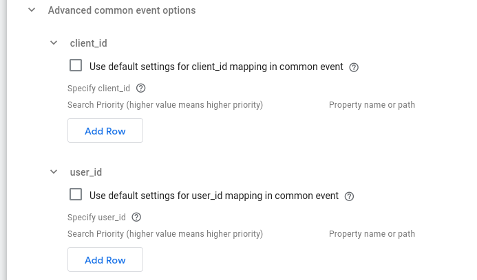

:::tip Populating common User Data

The [GTM Common Event](https://developers.google.com/tag-platform/tag-manager/server-side/common-event-data) has a `user_data` property. To populate this, you can attach a context Entity to your events of this schema: `iglu:com.google.tag-manager.server-side/user_data/jsonschema/1-0-0`, which can be found on [Iglu Central](https://github.com/snowplow/iglu-central/blob/853357452300b172ebc113d1d75d1997f595142a/schemas/com.google.tag-manager.server-side/user_data/jsonschema/1-0-0).

:::

## Forward User IP address

As the container sits between the website user and the Snowplow collector (or other downstream destinations), the users IP will be unknown to the destination. By enabling this option, the users IP address will be included in the events sent to Tags.

By disabling this, you are able to use GTM SS as a proxy which can string user IP addresses from requests. Many tags also offer this functionality at the tag level.

## Populate GAv4 Client Properties

Enabled by default, this option will populate additional properties which the GAv4 requires, that is useful if you want to forward your Snowplow events to the GAv4 Tag.

## sp.js settings

This setting allows for your GTM SS Container to serve your `sp.js` JavaScript Tracker file. This allows you to have first party hosting of your tracker without the need to set up separate hosting or use a third party CDN.

It is recommended to rename `sp.js` if enabling this setting, as many adblockers will block requests to files named `sp.js`. A random string is the best option here.

You can request _any_ version of the Snowplow JavaScript Tracker with this setting enabled. e.g. `https://{{gtm-ss-url}}/3.1.6/776b5b25.js` will load v3.1.6, or `https://{{gtm-ss-url}}/2.18.2/776b5b25.js` will load v2.18.2.

## Additional Options

### Custom POST Path

As many ad blockers will block the default `/com.snowplowanalytics.snowplow/tp2` POST path, it is recommended to change this and then update your trackers initialization to use this custom POST path.

### Claim GET Requests

The default Snowplow path for GET requests is `/i`, as this is so short there is a chance it could conflict with other Clients within your GTM SS Container. If you'd only like your Snowplow Client to listen for POST requests, you can disable this GET endpoint with this setting.

### Include Original `tp2` Event

If using this Client to receive Snowplow Tracker events and then forward to a Snowplow Collector with the Snowplow Tag, you should leave this option enabled as it will allow the Snowplow Tag to forward the original tracker event with no extra processing.

### Include Original Self Describing Event

By default, the self describing event will be "shredded" into a key using the schema name as the key, this is a "lossy" transformation, as the Minor and Patch parts of the jsonschema version will be dropped. This flag populates the original, lossless, Self Describing Event as `x-sp-self_describing_event`.

### Include Original Contexts Array

By default, the contexts will be "shredded" into separate keys using the context name as the key, this is a "lossy" transformation, as the Minor and Patch parts of the jsonschema version will be dropped. If you would like to keep the original "lossless" contexts array (as `x-sp-contexts`), enable this option.

## Advanced common event options

### `client_id`

#### Use default settings for client_id mapping in common event

By default the Snowplow Client sets the `client_id` as follows: If the Snowplow event has the `client_session` context entity attached, its `userId` property is used. Else the `domain_userid` atomic property is used. Disabling this option reveals the following table that allows you to override the default behavior.

#### Specify client_id

You can use this table to specify the rules to set the `client_id` of the common event. For consistency downstream it is suggested to specify properties that apply to all Snowplow events (atomic or through global context entities). The columns of this table are:

- **Priority**: Using this column you can set the priority (higher values mean higher priority) with which the Client will look into the Snowplow event to locate the value to set the `client_id`.
- **Property name or path**: This column refers to the common event, so you can define alternative Snowplow properties using the `x-sp-` prefix before the enriched property name or nested path (using dot notation). Example values: `x-sp-network_userid` or `x-sp-contexts_com_acme_user_1.0.anonymous_identifier`.

### `user_id`

#### Use default settings for user_id mapping in common event

By default the Snowplow Client sets the `user_id` from the corresponding `user_id` property of the Snowplow event. Disabling this option reveals the following table that allows you to override the default behavior.

#### Specify user_id

You can use this table to specify the rules to set the `user_id` of the common event, which will override the default Snowplow Client behavior. For consistency downstream it is suggested to specify properties that apply to all Snowplow events (atomic or through global context entities). The columns of this table are:

- **Priority**: Using this column you can set the priority (higher values mean higher priority) with which the Client will look into the Snowplow event to locate the value to set the `user_id`.
- **Property name or path**: This column refers to the common event, so you can define alternative Snowplow properties using the `x-sp-` prefix before the enriched property name or nested path (using dot notation). For example: `x-sp-contexts_com_acme_user_entity_1.0.email`.
