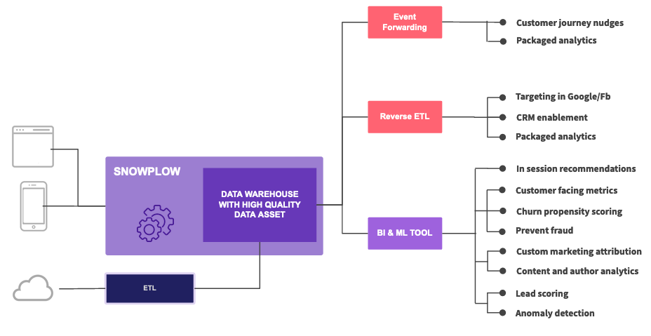

Snowplow gives you multiple ways to get your data where it needs to go. You can load data into warehouses and lakes for deeper analysis, forward individual events to marketing platforms in real-time, or send aggregated segments to activate your insights.

The best approach depends on your use case, but most organizations benefit from combining approaches: storing data centrally in a warehouse while selectively forwarding specific events or segments to operational systems.

## Data warehouses and lakes

Snowplow loads your data into warehouses and lakes where you can combine it with other datasets for comprehensive analytics. You can choose from major data platforms including Redshift, BigQuery, Snowflake, Databricks, and Synapse Analytics, as well as cloud storage like S3, GCS, and ADLS through [our various loaders](/docs/destinations/warehouses-lakes/index.md).

## Event forwarding

Send individual events to downstream platforms in real-time through [event forwarding](/docs/destinations/forwarding-events/index.md). This approach works well for marketing and personalization platforms that can act on fresh event data, product analytics tools that require granular event-level data, and streaming platforms like Kafka, Kinesis, and Pub/Sub for internal consumption and real-time processing.

## Reverse ETL

Sync aggregated data and customer segments from your warehouse to operational systems through [reverse ETL](/docs/destinations/reverse-etl/index.md). This approach lets you activate insights from your data by sending calculated metrics, audience segments, or enriched profiles to marketing and sales tools. Snowplow partners with Census to provide this functionality.
