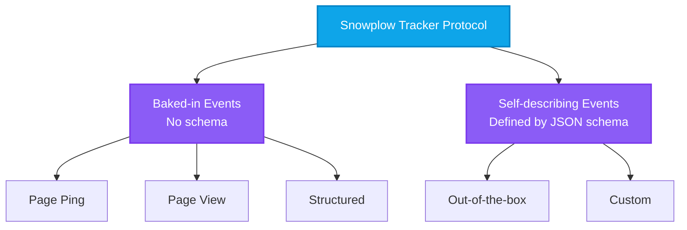

The word "event" can mean multiple things, depending on the context and perhaps on your role.

If you're a marketer or a product manager, you might think about an event as a description of a behavior, or as an interaction between the user and other [entities](/docs/fundamentals/entities/index.md). This is a high-level conceptual definition. Examples of events include:
- Load a web page
- Add an item to basket
- Enter a destination
- Check a balance
- Search for an item
- Share a video

If you're an analyst, an event to you might be a row in a database table. For a data engineer, an event might be a record in a stream, or an object in a storage bucket. For an implementation engineer, an event could be the parameters for a tracker API call, or the HTML payload generated. All of these definitions are valid.

## Event lifecycle

The different meanings of "event" apply at different stages of the tracking lifecycle:
1. Stakeholders decide what behaviors and **interactions** to capture
2. Stakeholders create a [tracking plan](/docs/fundamentals/tracking-design-best-practice/index.md) that defines the desired **structure** of the events
3. Engineers pass event data **parameters** to a Snowplow tracker
4. The tracker sends HTML **payloads** to the Collector endpoint
5. The Snowplow pipeline processes the payloads into stream **records**, then loads them into a data warehouse or lake
6. Analysts and data scientists query the data **rows** in the tables

## How to track events

Track events in your applications using one of the [Snowplow tracking SDKs](/docs/sources/trackers/index.md). Each SDK provides built-in APIs to track different types of events.

All the trackers also support custom tracking, so you can define the events that are relevant to your business.

You can also use [webhooks](/docs/sources/webhooks/index.md) to track automated actions. The Snowplow [Collector endpoint](/docs/pipeline/collector/index.md) accepts all [valid](/docs/events/going-deeper/event-parameters/index.md) Snowplow event payloads, regardless of their source.

## Snowplow event types

All Snowplow events have the same underlying structure and standard fields. These are listed in detail here ADD LINK. In the data warehouse, all events share a number of standard columns, such as timestamps. That said, event-specific data will be stored differently. See also [what Snowplow data looks like](/docs/fundamentals/canonical-event/index.md).

Snowplow has two core types of events:
* Schema-less **baked-in** events
  * The baked-in event types are page views, page pings, and structured events
* **Self-describing** events that are based on a [JSON schema](/docs/fundamentals/schemas/index.md)
  * All other events are self-describing events
  * This includes out-of-the-box events that come with Snowplow, and custom events that you define yourself

Whether an event is baked-in or self-describing affects how you'll model the data.

All Snowplow events are by default tracked with schema-defined [entities](/docs/fundamentals/entities/index.md) attached to them.

### Baked-in events

The following events are "baked in":
* Page views ADD LINK
* Page pings ADD LINK
* Structured events ADD LINK

In the data warehouse, any event-specific information will be in standard columns in the Snowplow `events` table. You can find those listed [here](/docs/fundamentals/canonical-event/index.md#event-specific-fields).

Find out more about how to track and model page view and page ping events [here](/docs/events/ootb-data/page-activity-tracking/index.md).

:::tip Legacy structured events
We recommend using self-describing events instead of structured events whenever possible. Structured event tracking is a legacy format used to track events that were not natively supported by Snowplow.
:::

:::info Legacy transaction events
The legacy `transaction` and `transaction_item` events are also "baked-in". Several Snowplow trackers provide [ecommerce tracking](/docs/events/ootb-data/ecommerce-events/index.md) APIs; we recommend using these instead, as they support current Snowplow best practise, and are compatible with the [Snowplow ecommerce dbt package](/docs/modeling-your-data/modeling-your-data-with-dbt/dbt-models/dbt-ecommerce-data-model/index.md).
:::

### Self-describing events

Self-describing events can include arbitrarily complex data, as defined by the event's [schema](/docs/fundamentals/schemas/index.md) or data structure. We call them "self-describing" because these events include a reference to their schema.

Each self-describing event consists of two parts:
- `schema`: a reference to a [schema](/docs/fundamentals/schemas/index.md) that describes the name, version and structure of the event
- `data`: the event data as a set of key-value properties in JSON format

Because the event references a specific version of its schema, it's always clear to downstream users and applications what each field in the event means, even if your definition of the event changes over time.

Snowplow provides a large number of self-describing events out-of-the-box, for example:
* Link clicks
* Form submissions
* Ecommerce transactions

Check out the full range of included events [here](/docs/events/ootb-data/index.md).

You can also create [custom self-describing events](/docs/events/custom-events/index.md) to match your business requirements. Snowplow provides [tooling](/docs/data-product-studio/index.md) to help you define and track custom events.

Find out more here ADD LINK about how self-describing events are structured in the data warehouse.

:::info Terminology
We originally called self-describing events "unstructured events", to distinguish them from structured events. This was misleading, because these events are actually more structured than structured events. The old term is deprecated, but you might still see it in some docs, APIs and database column names, such as `unstruct_event` or `ue`.
:::
