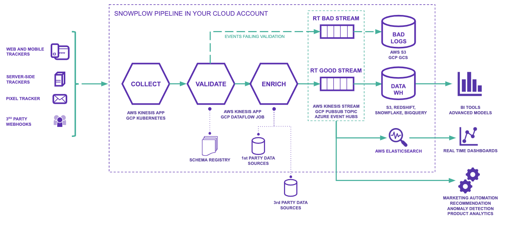

The diagram above illustrates a typical Snowplow pipeline with data flowing left to right.

- [**Trackers**](/docs/sources/index.md) generate [event](/docs/fundamentals/events/index.md) data and send this to your Collector. We have trackers covering web, mobile, desktop, server and IoT. Additionally, [**webhooks**](/docs/sources/webhooks/index.md) allow third-party software to send their own internal event streams to your Collector for further processing.
- Events hit the **Collector** application and it saves the raw events to storage (S3 on AWS and Google Cloud Storage on GCP) and then sends them down the pipeline to Enrich.
- The **Enrich** application cleanses the data and validates each event against its [schema](/docs/fundamentals/schemas/index.md) to ensure it meets the criteria you have designed and set. When an event fails to validate, it will feed into a bad data stream which contains all of your [**failed events**](/docs/fundamentals/failed-events/index.md). This way, the Snowplow pipeline is non-lossy as failed events [can be reprocessed](/docs/monitoring/recovering-failed-events/index.md).
- Once validated, each event is enriched by the [**Enrichments**](/docs/pipeline/enrichments/available-enrichments/index.md) you have configured for your pipeline.
- The enriched events are sent to real-time streams (Kinesis on AWS, PubSub on GCP). At this point, data can be [**forwarded**](/docs/destinations/forwarding-events/index.md) to other applications to power real-time use cases.
- [**Loaders**](/docs/destinations/warehouses-lakes/index.md) then load your data off the real-time streams into the various destinations you have set up for your pipeline. Typically these include a data warehouse (Redshift, Snowflake, BigQuery, Databricks) or a data lake (S3, GCS, ADLS / OneLake). Note that you can also connect a data warehouse to a data lake (e.g. Synapse Analytics + ADLS) instead of loading to a warehouse directly.
- Your event-level data is now in your chosen destinations. From here we recommend this raw data is [**modelled**](/docs/modeling-your-data/index.md) into smaller, cleaner tables that are easier to perform analysis on. At this stage it can also be joined with other data sets. We have out-of-the-box data models for web and mobile to help you get started.

## Why do we use this architecture?

Snowplow's distinctive architecture has been informed by a set of key design principles:

1. **Extreme scalability** - Snowplow should be able to scale to tracking billions of customer events without affecting the performance of your client (e.g. website) or making it difficult to subsequently analyze all of those events
2. **Permanent event history** - Snowplow events should be stored in a simple, non-relational, immutable data store. Your raw event data is never compacted, overwritten or otherwise corrupted by Snowplow
3. **Direct access to individual events** - you should have direct access to your raw Snowplow event data at the atomic level. Unlike with other solutions, the data is not intermediated by a third-party vendor, or a slow API, or an interface offering aggregates only
4. **Separation of concerns** - event tracking and event analysis should be two separate systems, only loosely-coupled. As a result, Snowplow can be used to feed whatever analytics process you want
5. **Support any analysis** - Snowplow should make it easy for business analysts, data scientists and engineers to answer any business question they want, using as wide a range of analytical tools as possible, including Machine Learning
