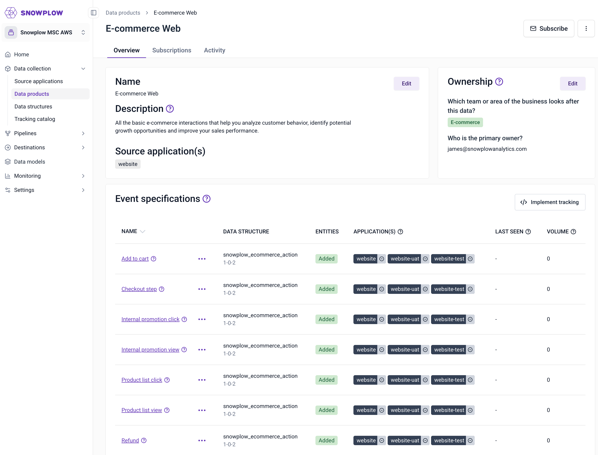
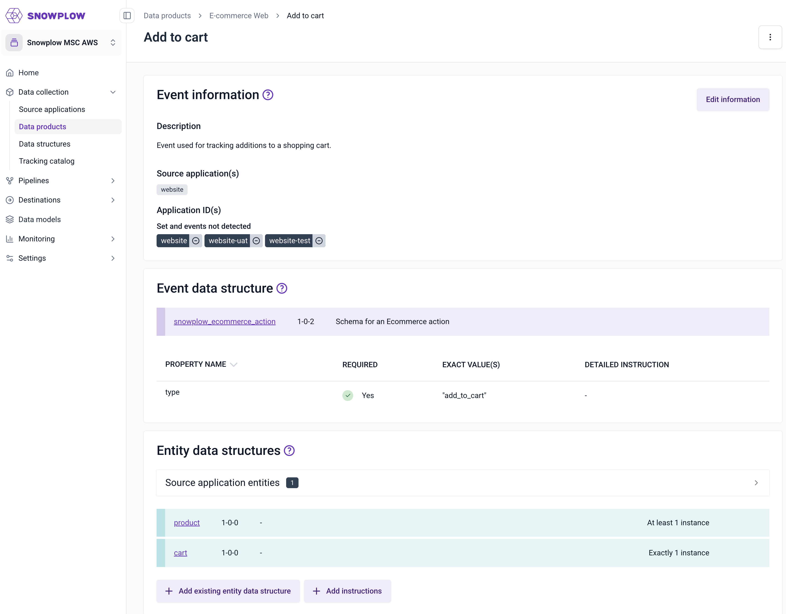
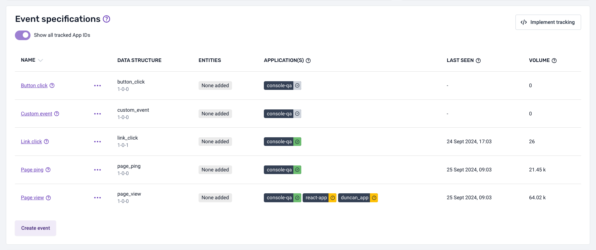

Tracking plans are Snowplow's solution to helping organizations more easily create and democratise behavioral data. By creating well-documented datasets, that are both human and machine readable, you can more easily collaborate around data and unlock self-service analytics at scale.

With tracking plans, you can:

* Set clear ownership for the data being created
* Make tracking implementation easier
* Deliver better governance around your data
* More easily communicate what the data means and how to use it
* Collaborate more effectively with the various teams involved in delivering value from your data
* Drive a self-serve culture around data across your organization

## What is a Tracking Plan

A tracking plan is a documented dataset. By documenting what data you are collecting, where, the meaning of that data and how to use it, you can break down the barriers that often exist between the many teams involved in the data value chain, i.e. from those implementing the tracking to those analysing the data.

At its core, a tracking plan has:

* An explicit owner; that is responsible for maintaining and updating the data over time
* Consumers; who use the data to deliver use cases and are impacted by upstream changes

Tracking plans at Snowplow are underpinned by the concept of a data contract. They act as a formal agreement between the producers of tracking plans and the consumers of tracking plans, and support better collaboration around the data being created.

Examples of tracking plans:

* Ecommerce Web
* Media Web

## Key elements of a Tracking Plan

**The Source Application/s it is part of**; a tracking plan is referencing the [Source Application/s](/docs/event-studio/source-applications/index.md) that is spanning across.

**Benefits:**

* Have a clear view in which application the tracking plan is implemented in, which domains it spans and the related application context information it will have available by default in the dataset.

**An owner**; tracking plans are typically split by domain with each tracking plan having an explicit owner that is responsible for the maintenance and evolution of that data.

**Benefits:**

* Know who to go to when new data is required for a particular domain or when there is an issue with the data, breaking down the barriers between data producers and data consumers

**Event specifications**; these describe each event that is collected as part of the tracking plan, on which applications they are triggered and where, the event data structure to validate against, and the entities to attach to each event (e.g. user, product etc).

**Benefits:**

* Provide implementation details to developers implementing tracking (see section on [Snowtype](/docs/event-studio/implement-tracking/snowtype/index.md) for further details)
* Provide documentation around the semantics of the data that you are creating, to enable analysts, data scientists, analytics engineers with data discoverability

**Subscribers;** allow colleagues to express an interest in understanding changes that are made to the data within a Tracking Plan, usually because the data is being used in a downstream data model or Data Model Pack.

**Benefits:**

Break down the barriers that exist between data producers and data consumers, by providing:

* data producers, with visibility of how the data is being used downstream and the implications of any changes
* data consumers, with notifications when changes are made to a Tracking Plan so that they can make any necessary changes to their models, reports etc.

**Change history**; a complete audit log of the changes that have been made to the tracking plan, including changes to existing data and new data that has been added over time.

**Benefits:**

* Enhances accountability and transparency by providing a clear audit trail of all data modifications, fostering confidence in data integrity

**Volume metrics**; tracking plans can detect events ingested in your pipeline that match the configured event specifications. This allows your team to monitor occurrence-related metrics for events being tracked with specific [event specification IDs](/docs/event-studio/implement-tracking/snowtype/commands/index.md#snowtype-patch).

**Benefits:**

You will be able to view several items in the UI that help detect anomalies or potential misconfigurations in trackers that are either not sending the expected events or are using incorrect [application IDs](/docs/event-studio/source-applications/index.md#application-ids). This is particularly useful during the development phase when implementing tracking for a specific application using [Snowtype](/docs/event-studio/implement-tracking/snowtype/index.md). These elements include:

* A counter for each event specification, showing the total number of events detected from the tracked application IDs in the last 30 days.
* A 'last seen' field for each event specification, indicating when the last event matching the event specification ID was detected.
* A list of application IDs from which events are being tracked, displayed for each event specification. For each application ID, a status will be shown with different colors:
  * __Green__: Event specifications are being tracked and identified with the specific application ID inherited from the configured [source applications](/docs/event-studio/source-applications/index.md).
  * __Gray__: No event specifications are being tracked for an application ID inherited from the configured source applications.
  * __Yellow__: Event specifications are being tracked for an application ID that has not been configured or inherited from the source applications.

:::note

Some tracking plans, such as [__Base Web__](/docs/event-studio/tracking-plans/templates/index.md#base-web) and [__Base Mobile__](/docs/event-studio/tracking-plans/templates/index.md#base-mobile), contain standard events (e.g., _page pings_, _link clicks_, _screen view_, _application install_).

For these tracking plans, the volume metrics will behave differently:

- If no standard events are being tracked with an application ID different from those inherited from the source applications set up in the tracking plan, the behavior will be the same as for a normal tracking plan.

- If standard events are being tracked with application IDs different from those inherited from the source applications set up in the tracking plan, a toggle will appear above the event specification list.

  This toggle will be disabled by default, so the metrics displayed will relate only to the application IDs inherited from the source applications set up in the tracking plan.

  

  If the toggle is enabled, it will show the metrics for all the application IDs found for the standard events (not just the ones inherited from the tracking plan).

  

:::

## How tracking plans help with governance, data quality and data discoverability

The **data structures** that you attach to your event specification describe the [structure of the data](/docs/fundamentals/schemas/index.md). They validate that the values of the properties contained within your events and entities are **valid** as they pass through your pipeline.

The **event specification** describes a specific implementation of an event. It is a narrower definition of your event than a data structure - not only do they describe the structure of the data (by attaching the relevant data structure to validate against), they also allow you to define the **right values** for fields when the event gets triggered and the entities that need to be attached.

*NB: the event specifications are not enforced by your pipeline (for example, we don’t yet validate that the correct entities are attached to an event).*

By adding screenshots, and descriptions to the event specification, you are also able to communicate the **semantics of the data** to those that want to analyse it. In this way you can ensure that the data is **represented accurately** when being used to derive insights and make decisions by the many teams using the data downstream.

A data structure can be used across event specifications, and across tracking plans. In doing so, you can ensure you consistently track business critical events and entities (for example, your "product" entity) across your organisation. Having the ability to use centralised event and entity schemas in this way, means that you are able to better govern the structure of the data across an organisation whilst also empowering teams to manage their own specific implementation of events via tracking plans.

To understand how to get started with tracking plans, see [Defining the Data to collect with Tracking Plans](/docs/event-studio/tracking-plans/index.md) for further details.
