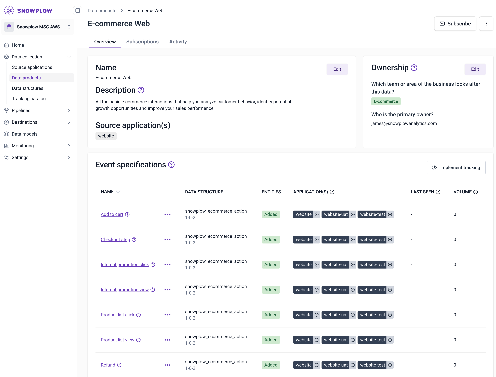

A tracking plan is a documented dataset. It acts as a data contract, recording what data you create, where it comes from, what it means, and how to use it.

Tracking plans give the teams involved in producing and consuming behavioral data a shared reference, so analysts, engineers, and product teams can collaborate around the same definitions.

The core of a tracking plan is its set of event specifications. Each event specification describes one [event](/docs/fundamentals/events/index.md) you collect: what triggers it, the [data structure](/docs/fundamentals/schemas/index.md) it validates against, and the [entities](/docs/fundamentals/entities/index.md) attached to it.

See the [tracking design best practice guide](/docs/fundamentals/tracking-design-best-practice/index.md) for advice on using tracking plans.

## Tracking plan structure

[Tracking plans](/docs/event-studio/tracking-plans/index.md) are typically split by domain, with each plan covering one product area. Every tracking plan has:
* An explicit owner who's responsible for maintaining the data over time
* Subscribed users who use the data downstream and want to be notified of changes
* [Event specifications](/docs/event-studio/tracking-plans/event-specifications/index.md) that describe how to track the data
* Defined [source applications](/docs/event-studio/source-applications/index.md) that events in the plan are tracked from
* A complete change history
* Volume metrics for the tracked events

Snowplow provides out-of-the-box [tracking plan templates](/docs/event-studio/tracking-plans/templates/index.md) to help you get started, including the Ecommerce Web template as shown in this screenshot:

### Event specifications

Event specifications describe a specific implementation of an event. They allow you define additional requirements on top of your data structures. Data structures can be used across tracking plans, but an event specification is unique to its tracking plan.

Every event specification has:
* A [data structure](/docs/fundamentals/schemas/index.md) that defines the event data
* Optional [entity data structures](/docs/fundamentals/entities/index.md) that define the entities to attach to the event
* [Source applications](/docs/event-studio/source-applications/index.md) in which the event is tracked
* Optional descriptions and screenshots that explain when the event should be tracked, and what the data means
* Optional expected values for specific fields in the tracked event
