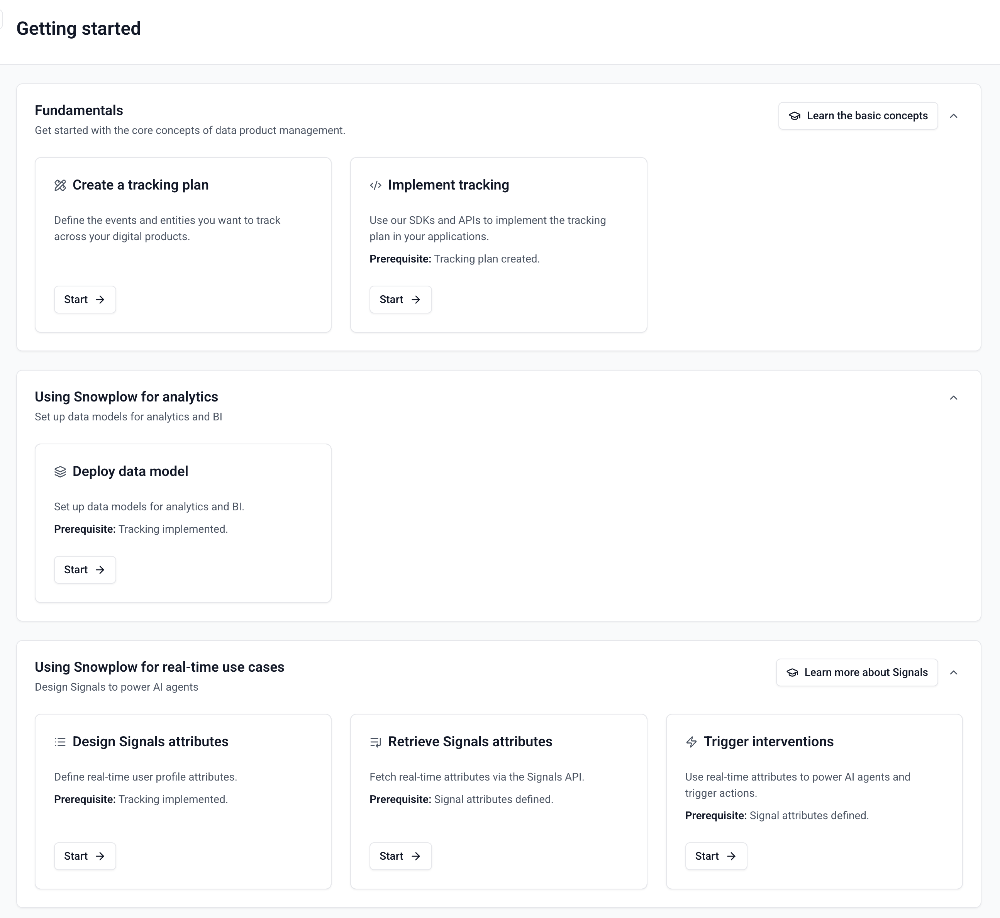

The Getting Started dashboard in Console guides you through collecting and acting on your behavioral data. It organizes workflows into three sections: **Fundamentals**, **Analytics**, and **Real-time use cases**.

## How the dashboard is organized

Each section contains workflow cards for a specific task, from designing a tracking plan to configuring Signals. The workflows follow a prerequisite chain: create a tracking plan, implement tracking, then unlock downstream features like data models and Signals.

:::note Console availability
The Getting Started dashboard is available to Snowplow CDI customers with Console access.
:::

## Design and implement tracking

The Fundamentals section covers the core data collection workflow.

### Create a tracking plan

The first card guides you through creating a [tracking plan](/docs/event-studio/tracking-plans/index.md), which defines the [events](/docs/fundamentals/events/index.md) and [entities](/docs/fundamentals/entities/index.md) you want to collect.

1. Choose between built-in events or custom tracking
2. Create or select a [source application](/docs/event-studio/source-applications/index.md)
3. Select tracking plan templates (Base Web, E-commerce Web, Media Web, and others)
4. Review and confirm your selections

Console then creates the tracking plan and associated data structures in your account.

### Implement tracking

With a tracking plan in place, the next card helps you [implement tracking](/docs/event-studio/implement-tracking/index.md).

1. Select your source application
2. Configure tracker initialization with the generated code snippet
3. Select your tracking plan and view event-specific code snippets
4. Test with Snowplow Micro
5. Deploy to production

:::tip Test before deploying
Test your implementation with Snowplow Micro before deploying to production to verify that events are structured correctly and match your tracking plan.
:::

## Deploy a data model

Once data is flowing, you can deploy a data model to transform raw events into structured tables for analysis. Console offers two types of data models:

- [Out-of-the-box data models](/docs/modeling-your-data/running-data-models-via-console/index.md) for common use cases like web and mobile analytics
- [Automatically generated data models](/docs/modeling-your-data/automatically-generated-data-models/index.md) tailored to your tracking plan

## Configure Signals for real-time use cases

[Signals](/docs/signals/get-started/index.md) processes your event stream to compute user attributes in real time and trigger automated actions.

:::note Paid add-on
Signals is a paid add-on. Contact your account team to enable it.
:::

### Design Signals attributes

Define [Signals attributes](/docs/signals/attributes/index.md) that compute real-time properties about your users (for example, session count, cart value, or engagement score).

1. Choose a template or create a custom attribute
2. Create or edit an attribute group
3. Test and simulate against real data

### Retrieve Signals attributes

Create a [service](/docs/signals/attributes/services/index.md) and follow the [retrieval steps](/docs/signals/connection/index.md) to access attribute values from your front-end or back-end.

### Trigger interventions

Create [interventions](/docs/signals/interventions/index.md) that automatically respond to user behavior — for example, displaying a promotion when a cart value exceeds a threshold or suppressing a campaign for users who have already converted.
