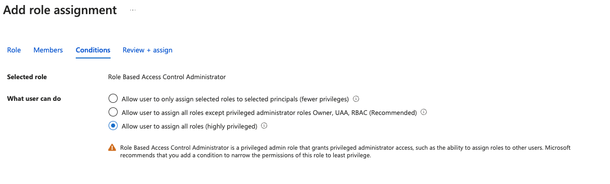

To set up Snowplow, log in to Snowplow [Console](https://console.snowplowanalytics.com) where you'll be able to follow a step-by-step guide to getting started, including the steps below.

## Setting up your Azure account

The following steps explain how to set up your cloud environment ready for your Snowplow pipeline to be installed.

### Create a new subscription

We require a new subscription which does not contain anything else that you have running in Azure.  If you don't have an Azure account, then you will need to create a new Azure account and tenant, along with a subscription for Snowplow to use. For the latest documentation on setting up a new account and tenant please refer to the [Azure documentation](https://azure.microsoft.com/).

### Enable billing for the account

Enable billing in the tenant by creating a subscription. Otherwise, the pipeline will fail to deploy. For details on enabling billing for your tenant, please refer to the Azure documentation for [subscriptions](https://learn.microsoft.com/en-us/azure/cost-management-billing/manage/create-subscription).

### Set up access and required permissions

Snowplow deploys into your tenant using a verified [application service principal](https://learn.microsoft.com/en-us/entra/identity-platform/app-objects-and-service-principals?tabs=browser#service-principal-object) (Enterprise application). We require a custom role to be assigned to the application service principal. This will allow us to create custom pipeline roles needed for deploying and managing different components of your infrastructure.

#### Consent to Snowplow Private Managed Cloud Deployment application

You will need to grant our verified application service principal the access into your Azure tenant. Once that’s done, you should see the application service principal under _Microsoft Entra ID_ → _Enterprise Applications_.

1. Grab your Azure tenant ID by navigating to Microsoft Entra ID
2. Complete the consent URL where `<TenantID>` is your tenant ID. The `client_id` set is for “Snowplow BDP Enterprise Deployment” application service principal. Go to this URL in a browser window
    ```
    https://login.microsoftonline.com/<TenantID>/oauth2/authorize?client_id=0581feb4-b614-42c7-b8e7-b4e7fba9153a&response_type=code
    ```
3. A consent window will appear detailing that an Enterprise application is being set up in your tenant. It needs to be accepted by your Azure tenant admin for the organization (there is a tick box that must be ticked). After accepting, Microsoft redirects you to a page unrelated to the Azure Portal, so close this window
4. Verify the trust has been established by viewing “Snowplow Private Managed Cloud Deployment” application in the Enterprise Applications section of Entra ID

#### Create and assign role to application service principal

Create a custom role and assign it the “Snowplow BDP Enterprise Deployment” application service principal under your subscription. This grants the permission to create distinct roles for deploying and managing infrastructure resources that make up your pipeline.

1. Navigate to your newly created subscription
2. Click into “Access Control (IAM)”
3. Click “Add custom role”
4. Create the following role, which allows Snowplow to create various roles that are specific to components that make up your pipeline. The `customer_subscription_id` should be the subscription ID that Snowplow will deploy into. The role should be single scoped to the subscription. It is recommended to have a custom role per environment to give clear separation between environments.
    ```json
    {
        "properties": {
            "roleName": "Snowplow-Deployment-Role-Creator-Role",
            "description": "Custom policy to allow creation of individual Azure stack related roles",
            "assignableScopes": [
                "/subscriptions/<customer_subscription_id>"
            ],
            "permissions": [
                {
                    "actions": [
                        "Microsoft.Authorization/roleAssignments/write",
                        "Microsoft.Authorization/roleAssignments/read",
                        "Microsoft.Authorization/roleAssignments/delete",
                        "Microsoft.Authorization/roleDefinitions/write",
                        "Microsoft.Authorization/roleDefinitions/read",
                        "Microsoft.Authorization/roleDefinitions/delete",
                        "Microsoft.Resources/subscriptions/resourcegroups/read"
                    ],
                    "notActions": [],
                    "dataActions": [],
                    "notDataActions": []
                }
            ]
        }
    }
    ```
5. Within “Access Control (IAM)”, click “Add role assignment”
6. Assign the `Snowplow-Deployment-Role-Creator-Role` to service principal “Snowplow BDP Enterprise Deployment”. The role can be found under the “Privileged administrator roles” tab. The Conditions tab should be selected and you must select the third option. This is required to enable the [Lighthouse Offer to be created as detailed in Microsoft documentation](https://learn.microsoft.com/en-us/azure/lighthouse/how-to/deploy-policy-remediation#create-a-user-who-can-assign-roles-to-a-managed-identity-in-the-customer-tenant:~:text=To%20allow%20a,Administrator%20or%20Owner)


### Determine if Snowplow requires a specific VPC (optional)

If you require Snowplow to be deployed into a specific VPC CIDR range, this
should be provided at the same time as credentials. We need a /16 provided
for the VPC so that we can create /20 subnets (note: [VPC peering and using a custom VPC is an additional bolt-on](https://snowplow.io/snowplow-behavioral-data-platform-product-description/#h-vpc-peering-aws-gcp))

### Check subscription resource availability

You must check that the following infrastructure is available in the subscription
before deployment starts. If the required instances are unavailable, it will
result in delays to getting started.

Snowplow requires the below instances and databases. We have provided the Azure
CLI commands that can be used to check their availability. Please note that they
are required in all three availability zones in the region for redundancy. You
may need to raise a quota ticket with Azure or contact your Azure Technical
Account Manager to ensure the instance types are fully available.

Instances D4s_v5 (preferred), or D4s_v4 / D4_v5 / D4_v4 series:

```bash
az vm list-skus --location <REGION> --size Standard_D4s_v5 --all --output table
az vm list-skus --location <REGION> --size Standard_D4s_v4 --all --output table
az vm list-skus --location <REGION> --size Standard_D4_v5 --all --output table
az vm list-skus --location <REGION> --size Standard_D4_v4 --all --output table
```

Database B_Standard_B2s:

```bash
az vm list-skus --location <REGION> --size Standard_B2s --all --output table
```

Please note that the above is for a minimal deployment. If you will be sending
over one billion events per month through the pipeline, please speak to us for
advice on what instance sizes are recommended.

### Final checklist

If you are sending a request to our team to set up deployment into your Azure
account, please ensure you provide the following information:

1. The tenant ID
2. The subscription ID
3. Azure region to deploy into
4. The ID of the `Snowplow-Deployment-Role-Creator-Role`
5. The specific VPC CIDR range that the pipeline should be deployed in (optional).
