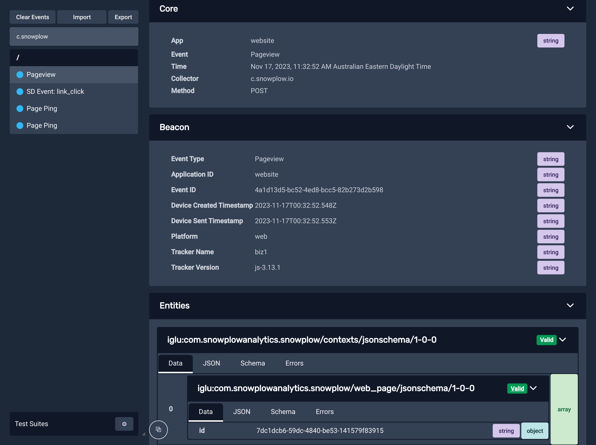

## Snowplow Inspector

If you are implementing tracking on a website or in a web or mobile application, we highly recommend to install the [Snowplow Inspector](/docs/data-product-studio/data-quality/snowplow-inspector/index.md). It will help you validate which Snowplow events are triggering, look at their properties, and more.

## Snowplow Micro

For debugging [enrichments](/docs/pipeline/enrichments/index.md), streaming applications (e.g. using the [analytics SDKs](/docs/api-reference/analytics-sdk/index.md)), and other more advanced usage, take a look at [Snowplow Micro](/docs/data-product-studio/data-quality/snowplow-micro/index.md). It’s a minified Snowplow pipeline that can run on your machine.

