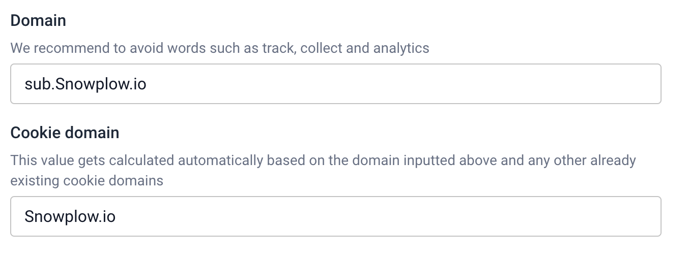

# First party tracking

This feature lets you configure a custom collector domain to match the domain you wish to track. This allows for first-party cookies to be set on the server.
Enter the domain you wish to track, **any sub domain or multi level sub domain will be removed** and a cookie domain will be generated. If you wish to restrict the tracking to a sub domain the cookie domain can still be edited.

## DNS records
The required DNS records will now be created, this may take several minutes.
When the records are ready you will receive email confirmation.

Once the DNS records are available, copy them into your domain provider.
We will attempt to verify that the records have been correctly applied up to 72 hours after they have been generated.

**After 72 hours** if the records are not verified the process will be terminated in a failed state and you will need to start over.

When verification has been completed the status in the bottom left will change and you will receive email confirmation.

## Implement new tracking snippet
In console navigate to “**Start tracking events**”, here you will find the JavaScript tracking snippet.
The code snippet will show the default collector URL, once the new custom domain is verified you can change the URL via the dropdown menu. 

You now need to update the tracking snippet in your code base with the new URL to complete the implementation of First-party tracking.

