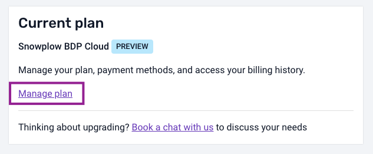
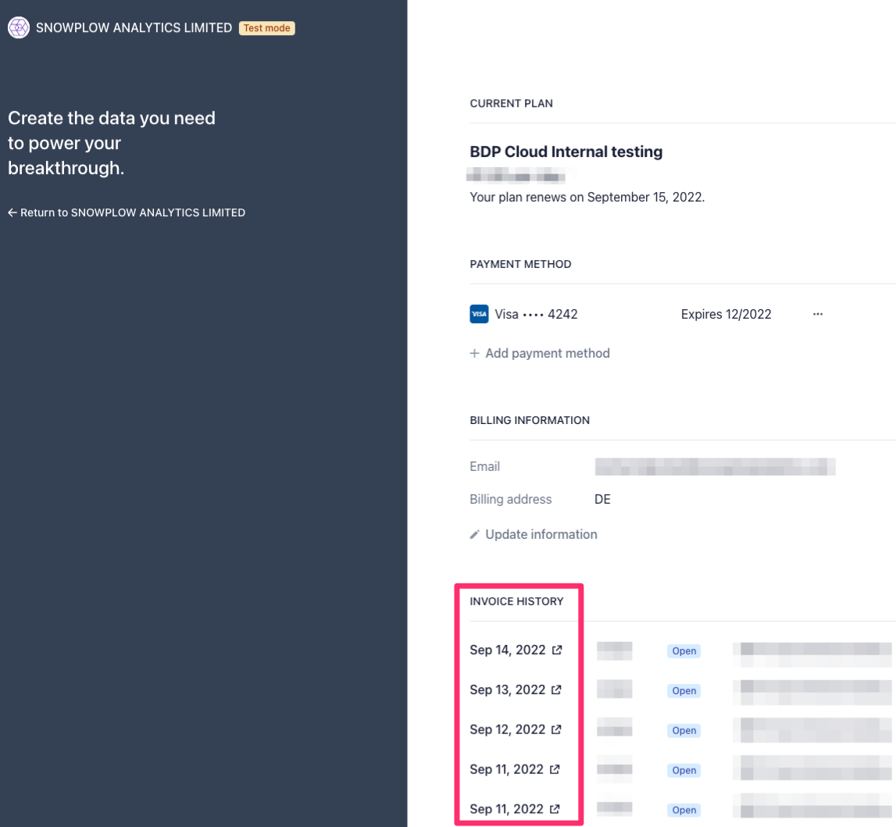

# Viewing your payment history

To view your payment history, navigate to “[**Manage organization**](https://console.snowplowanalytics.com/settings)” in Console. 

Scroll down to the **Current Plan** section and click on “**Manage Plan**”:

You’ll be forwarded to the Stripe billing portal. Scroll to the bottom of the page to see your payment history:

