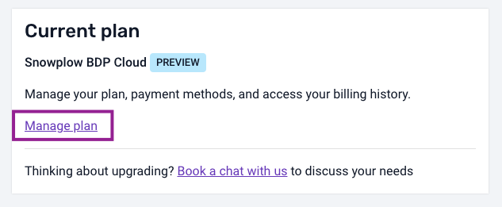

# Updating your plan & billing details

To edit your payment and billing details or to cancel your subscription, navigate to “[**Manage organization**](https://console.snowplowanalytics.com/settings)” in Console.

Scroll down to the **Current Plan** section and click on “**Manage Plan**”:

You’ll be forwarded to the Stripe billing portal where you can update your plan, edit your payment and billing details or cancel your subscription.
