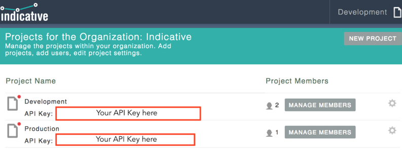
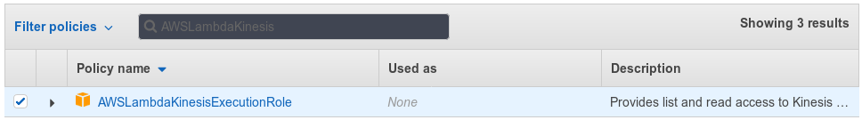
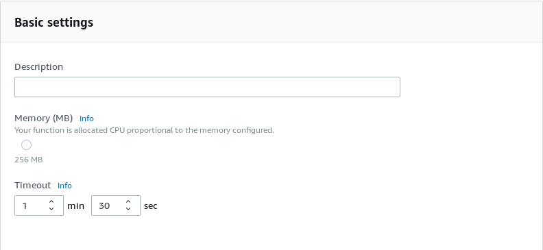

Please follow these steps to setup the Snowplow Indicative Relay on AWS Lambda:

### 1\. Create your Indicative account

If you do not have an Indicative account, go to [Indicative](https://app.indicative.com/#/login/register) to create an account.

### 2\. Obtain an API key from Indicative

- If you are a new Indicative user, go to [https://app.indicative.com/#/onboarding/snowplow](https://app.indicative.com/#/onboarding/snowplow). Then select _Snowplow_ and copy the API Key. Save it, you will need it later

- If you want to send data to an existing project, go to [https://app.indicative.com/#/account/projects](https://app.indicative.com/#/account/projects)

### 3\. Create an IAM Role for the Lambda

Your AWS Lambda needs to have an Execution Role that allows it to use the Kinesis Stream and CloudWatch. Open the AWS Management Console and follow these steps:

1. Go to IAM Management in the Console, choose _Roles_ from the sidebar, then click _Create role_.
2. As shown in the screenshot below, for the type of trusted entity select _AWS Service_ and for the service that will use this role choose _Lambda_.

3. Now you need to choose a permission policy for the role. The Lambda needs to have read access to Kinesis and write access to CloudWatch logs - for that we will choose _AWSLambdaKinesisExecutionRole_.
4. On the next screen provide a name for the newly created role, then click _Create role_ to finish the process.

### 4\. Create the Lambda function

As with the IAM Role, we will be using the AWS Console to get our Lambda function up and running.

1. On the Console navigate to `Lambda` section and click `Create a function`. Runtime should be _Java 8_. In the _Role_ dropdown pick _Choose an existing role_, then in the dropdown below choose the name of the role you have created in the previous part of the guide. Click _Create function_.

2. Jars for the Indicative Relay are hosted by us in S3. To find the S3 url to the appropriate hosted asset for the Snowplow Indicative Relay to provide to your Lambda function, you will need to choose the S3 bucket that is in the same region as your AWS Lambda function. For example, if your Lambda is `us-east-1` region, and the latest version `0.4.0`, then the jar you will provide to your Lambda function will be available at the following URL: `s3://snowplow-hosted-assets-us-east-1/relays/indicative/indicative-relay-0.4.0.jar`.

To find the name of the bucket for your region, consult this table:

| Region         | Bucket                                |
| -------------- | ------------------------------------- |
| eu-west-1      | snowplow-hosted-assets                |
| us-east-1      | snowplow-hosted-assets-us-east-1      |
| us-west-1      | snowplow-hosted-assets-us-west-1      |
| us-west-2      | snowplow-hosted-assets-us-west-2      |
| sa-east-1      | snowplow-hosted-assets-sa-east-1      |
| eu-central-1   | snowplow-hosted-assets-eu-central-1   |
| ap-southeast-1 | snowplow-hosted-assets-ap-southeast-1 |
| ap-southeast-2 | snowplow-hosted-assets-ap-southeast-2 |
| ap-northeast-1 | snowplow-hosted-assets-ap-northeast-1 |
| ap-south-1     | snowplow-hosted-assets-ap-south-1     |
| us-east-2      | snowplow-hosted-assets-us-east-2      |
| ca-central-1   | snowplow-hosted-assets-ca-central-1   |
| eu-west-2      | snowplow-hosted-assets-eu-west-2      |
| ap-northeast-2 | snowplow-hosted-assets-ap-northeast-2 |

2. Although the Lambda has been created, it does not do anything yet. We need to provide the code and configure the function. Take a look at the _Function code_ box. In the _Handler_ textbox paste: `com.snowplowanalytics.indicative.LambdaHandler::recordHandler`  
   From the _Code entry type_ dropdown pick _Upload a file from Amazon S3_. A textbox labeled _S3 Link URL_ will appear. Paste in the S3 url you found in the previous step.

3. Below _Function code_ settings you will find a section called _Environment variables_. You need to use these environment variables to configure some additional settings for the relay, such as the the API key and filters.
   - **3.1 Setting up the API key**: In the first row, first column (the key) type `INDICATIVE_API_KEY`. In the second column (the value) paste your API Key obtained in the beginning of this guide.
   - **3.2 Setting up filters**: The relay lets you configure the following filters:
     - UNUSED_EVENTS: events that will not be relayed to Indicative;
     - UNUSED_ATOMIC_FIELDS: fields of the [canonical](/docs/understanding-your-pipeline/canonical-event/index.md) Snowplow event that will not be relayed to Indicative;
     - UNUSED_CONTEXTS: contexts whose fields will not be relayed to Indicative.

Out of the box, the relay is configured to use the following defaults:

| Unused events            | Unused atomic fields     | Unused contexts            |
| ------------------------ | ------------------------ | -------------------------- |
| app_heartbeat            | etl_tstamp               | application_context        |
| app_initialized          | collector_tstamp         | application_error          |
| app_shutdown             | dvce_created_tstamp      | duplicate                  |
| app_warning              | event                    | geolocation_context        |
| create_event             | txn_id                   | instance_identity_document |
| emr_job_failed           | name_tracker             | java_context               |
| emr_job_started          | v_tracker                | jobflow_step_status        |
| emr_job_status           | v_collector              | parent_event               |
| emr_job_succeeded        | v_etl                    | performance_timing         |
| incident                 | user_fingerprint         | timing                     |
| incident_assign          | geo_latitude             |                            |
| incident_notify_of_close | geo_longitude            |                            |
| incident_notify_user     | ip_isp                   |                            |
| job_update               | ip_organization          |                            |
| load_failed              | ip_domain                |                            |
| load_succeeded           | ip_netspeed              |                            |
| page_ping                | page_urlscheme           |                            |
| s3_notification_event    | page_urlport             |                            |
| send_email               | page_urlquery            |                            |
| send_message             | page_urlfragment         |                            |
| storage_write_failed     | refr_urlscheme           |                            |
| stream_write_failed      | refr_urlport             |                            |
| task_update              | refr_urlquery            |                            |
| wd_access_log            | refr_urlfragment         |                            |
|                          | pp_xoffset_min           |                            |
|                          | pp_xoffset_max           |                            |
|                          | pp_yoffset_min           |                            |
|                          | pp_yoffset_max           |                            |
|                          | br_features_pdf          |                            |
|                          | br_features_flash        |                            |
|                          | br_features_java         |                            |
|                          | br_features_director     |                            |
|                          | br_features_quicktime    |                            |
|                          | br_features_realplayer   |                            |
|                          | br_features_windowsmedia |                            |
|                          | br_features_gears        |                            |
|                          | br_features_silverlight  |                            |
|                          | br_cookies               |                            |
|                          | br_colordepth            |                            |
|                          | br_viewwidth             |                            |
|                          | br_viewheight            |                            |
|                          | dvce_ismobile            |                            |
|                          | dvce_screenwidth         |                            |
|                          | dvce_screenheight        |                            |
|                          | doc_charset              |                            |
|                          | doc_width                |                            |
|                          | doc_height               |                            |
|                          | tr_currency              |                            |
|                          | mkt_clickid              |                            |
|                          | etl_tags                 |                            |
|                          | dvce_sent_tstamp         |                            |
|                          | refr_domain_userid       |                            |
|                          | refr_device_tstamp       |                            |
|                          | derived_tstamp           |                            |
|                          | event_vendor             |                            |
|                          | event_name               |                            |
|                          | event_format             |                            |
|                          | event_version            |                            |
|                          | event_fingerprint        |                            |
|                          | true_tstamp              |                            |

To change the defaults, you can pass in your own lists of events, atomic fields or contexts to be filtered out. For example:

| Environment variable key | Environment variable value        |
| ------------------------ | --------------------------------- |
| UNUSED_EVENTS            | page_ping,file_download           |
| UNUSED_ATOMIC_FIELDS     | name_tracker,event_vendor         |
| UNUSED_CONTEXTS          | performance_timing,client_context |

Similarly to setting up the API key, the first column (key) needs to be set to the specified environment variable name in ALLCAPS. The second column (value) is your own list as a comma-separated string with no spaces.

If you only specify the environment variable name but do not provide a list of values, then nothing will be filtered out.

If you do not set any of the environment variables, the defaults will be used.

- **3.3. Setting up the Indicative API URI**: By default, the relay uses the standard URI. To change that, you can set the `INDICATIVE_URI` environment variable.
- **3.4. Setting up the field whose value should be used as the event name for `struct` events**: In Snowplow's canonical event model, there's a legacy type of custom structured event, which is known as a `struct` or ['structured event'](/docs/understanding-your-pipeline/canonical-event/index.md#Custom_structured_events). These are still fairly popular with users, however the value of the `event_name` field for those events (which is simply `event`) can be confusing. To help group similar events, Snowplow users often designate one of their special fields (most commonly `se_action`) to be the 'event name field'. Since version 0.5.0 by default `se_action` is used as the event name field for structured events. But you can override that by setting the Lambda environment variable `STRUCTURED_EVENT_NAME_FIELD` to the field whose value you'd rather use, eg `se_category`.

4. Scroll down a bit and take a look at the _Basic settings_ box. There you can set memory and timeout limits for the Lambda. We recommend setting 256 MB of memory or higher (on AWS Lambda the CPU performance scales linearly with the amount of memory). The timeout should be set quite high - we recommend one and half minute - because of so-called _JVM cold starts_. The cold starts happen when the Lambda function is invoked for the first time on a new instance and it can take a significant amount of time.

5. Now let's add our enriched Kinesis stream as an event source for the function. From the list of triggers in the Designer configuration up top, choose Kinesis.

Take a look at the Configure triggers section which just appeared below. Choose your Kinesis stream that contains Snowplow enriched events. Set the batch size to your liking - 100 is a reasonable setting. Note that this a maximum batch size, the function can be triggered with less records. For the starting position we recommend Trim horizon, which starts processing the stream from an observable start. Click Add button to finish the trigger configuration. Make sure Enable trigger is selected.

6. Save the changes by clicking the Save button in the top-right part of the page.

## 5\. Observe the events in Indicative

After a while the events should start flowing into Indicative. You can go _Settings -> Events and Properties_ to see incoming event types, change their labels, descriptions and categories.

