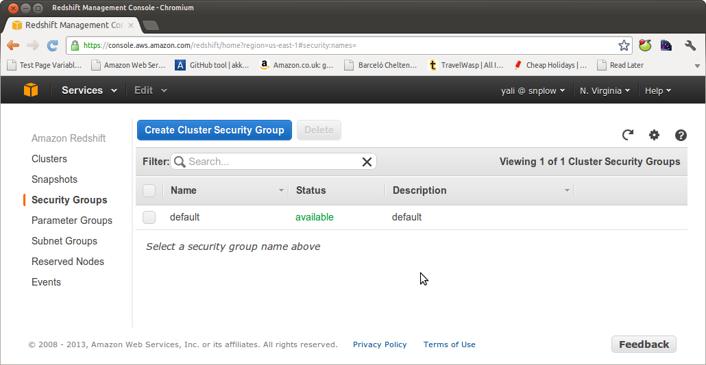
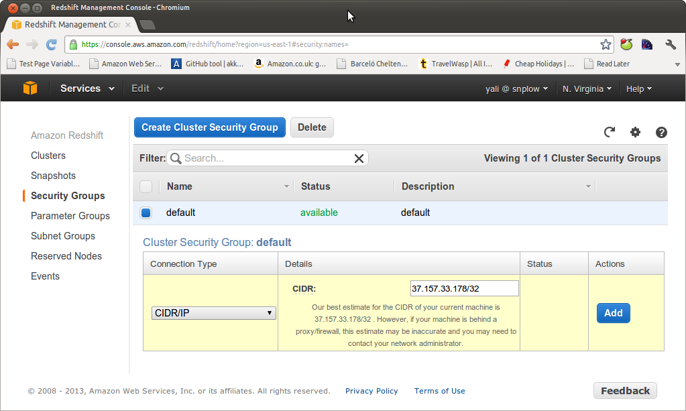

To enable a direct connection between a client (e.g. on your local machine) and Redshift, click on the cluster you want to access, via the AWS console:


Click on "Security Groups" on the left hand menu.



Amazon lets you create several different security groups so you can manage access by different groups of people. In this tutorial, we will just update the default group to grant access to a particular IP address.

Select the default security group:


We need to enable a connection type for this security group. Amazon offers two choices: an 'EC2 Security Group' (if you want to grant access to a client running on EC2) or a CIDR/IP connection if you want to connect a clieint that is not an EC2 instance.

In this example we're going to establish a direct connection between Redshift and our local machine (not on EC2), so select CIDR/IP. Amazon helpfully guesses the CIDR of the current machine. In our case, this is right, so we enter the value:



and click "Add".

We should now be able to connect a SQL client on our local machine to Amazon Redshift.

**Note:** Amazon has moved to launching Redshift clusters in a VPC instance by default. In this case, the process for adding IP addresses or EC2 instances to a security group is very similar, but rather than being done in the `Redshift > Security Groups` section of the AWS console, it is done in the `EC2 -> VPC security groups` section of the AWS management console.

Via [AWS CLI](https://aws.amazon.com/cli/), you could create the security group in the following fashion.

```bash
$ aws ec2 create-security-group \
    --group-name "Redshift unlimited access" \
    --description "Unsafe. Use for demonstration only" \
    --vpc-id {{ VPC_ID }} \
    | jq -r '.GroupId'
```

On output, you'll get `GroupId`. We'll refer to it as `{{ REDSHIFT_SG }}`.

Next, you need to add access rules to the new security group (amend as required to serve your purpose).

```bash
$ aws ec2 authorize-security-group-ingress \
    --group-id {{ REDSHIFT_SG }} \
    --protocol tcp \
    --port 5439 \
    --cidr 0.0.0.0/0
```

Then tie the previously created security to the cluster in the following manner. On output, you'll get the cluster address which you can use in place of `hostname` when establishing the connection to your database.

```bash
$ aws redshift modify-cluster \
    --cluster-id snowplow \
    --vpc-security-group-ids {{ REDSHIFT_SG }} \
    | jq -r '.Cluster.Endpoint.Address'
```
