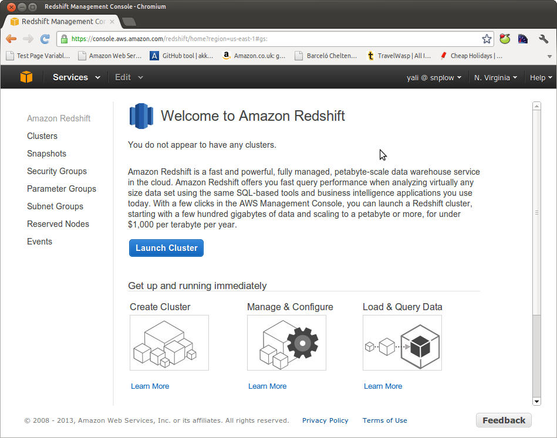
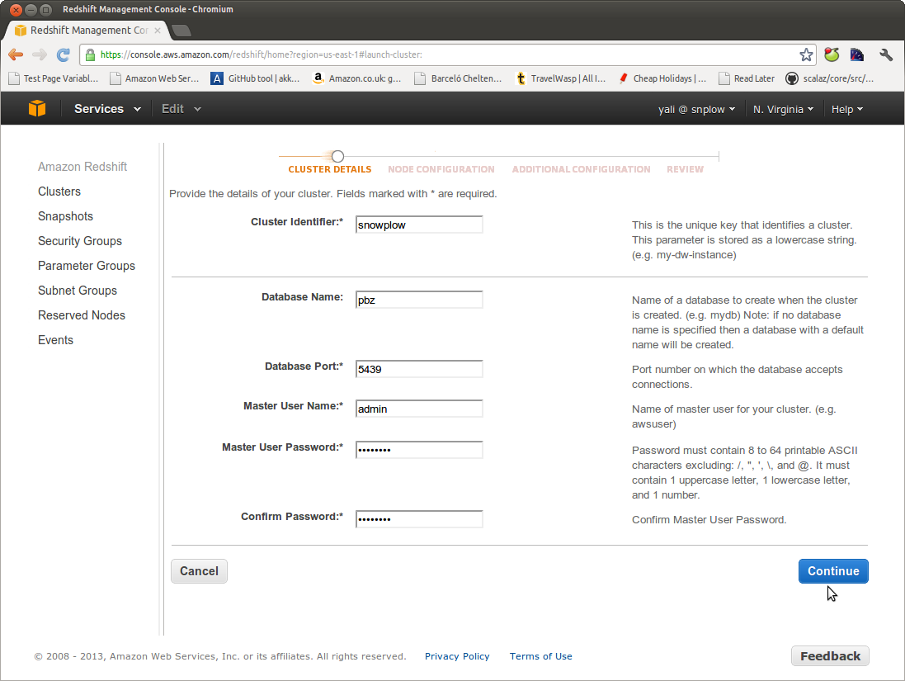
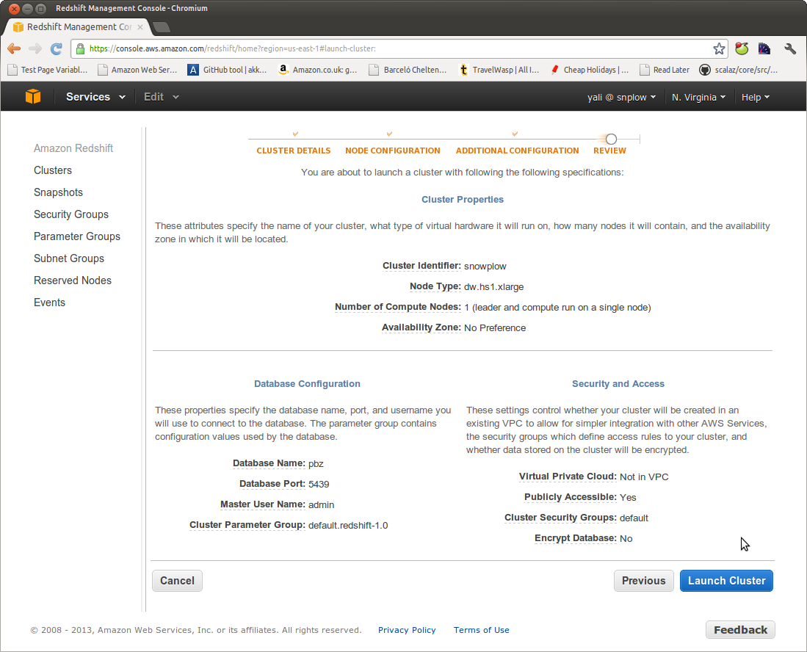

Go into the Amazon webservices console and select "Redshift" from the list of services.



Click on the "Launch Cluster" button:



Enter suitable values for the cluster identifier, database name (e.g. 'snowplow'), port, username and password. Click the "Continue" button.


We now need to configure the cluster size. Select the values that are most appropriate to your situation. We generally recommend starting with a single node cluster with node type i.e. a `dw1.xlarge` or `dw2.large` node, and then adding nodes as your data volumes grow.

You now have the opportunity to encrypt the database and and set the availability zone if you wish. Select your preferences and click "Continue".



Amazon summarises your cluster information. Click "Launch Cluster" to fire your Redshift instance up. This will take a few minutes to complete.

Alternatively, you could use [AWS CLI](https://aws.amazon.com/cli/) to launch a new cluster. The outcome of the above steps could be achieved with the following command.

```bash
$ aws redshift create-cluster \
    --node-type dc1.large \
    --cluster-type single-node \
    --cluster-identifier snowplow \
    --db-name pbz \
    --master-username admin \
    --master-user-password TopSecret1
```
