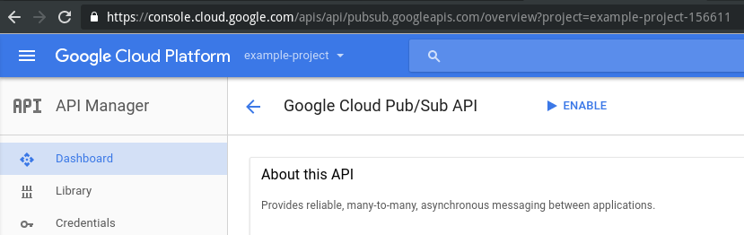
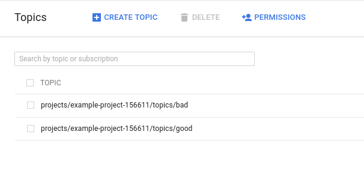

Go to [https://console.cloud.google.com/apis/api/pubsub.googleapis.com/overview](https://console.cloud.google.com/apis/api/pubsub.googleapis.com/overview)

- Make sure your project is selected (on the navbar, to the left of the search bar)
- Click enable

You’ll then have to create the topics to which the Scala Stream Collector publishes:

- Click on the hamburger, on the top left corner
- Scroll down until you find it, under “Big Data”

Create two topics: thse will be the good and bad raw topics:

Now you are ready to setup the collector application itself.
